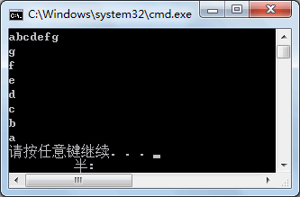
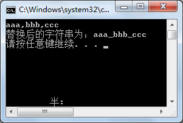
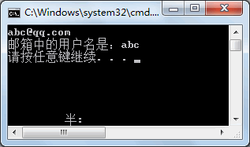
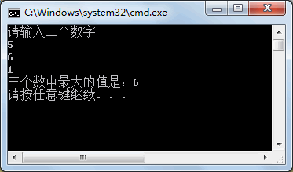

# string字符串

在编程时字符串是比较常用的一种数据类型，例如用户名、邮箱、家庭住址、商品名称等信息都需要使用字符串类型来存取。

在 C# 语言中提供了对字符串类型数据操作的方法，例如截取字符串中的内容、查找字符串中的内容等。

在任何一个软件中对字符串的操作都是必不可少的，掌握好字符串的操作将会在编程中起到事半功倍的作用。

下面将分别来介绍常见的字符串操作、数据类型的转换，以及字符串操作在实际工作中的应用。

## 1.常用方法

 编程时字符串是比较常用的一种数据类型，例如用户名、邮箱、家庭住址、商品名称等信息都需要使用字符串类型来存取。

在任何一个软件中对字符串的操作都是必不可少的，掌握好字符串的操作将会在编程中起到事半功倍的作用。

在 C# 语言中提供了对字符串类型数据操作的方法，例如截取字符串中的内容、查找字符串中的内容等。

常用的字符串操作包括获取字符串的长度、查找某个字符在字符串中的位置、替换字符串中的内容、拆分字符串等。

在字符串操作中常用的属性或方法如下表所示。

| 编号 | 属性或方法名 | 作用                                                         |
| ---- | ------------ | ------------------------------------------------------------ |
| 1    | Length       | 获取字符串的长度，即字符串中字符的个数                       |
| 2    | IndexOf      | 返回整数，得到指定的字符串在原字符串中第一次出现的位置       |
| 3    | LastlndexOf  | 返回整数，得到指定的字符串在原字符串中最后一次出现的位置     |
| 4    | Starts With  | 返回布尔型的值，判断某个字符串是否以指定的字符串开头         |
| 5    | EndsWith     | 返回布尔型的值，判断某个字符串是否以指定的字符串结尾         |
| 6    | ToLower      | 返回一个新的字符串，将字符串中的大写字母转换成小写字母       |
| 7    | ToUpper      | 返回一个新的字符串，将字符串中的小写字母转换成大写字母       |
| 8    | Trim         | 返回一个新的字符串，不带任何参数时表示将原字符串中前后的空格删除。 参数为字符数组时表示将原字符串中含有的字符数组中的字符删除 |
| 9    | Remove       | 返回一个新的字符串，将字符串中指定位置的字符串移除           |
| 10   | TrimStart    | 返回一个新的字符串，将字符串中左侧的空格删除                 |
| 11   | TrimEnd      | 返回一个新的字符串，将字符串中右侧的空格删除                 |
| 12   | PadLeft      | 返回一个新的字符串，从字符串的左侧填充空格达到指定的字符串长度 |
| 13   | PadRight     | 返回一个新的字符串，从字符串的右侧填充空格达到指定的字符串长度 |
| 14   | Split        | 返回一个字符串类型的数组，根据指定的字符数组或者字符串数组中的字符 或字符串作为条件拆分字符串 |
| 15   | Replace      | 返回一个新的字符串，用于将指定字符串替换给原字符串中指定的字符串 |
| 16   | Substring    | 返回一个新的字符串，用于截取指定的字符串                     |
| 17   | Insert       | 返回一个新的字符串，将一个字符串插入到另一个字符串中指定索引的位置 |
| 18   | Concat       | 返回一个新的字符串，将多个字符串合并成一个字符串             |

### 1.1 遍历 & Length

#### a. Length

```c#
class Program
{
    static void Main(string[] args)
    {
        string str = Console.ReadLine();
        Console.WriteLine("字符串的长度为：" + str.Length);
        Console.WriteLine("字符串中第一个字符为：" + str[0]);
        Console.WriteLine("字符串中最后一个字符为：" + str[str.Length - 1]);
    }
}
```

执行上面的代码，效果如下图所示。


从该实例可以看出，获取字符串中的某个字符只需要通过下标即可完成。

#### b. 遍历

```c#
class Program
{
    static void Main(string[] args)
    {
        string str = Console.ReadLine();
        for(int i = str.Length - 1; i >= 0; i--)
        {
            Console.WriteLine(str[i]);
        }
    }
}
```

执行上面的代码，效果如下图所示。



### 1.2 位置 IndexOf & LastIndexOf

#### a. IndexOf

```c#
class Program
{
    static void Main(string[] args)
    {
        string str = Console.ReadLine();
        if (str.IndexOf("@") != -1)
        {
            Console.WriteLine("字符串中含有@，其出现的位置是{0}", str.IndexOf("@") + 1);
        }
        else
        {
            Console.WriteLine("字符串中不含有@");
        }
    }
}
```

执行上面的代码，效果如下图所示。


#### b. LastIndexOf

```c#
class Program
{
    static void Main(string[] args)
    {
        string str = Console.ReadLine();
        int firstIndex = str.IndexOf("@");
        int lastIndex = str.LastIndexOf("@");
        if(firstIndex != -1)
        {
            if (firstIndex == lastIndex)
            {
                Console.WriteLine("在该字符串中仅含有一个@");
            }
            else
            {
                Console.WriteLine("在该字符串中含有多个@");
            }
        }
        else
        {
            Console.WriteLine("在该字符串中不含有@");
        }
    }
}
```

执行上面的代码，效果如下图所示。

 


从上面的执行效果可以看出，在字符串中包含了两个 @,因此提示的结果是“在该字符串中含有多个@”。

### 1.3 替换 Replace

```c#
class Program
{
    static void Main(string[] args)
    {
        string str = Console.ReadLine();
        if (str.IndexOf(",") != -1)
        {
            str = str.Replace(",", "_");
        }
        Console.WriteLine("替换后的字符串为：" + str);
    }
}
```

执行上面的代码，效果如下图所示。




从上面的执行效果可以看出，通过 Replace 方法将字符串中所有的‘,’换成了‘_’。

### 1.4 截取 Substring

```c#
class Program
{
    static void Main(string[] args)
    {
        string str = Console.ReadLine();
        int firstIndex = str.IndexOf("@");
        int lastIndex = str.LastIndexOf("@");
        if(firstIndex != -1 && firstIndex == lastIndex)
        {
            str = str.Substring(0, firstIndex);
        }
        Console.WriteLine("邮箱中的用户名是：" + str);
    }
}
```

执行上面的代码，效果如下图所示。



在上面的代码中，在截取邮箱中的用户名时得到 @ 的位置即可清楚需要截取的字符的个数

### 1.5 插入 Insert

在一个字符串中可以在指定位置插入另一个字符串，在 

C#

 中插入字符串使用的方法是 Insert 方法。

在 Insert 方法中需要两个参数，一个是字符串插入的位置，一个是字符串。

【实例】在 Main 方法中从控制台输入一个字符串，然后将‘@@@’插入到字符串的第 2 个字符的位置。

根据题目要求，代码如下。

```c#
class Program
{
    static void Main(string[] args)
    {
        string str = Console.ReadLine();
        str = str.Insert(1, "@@@");
        Console.WriteLine("新字符串为：" + str);
    }
}
```

执行上面的代码，效果如下图所示。


从上面的执行效果可以看出，已经将‘@@@’插入到第 2 个字符的位置。

## 2.数据类型转换

### 2.1隐式转换

* 隐式数值转换实际上就是从低精度的数值类型到高精度的数值类型的转换。
* 隐式数值转换包括以下几种：
  * 从 sbyte 类型到 short,int,long,float,double,或 decimal 类型。
  * 从 byte 类型到 short,ushort,int,uint,long,ulong,float,double,或 decimal 类型。
  * 从 short 类型到 int,long,float,double,或 decimal 类型。
  * 从 ushort 类型到 int,uint,long,ulong,float,double,或 decimal 类型。
  * 从 int 类型到 long,float,double,或 decimal 类型。
  * 从 uint 类型到 long,ulong,float,double,或 decimal 类型。
  * 从 long 类型到 float,double,或 decimal 类型。
  * 从 ulong 类型到 float,double,或 decimal 类型。
  * 从 char 类型到 ushort,int,uint,long,ulong,float,double,或 decimal 类型。
  * 从 float 类型到 double 类型。

示例代码如下。

```c#
int a = 100;
double d = a;  	//将int类型转换为double类型
float f = 3.14f;
d = f;    		//将float类型转换为double类型
```

### 2.1显式转化

  显式类型转换，即强制类型转换。显式转换需要强制转换运算符，而且强制转换会造成数据丢失。

常用的类型转换方法如下表所示。  

| 方法       | 描述                                              |
| ---------- | ------------------------------------------------- |
| ToBoolean  | 如果可能的话，把类型转换为布尔型。                |
| ToByte     | 把类型转换为字节类型。                            |
| ToChar     | 如果可能的话，把类型转换为单个 Unicode 字符类型。 |
| ToDateTime | 把类型（整数或字符串类型）转换为 日期-时间 结构。 |
| ToDecimal  | 把浮点型或整数类型转换为十进制类型。              |
| ToDouble   | 把类型转换为双精度浮点型。                        |
| ToInt16    | 把类型转换为 16 位整数类型。                      |
| ToInt32    | 把类型转换为 32 位整数类型。                      |
| ToInt64    | 把类型转换为 64 位整数类型。                      |
| ToSbyte    | 把类型转换为有符号字节类型。                      |
| ToSingle   | 把类型转换为小浮点数类型。                        |
| ToString   | 把类型转换为字符串类型。                          |
| ToType     | 把类型转换为指定类型。                            |
| ToUInt16   | 把类型转换为 16 位无符号整数类型。                |
| ToUInt32   | 把类型转换为 32 位无符号整数类型。                |
| ToUInt64   | 把类型转换为 64 位无符号整数类型。                |

### 2.3 强制类型转换

* 强制类型转换主要用于将存储范围大的数据类型转换成存储范围小的，但数据类型需要兼容。

* 例如 int 型转换成 float 型是可行的，但 float 型转换成 int 型则会造成数据精度丢失，而且字符串类型与整数类型之间是无法进行强制类型转换的。

* 强制类型转换的语法如下。  

  ```c#
  数据类型变量名 = (数据类型)  变量名或值;
  ```

* 这里要求等号左、右两边的数据类型是一致的。例如将 double 类型转换成 int 类型，代码如下。

  ```c#
  double dbl_num = 12345678910.456;
  int k = (int) dbl_num ;//此处运用了强制转换
  ```

  通过上面的语句即可将浮点型转换成整数。

  这样虽然能将值进行类型的转换，但损失了数据的精度，造成了数据的不准确，因此在使用强制类型转换时还需要注意数据的准确性。

### 2.4`Convert`类

  Convert 方法是数据类型转换中最灵活的方法，它能够将任意数据类型的值转换成任意数据类型，前提是不要超出指定数据类型的范围。

具体的语法形式如下。  

```
数据类型  变量名 = convert.To数据类型(变量名);
```

这里 Convert.To 后面的数据类型要与等号左边的数据类型相匹配。

Convert 类常用的类型转换方法如下表所示。

| 方法                 | 说明                       |
| -------------------- | -------------------------- |
| Convert.ToInt16()    | 转换为整型(short)          |
| Convert.ToInt32()    | 转换为整型(int)            |
| Convert.ToInt64()    | 转换为整型(long)           |
| Convert.ToChar()     | 转换为字符型(char)         |
| Convert.ToString()   | 转换为字符串型(string)     |
| Convert.ToDateTime() | 转换为日期型(datetime)     |
| Convert.ToDouble()   | 转换为双精度浮点型(double) |
| Conert.ToSingle()    | 转换为单精度浮点型(float)  |

对于整型和浮点型的强制数据类型操作也可以使用 Convert 方法代替，但是依然会损失存储范围大的数据类型的精度。

【实例】使用 Convert 方法将分别将一个浮点型数据转换成整型和字符串型。

根据题目要求，代码去下。

```c#
class Program
{
    static void Main(string[] args)
    {
         float num1 = 82.26f;
         int integer;
         string str;
         integer = Convert.ToInt32(num1);
         str = Convert.ToString(num1);
         Console.WriteLine("转换为整型数据的值{0}", integer);
         Console.WriteLine("转换为字符串{0},",str);
    }
}
```

执行上面代码，效果如下图所示。


### 2.5`Parse`方法

 `Parse` 方法用于将字符串类型转换成任意类型，具体的语法形式如下。

```
数据类型   变量二数据类型.Parse(字符串类型的值);
```

这里要求等号左、右两边的数据类型兼容。

【实例】在 Main 方法中从控制台输入 3 个数，并将其中的最大数输出。

根据题目要求，代码如下。

```c#
class Program
{
    static void Main(string[] args)
    {
        Console.WriteLine("请输入三个数字");
        int num1 = int.Parse(Console.ReadLine());
        int num2 = int.Parse(Console.ReadLine());
        int num3 = int.Parse(Console.ReadLine());
        int maxvalue = num1;
        if (num2 > maxvalue)
        {
            maxvalue = num2;
        }
        if (num3 > maxvalue)
        {
            maxvalue = num3;
        }
        Console.WriteLine("三个数中最大的值是：" + maxvalue);
    }
}
```

执行上面的代码，效果如下图所示。



在上面的实例中使用 Parse 方法将字符串类型转换成了整数类型 int，但输入的字符串必须是数字并且不能超出 int 类型的取值范围。

## 3.装箱拆箱

ToString 方法用于将任意的数据类型转换成字符串类型，例如将整数类型转换成字符串类型。

```
int a=100;string str=a.ToString();
```

这样整型变量 a 即可被转换成字符串类型。

* 将值类型转换为引用类型的操作称为装箱
* 相应地将引用类型转换成值类型称为拆箱。

在上面的转换中 int 类型是值类型，而 string 类型是引用类型，当将值类型变量 a 的值转换成引用类型变量 str 时就是一个装箱的操作， 而拆箱操作则是将引用类型变量 str 的值再转换成整型的过程，转换的代码如下。

```c#
a=int.Parse(str);
```

这样就完成了一个简单的装箱和拆箱操作。

【实例】利用装箱和拆箱功能，可通过允许值类型的任何值与 Object 类型的值相互转换，将值类型与引用类型链接起来

根据题目要求，代码如下。

```c#
int val = 100;
object obj = val;
Console.WriteLine("对象的值 = {0}", obj);
//这是一个装箱的过程，是将值类型转换为引用类型的过程
int val = 100;
object obj = val;
int num = (int) obj;
Console.WriteLine("num: {0}", num);
//这是一个拆箱的过程，是将值类型转换为引用类型，再由引用类型转换为值类型的过程
```

## 4.正则表达式 

正则表达式的主要作用是验证字符串的值是否满足一定的规则，在页面输入数据验证方面的应用比较多。

例如验证输入的邮箱是否合法、输入的身份证号码是否合法、输入的用户名是否满足条件等。

正则表达式并不是 [C#](http://c.biancheng.net/csharp/) 语言独有的，在大多数的编程语言中都是支持的，包括一些脚本语言也支持，例如 [Java](http://c.biancheng.net/java/)Script、JQucry 等。

正则表达式是专门处理字符串操作的，其本身有固定的写法。

正则表达式的符号主要分为元字符和表示重复的字符，分别如下表所示。  

### 4.1正则表达式中的元字符

| 编号 | 字符 | 描述                       |
| ---- | ---- | -------------------------- |
| 1    | `.`  | 匹配除换行符以外的所有字符 |
| 2    | `\w` | 匹配字母\数字\下划线       |
| 3    | `\s` | 匹配空格                   |
| 4    | `\d` | 匹配数字                   |
| 5    | `\b` | 匹配表达式的开始或结束     |
| 6    | `^`  | 匹配正则表达式的开始       |
| 7    | `$`  | 匹配正则表达式的结束       |

### 4.2正则表达式中表示重复的字符

| 编号 | 字符    | 描述          |
| ---- | ------- | ------------- |
| 1    | `*`     | 0次或多次字符 |
| 2    | `?`     | 0次或一次字符 |
| 3    | `+`     | 1次或多次字符 |
| 4    | `{n}`   | n次字符       |
| 5    | `{n.M}` | n到M次字符    |
| 6    | `{n,}`  | n次以上字符   |

* 此外,在正则表达式中使用`|`分割师表示多个正则表达式之间或者的关系.

### 4.3使用正则表达式`Regex`

* 在C#中使用正则表达式需要用到`Regex`这个类,该类在`System.Text.RegularExperssions`命名空间中

* 在`Regex`类中使用`IsMatch`方法判断字符串是否匹配正则表达式的要求.

* 实例:

  ```c#
  class Program
  {
      static void Main(string[] args)
      {
          Console.WriteLine("请输入一个邮箱");
          string email = Console.ReadLine();
          Regex regex = new Regex(@"^(\w)+(\.\w)*@(\w)+((\.\w+)+)$");
          if (regex.IsMatch(email))
          {
              Console.WriteLine("邮箱格式正确。");
          }
          else
          {
              Console.WriteLine("邮箱格式不正确。");
          }
      }
  }
  ```

  

