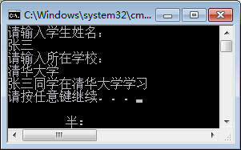

`C#` Console 类主要用于控制台应用程序的输入和输岀操作。

在前面演示的实例中就使用了该类，本节将具体具体讲解 Console 类的 4 个常用方法。

| 方法      | 描述                     |
| --------- | ------------------------ |
| Write     | 向控制台输出内容后不换行 |
| WriteLine | 向控制台输出内容后换行   |
| Read      | 从控制台上读取一个字符   |
| ReadLine  | 从控制台上读取一行字符   |

此外，在向控制台中输出内容时也可以对输出的内容进行格式化，格式化时使用的是占位符的方法，语法形式如下。

Console.Write(格式化字符串, 输出项, 输出项2);

其中，在格式化字符串中使用`{索引号}`的形式，索引号从 0 开始。输出项 1 填充 `{0}` 位置的内容，依此类推。

下面通过实例来学习 Console 类的用法。

【实例】从控制台依次输入姓名和所在学校，并在输出时组成一句话“xx 同学在 xx 学习”。

根据题目要求，代码如下。

```c#
class Program
{
    static void Main(string[] args)
    {
        Console.WriteLine("请输入学生姓名：");
        string name = Console.ReadLine();
        Console.WriteLine("请输入所在学校：");
        string school = Console.ReadLine();
        Console.WriteLine("{0}同学在{1}学习", name, school);
    }
}
```

执行上面的代码，效果如下图所示。

