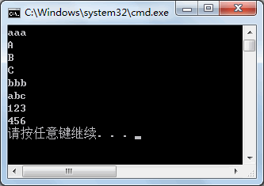
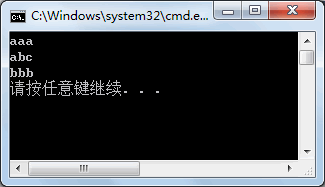
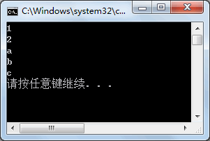
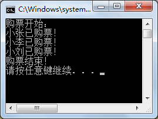
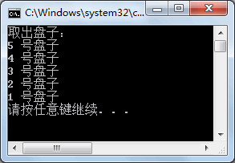
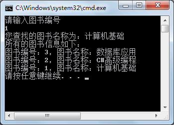
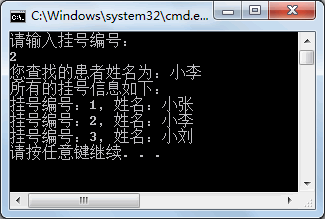

# 集合


集合与数组比较类似，都用于存放一组值，但集合中提供了特定的方法能直接操作集合中的数据，并提供了不同的集合类来实现特定的功能。

集合简单的说就是数组的升级版。他可以动态的对集合的长度（也就是集合内最大元素的个数）进行定义和维护！

所有集合类或与集合相关的接口命名空间都是 System.Collection，在该命名空间中提供的常用接口如下表所示。

| 接口名称              | 作用                                                         |
| --------------------- | ------------------------------------------------------------ |
| IEnumerable           | 用于迭代集合中的项，该接口是一种声明式的接口                 |
| IEnumerator           | 用于迭代集合中的项，该接口是一种实现式的接口                 |
| ICollection           | .NET 提供的标准集合接口，所有的集合类都会直接或间接地实现这个接口 |
| IList                 | 继承自 IEnumerable 和 ICollection 接口，用于提供集合的项列表，并允许访问、查找集合中的项 |
| IDictionary           | 继承自 IEnumerable 和 ICollection 接口，与 IList 接口提供的功能类似，但集 合中的项是以键值对的形式存取的 |
| IDictionaryEnumerator | 用于迭代 IDictionary 接口类型的集合                          |

针对上表中的接口有一些常用的接口实现类，如下表所示。

| 类名称     | 实现接口                                                   | 特点                                                         |
| ---------- | ---------------------------------------------------------- | ------------------------------------------------------------ |
| ArrayList  | ICollection、IList、IEnumerable、ICloneable                | 集合中元素的个数是可变的，提供添加、删除等方法               |
| Queue      | ICollection、IEnumerable、ICloneable                       | 集合实现了先进先出的机制，即元素将在集合的尾部添加、在集合的头部移除 |
| Stack      | ICollection、IEnumerable、ICloneable                       | 集合实现了先进后出的机制，即元素将在集合的尾部添加、在集合的尾部移除 |
| Hashtable  | IDictionary、ICollection、IEnumerable、 ICloneable 等接口  | 集合中的元素是以键值对的形式存放的，是 DictionaryEntry 类型的 |
| SortedList | IDictionary、ICollection、IEnumerable、  ICloneable 等接口 | 与 Hashtable 集合类似，集合中的元素以键值对的形式存放，不同的是该集合会按照 key 值自动对集合中的元素排序 |

## 1.ArrayList 动态数组

ArrayList 类（动态数组）是一个最常用的集合类，与数组的操作方法也是最类似的。

ArrayList 代表了可被单独索引的对象的有序集合。它基本上可以替代一个数组。

但是，与数组不同的是，ArrayList 可以使用索引在指定的位置添加和移除项目，动态数组会自动重新调整它的大小。

同时 ArrayList 也允许在列表中进行动态内存分配、增加、搜索、排序各项。

### 构造方法

创建 ArrayList 类的对象需要使用该类的构造方法，如下表所示。

| 构造方法                 | 作用                                                         |
| ------------------------ | ------------------------------------------------------------ |
| ArrayList()              | 创建 ArrayList 的实例，集合的容量是默认初始容量              |
| ArrayList(ICollection c) | 创建 ArrayList 的实例，该实例包含从指定实例中复制的元素，并且初始容量与复制的元素个数相同 |
| ArrayList(int capacity)  | 创建 ArrayList 的实例，并设置其初始容量                      |

下面分别使用 ArrayList 类的构造器创建 ArrayList 实例，代码如下。

```c#
ArrayList listl=new ArrayList();
ArrayList list2=new ArrayList(listl);
ArrayList list3=new ArrayList(20);
```

在创建 ArrayList 类的实例后，集合中还未存放值。

在 C# 语言中提供了集合初始化器，允许在创建集合实例时向集合中添加元素，代码如下。  

```c#
ArrayList list4 = new ArrayList(){l,2,3,4};
```

在`{}`中的值即集合中存入的值。

集合与数组一样也能使用 foreach 语句遍历元素。

由于在集合中存放的值允许是任意类型，能使用 var 关键字来定义任意类型的变量。

遍历 list4 集合中的数据的代码如下。  

```c#
foreach(var v in list4)
{
    Console.WriteLine(v);
}
```

执行上面的代码，即可将集合 list4 中的元素输岀。

在 ArrayList 类中提供了很多属性和方法供开发人员调用，以便简化更多的操作。

### 常用方法

ArrayList 类中常用的属性和方法如下表所示。  

| 属性或方法                                                  | 作用                                                         |
| ----------------------------------------------------------- | ------------------------------------------------------------ |
| int Add(object value)                                       | 向集合中添加 object 类型的元素，返回元素在集合中的下标       |
| void AddRange(ICollection c)                                | 向集合中添加另一个集合 c                                     |
| Capacity                                                    | 属性，用于获取或设置集合中可以包含的元素个数                 |
| void Clear()                                                | 从集合中移除所有元素                                         |
| bool Contains(object item)                                  | 判断集合中是否含有 item 元素，若含有该元素则返回 True, 否则返回 False |
| void CopyTo(Array array)                                    | 从目标数组 array 的第 0 个位置开始，将整个集合中的元素复制到类型兼容的数组 array 中 |
| void CopyTo(Array array,int arraylndex)                     | 从目标数组 array 的指定索引 arraylndex 处，将整个集合中的元素赋值到类型兼容的数组 array 中 |
| void CopyTo(int index,Array array,int arrayIndex,int count) | 从目标数组 array 的指定索引 arrayindex 处，将集合中从指定索引 index 开始的 count 个元素复制到类型兼容的数组 array 中 |
| Count                                                       | 属性，用于获取集合中实际含有的元素个数                       |
| int IndexOf(object value)                                   | 返回 value 值在集合中第一次出现的位置                        |
| int IndexOf(object value,int startIndex)                    | 返回 value 值在集合的 startindex 位置开始第一次出现的位置    |
| int IndexOf(object value,int startIndex,int count)          | 返回 value 值在集合的 startindex 位置开始 count 个元素中第一次出现的位置 |
| int LastIndexOf(object value)                               | 返回 value 值在集合中最后一次出现的位置                      |
| int LastIndexOf(object value,int startIndex)                | 返回 value 值在集合的 startindex 位置开始最后一次出现的位置  |
| int LastIndexOf(object value,int startIndex,int count)      | 入元素 value值在集合的 startindex 位置开始 count 个元素中最后一次出现的位置 |
| void Insert(int index,object value)                         | 返回 value 向集合中的指定索引 index 处插                     |
| void InsertRange(int index,ICollection c)                   | 向集合中的指定索引 index 处插入一个集合                      |
| void Remove(object obj)                                     | 将指定元素 obj 从集合中移除                                  |
| void RemoveAt(int index)                                    | 移除集合中指定位置 index 处的元素                            |
| void RemoveRange(int index,int count)                       | 移除集合中从指定位置 index 处的 count 个元素                 |
| void Reverse()                                              | 将集合中的元素顺序反转                                       |
| void Reverse(int index,int count)                           | 将集合中从指定位置 index 处的 count 个元素反转               |
| void Sort()                                                 | 将集合中的元素排序，默认从小到大排序                         |
| void Sort(IComparer comparer)                               | 将集合中的元素按照比较器 comparer 的方式排序                 |
| void Sort(int index,int count,IComparer comparer)           | 将集合中的元素从指定位置 index 处的 count 个元素按照比较器 comparer 的方式排序 |
| void TrimToSize()                                           | 将集合的大小设置为集合中元素的实际个数                       |

下面通过实例来演示 ArrayList 类中属性和方法的使用。

定义 ArrayList 集合，在集合中存入任意值，完成如下操作。

* 查找集合中是否含有 abc 元素。
* 将集合中元素下标是偶数的元素添加到另一个集合中。
* 在集合中第一个元素的后面任意插入 3 个元素。
* 将集合中的元素使用 Sort 方法排序后输出。

#### 实例1 - IndexOf

是查找集合中的元素，使用 IndexOf 或者 LastlndexOf 都可以，代码如下。

```c#
class Program
{
    static void Main(string[] args)
    {
        ArrayList list = new ArrayList() { "aaa", "bbb", "abc", 123, 456 };
        int index = list.IndexOf("abc");
        if (index != -1)
        {
            Console.WriteLine("集合中存在 abc 元素！");
        }
        else
        {
            Console.WriteLine("集合中不存在 abc 元素！");
        }
    }
}
```

执行上面的代码，效果如下图所示。


#### 实例2 - Add

将集合中下标为偶数的元素添加到另一个集合中，由于集合中共有 5 个元素，则所添加元素的下标分别为 0、2、4。

向集合中添加元素使用Add方法即可，代码如下。

```c#
class Program
{
    static void Main(string[] args)
    {
        ArrayList list = new ArrayList() { "aaa", "bbb", "abc", 123, 456 };
        ArrayList newList = new ArrayList();
        for(int i = 0; i < list.Count; i = i + 2)
        {
            newList.Add(list[i]);
        }
        foreach(var v in newList)
        {
            Console.WriteLine(v);
        }
    }
}
```

执行上面的代码，效果如下图所示。


从上面的执行效果可以看出，newList 集合中的元素是 list 集合中下标为偶数的元素。

#### 实例3 - Insert 

在集合中的第一个元素后面添加元素，使用 Insert 方法每次只能添加一个元素，但使用 InsertRange 方法能直接将一个集合插入到另一个集合中。

在本例中使用的是 InsertRange 方法，代码如下。

```c#
class Program
{
    static void Main(string[] args)
    {
        ArrayList list = new ArrayList() { "aaa", "bbb", "abc", 123, 456 };
        ArrayList insertList = new ArrayList() { "A", "B", "C" };
        list.InsertRange(1, insertList);
        foreach(var v in list)
        {
            Console.WriteLine(v);
        }
    }
}
```

执行上面的代码，效果如下图所示。



从上面的执行效果可以看出，已经在原有集合 list 中的第一个元素后面加入了 3 个元素。

#### 实例4 - Sort

将集合中的元素使用 Sort 方法排序后输出。

如果使用 Sort 方法对集合中的元素排序，则需要将集合中的元素转换为同一类型才能比较，否则会出现无法比较的异常。

这里创建一个 ArrayList，并在其中存入字符串类型的值，再使用 Sort 方法排序，代码如下。

```c#
class Program
{
    static void Main(string[] args)
    {
        ArrayList list = new ArrayList() { "aaa", "bbb", "abc" };
        list.Sort();
        foreach(var v in list)
        {
            Console.WriteLine(v);
        }
    }
}
```

执行上面的代码，效果如下图所示。



从上面的执行效果可以看出，Sort 方法将集合中的元素按照字母的 `ASCII` 码从小到大排序，相当于字母的顺序。

如果需要将所得到的值按照从大到小的顺序排序，则可以在使用过 Sort 方法后再使用 Reverse 方法将元素倒置。

字符串类型的值不能直接使用大于、小于的方式比较，要使用字符串的 CompareTo 方法，该方法的返回值是 int 类型，语法形式如下。

```c#
字符串1.CompareTo(字符串2);
```
当字符串 1 与字符串 2 相等时结果为 0；

当字符串 1 的字符顺序在字符串 2 前面时结果为 -1;

当字符串 1 的字符顺序在字符串 2 后面时结果为1。

在由多个字符组成的字符串中，首先比较的是两个字符串的首字母，如果相同则比较第二个字符，依此类推，如果两个字符串的首字母不同，则不再比较后面的字符。

在 ArrayList 类中常用的属性和方法表中列出的 Sort 方法中，Sort 方法能传递 IComparer 类型的参数。

IComparer 类型的参数是自定义的比较器，要求使用一个类来实现 IComparer 接口，并实现其中的 Compare 方法。

下面通过实例来完成用自定义比较器实现排序的操作。

#### 实例5 - Sort (自定义)

定义一个 ArrayList 类型的集合，并在其中任意存放 5 个值，使用 Sort 方法完成排序并输岀结果。

根据题目要求，由于没有在集合中指定统一的数据类型，需要用自定义比较器来完成排序，自定义比较器类 MyCompare，代码如下。

```c#
class MyCompare :IComparer
{
    public int Compare(object x,object y)
    {
        string str1 = x.ToString();
        string str2 = y.ToString();
        return str1.CompareTo(str2);
    }
}
```

在上面的代码中，对于 Compare 方法，当比较的两个值 x 和 y 相等时返回 0,当 x>y 时返回值大于 0,当 x<y 时返回值小于 0。

由于 CompareTo 方法的返回值与 Compare 方法的返回值的计算方法相同，因此，直接返回 CompareTo 的比较结果即可满足对两个值从小到大的比较操作。

如果需要返回的是从大到小的比较结果，则只需要将比较的两个值调换顺序即可，即`return str2.CompareTo(strl);`。

在 ArrayList 集合中使用带自定义比较器的 Sort 方法，代码如下。  

```c#
class Program
{
    static void Main(string[] args)
    {
        ArrayList list = new ArrayList() { "a", "b", "c", 1, 2 };
        MyCompare myCompare = new MyCompare();//创建自定义比较器实例
        list.Sort(myCompare);
        foreach(var v in list)
        {
            Console.WriteLine(v);
        }
    }
}
```

执行上面的代码，效果如下图所示。



从上面的执行效果可以看出，虽然在 ArrayList 集合中存放了不同类型的值，但通过在自定义比较器中将所有的值转换为字符串类型并进行比较，使用 Sort 方法即可完成排序操作。

## 2.Queue 队列 (先进先出)

Queue (队列) 是常见的数据结构之一，队列是一种<u>***先进先出***</u>的结构，即元素从队列尾部插入，从队列的头部移除，类似于日常生活中的站队，先到先得的效果。

集合中的 Queue 类模拟了队列操作，提供了队列中常用的属性和方法。

### 构造方法

Queue 类提供了 4 个构造方法，如下表所示。

| 构造方法                              | 作用                                                         |
| ------------------------------------- | ------------------------------------------------------------ |
| Queue()                               | 创建 Queue 的实例，集合的容量是默认初始容量 32 个元素，使用默认的增长因子 |
| Queue(ICollection col)                | 创建 Queue 的实例，该实例包含从指定实例中复制的元素，并且初始容量与复制的元素个数、增长因子相同 |
| Queue(int capacity)                   | 创建 Queue 的实例，并设置其指定的元素个数，默认增长因子      |
| Queue(int capacity, float growFactor) | 创建 Queue 的实例，并设置其指定的元素个数和增长因子          |

增长因子是指当需要扩大容量时，以当前的容量（capacity）值乘以增长因子（growFactor）的值来自动增加容量。

下面使用上表中的构造方法来创建 Queue 的实例，代码如下。

```c#
//第 1 中构造器
Queue queueq1 = new Queue();
//第 2 中构造器
Queue queueq2 = new Queue(queue1);
//第 3 中构造器
Queue queueq3 = new Queue(30);
//第 4 中构造器
Queue queueq4 = new Queue(30, 2);
```

与上一节《[C# ArrayList](http://c.biancheng.net/view/2892.html)》中介绍的 ArrayList 类不同，Queue 类不能在创建实例时直接添加值。

### 属性和方法

Queue类中常用的属性和方法如下表所示。

| 属性或方法                          | 作用                                                   |
| ----------------------------------- | ------------------------------------------------------ |
| Count                               | 属性，获取 Queue 实例中包含的元素个数                  |
| void Clear()                        | 清除 Queue 实例中的元素                                |
| bool Contains(object obj)           | 判断 Queue 实例中是否含有 obj 元素                     |
| void CopyTo(Array array, int index) | 将 array 数组从指定索引处的元素开始复制到 Queue 实例中 |
| object Dequeue()                    | 移除并返回位于 Queue 实例开始处的对象                  |
| void Enqueue(object obj)            | 将对象添加到 Queue 实例的结尾处                        |
| object Peek()                       | 返回位于 Queue 实例开始处的对象但不将其移除            |
| object[] ToArray()                  | 将 Queue 实例中的元素复制到新数组                      |
| void TrimToSize()                   | 将容量设置为 Queue 实例中元素的实际数目                |
| IEnumerator GetEnumerator()         | 返回循环访问 Queue 实例的枚举数                        |

下面通过实例来演示 Queue 类的使用。

### 实例

#### 实例1- Enqueue 插入到结尾

创建 Queue 类的实例，模拟排队购电影票的操作。

根据题目要求，先向队列中加入 3 个元素，然后再依次购票。实现代码如下。

```c#
class Program
{
    static void Main(string[] args)
    {
        Queue queue = new Queue();
        //向队列中加入3为购票人
        queue.Enqueue("小张");
        queue.Enqueue("小李");
        queue.Enqueue("小刘");
        Console.WriteLine("购票开始：");
        //当队列中没有人时购票结束
        while (queue.Count != 0)
        {
            Console.WriteLine(queue.Dequeue() + "已购票！");
        }
        Console.WriteLine("购票结束！");
    }
}
```

执行上面的代码，效果如下图所示。



从上面的执行效果可以看出，在从队列中取值时与存入队列中的值顺序是相同的。

#### 实例2 - ToArray 变成数组

向 Queue 类的实例中添加 3 个值，在不移除队列中元素的前提下将队列中的元素依次输出。

根据题目要求，可以使用 ToArray() 方法将 Queue 类的实例中存放的值复制到数组后再遍历数组。实现的代码如下。

```c#
class Program
{
    static void Main(string[] args)
    {
        Queue queue = new Queue();
        queue.Enqueue("aaa");
        queue.Enqueue("bbb");
        queue.Enqueue("ccc");
        object[] obj = queue.ToArray();
        foreach(var v in obj)
        {
            Console.WriteLine(v);
        }
    }
}
```

执行上面的代码，效果如下图所示。


#### 实例3 - GetEnumerator 枚举数

除了使用 ToArray() 方法以外，还可以使用 GetEnumerator() 方法来遍历，实现的代码如下。

```c#
class Program
{
    static void Main(string[] args)
    {
        Queue queue = new Queue();
        queue.Enqueue("aaa");
        queue.Enqueue("bbb");
        queue.Enqueue("ccc");
        IEnumerator enumerator = queue.GetEnumerator();
        while (enumerator.MoveNext())
        {
            Console.WriteLine(enumerator.Current);
        }
    }
}
```

执行上面的代码，效果与使用 ToArray() 所示的效果相同。在实际应用中，我们可以自由选择上面两种方法。

## 3.Stack 堆栈 (先进后出)

Stack (栈)是常见的数据结构之一，栈是一种先进后出的结构，即元素从栈的尾部插入，从栈的尾部移除，类似于日常生活中搬家的时候装车，先装上车的东西要后拿下来。

集合中的 Stack 类模拟了栈操作，提供了栈中常用的属性和方法。

### 构造方法

Stack 类提供了 3 种构造方法，如下表所示。

| 构造方法               | 作用                                                         |
| ---------------------- | ------------------------------------------------------------ |
| Stack()                | 使用初始容量创建 Stack 的对象                                |
| Stack(ICollection col) | 创建 Stack 的实例，该实例包含从指定实例中复制的元素，并且初始容量与复制的元素个数、增长因子相同 |
| Stack(int capacity)    | 创建 Stack 的实例，并设置其初始容量                          |

### 常用方法

Stack 类中的常用属性和方法如下表所示。

| 属性或方法           | 作用                                       |
| -------------------- | ------------------------------------------ |
| Push(object obj)     | 向栈中添加元素，也称入栈                   |
| object Peek()        | 用于获取栈顶元素的值，但不移除栈顶元素的值 |
| object Pop()         | 用于移除栈顶元素的值，并移除栈顶元素       |
| Clear()              | 从 Stack 中移除所有的元素                  |
| Contains(object obj) | 判断某个元素是否在 Stack 中                |
| object[] ToArray()   | 复制 Stack 到一个新的数组中                |

下面通过实例来演示 Stack 类的使用。

### 实例

创建一个栈（Stack），模拟餐馆盘子的存取。

根据题目要求，先在栈中按顺序放置 5 个盘子，再将所有盘子取出，取盘子时应先取最上面的盘子，与栈的存取原理一致。具体的代码如下。

```c#
class Program
{
    static void Main(string[] args)
    {
        Stack stack = new Stack();
        //向栈中存放元素
        stack.Push("1 号盘子");
        stack.Push("2 号盘子");
        stack.Push("3 号盘子");
        stack.Push("4 号盘子");
        stack.Push("5 号盘子");
        Console.WriteLine("取出盘子：");
        //判断栈中是否有元素
        while(stack.Count != 0)
        {
            //取出栈中的元素
            Console.WriteLine(stack.Pop());
        }
    }
}
```

执行上面的代码，效果如下图所示。



从上面的执行效果可以看出，通过 Stack 类提供的 Pop 方法可以依次从栈顶取出栈中的每一个元素。

## 4.Hashtable (哈希表)

  Hashtable 类实现了 IDictionary 接口，集合中的值都是以键值对的形式存取的。

C# 中的 Hashtable 称为哈希表，也称为散列表，在该集合中使用键值对（key/value）的形式存放值。

换句话说，在 Hashtable 中存放了两个数组，一个数组用于存放 key 值，一个数组用于存放 value 值。

此外，还提供了根据集合中元素的 key 值查找其对应的 value 值的方法。

### 构造方法

Hashtable 类提供的构造方法有很多，最常用的是不含参数的构造方法，即通过如下代码来实例化 Hashtable 类。  

```c#
Hashtable 对象名 = new Hashtable ();
```

### 常用方法

Hashtable 类中常用的属性和方法如下表所示。

| 属性或方法                        | 作用                                  |
| --------------------------------- | ------------------------------------- |
| Count                             | 集合中存放的元素的实际个数            |
| void Add(object key,object value) | 向集合中添加元素                      |
| void Remove(object key)           | 根据指定的 key 值移除对应的集合元素   |
| void Clear()                      | 清空集合                              |
| ContainsKey (object key)          | 判断集合中是否包含指定 key 值的元素   |
| ContainsValue(object value)       | 判断集合中是否包含指定 value 值的元素 |

下面通过实例演示 Hashtable 类的使用。

### 实例

使用 Hashtable 集合实现图书信息的添加、查找以及遍历的操作。

根据题目要求，先向 Hashtable 集合中添加 3 个值，再根据所输入的 key 值查找图书名称，最后遍历所有的图书信息，代码如下。

```c#
class Program
{
    static void Main(string[] args)
    {
        Hashtable ht = new Hashtable();
        ht.Add(1, "计算机基础");
        ht.Add(2, "C#高级编程");
        ht.Add(3, "数据库应用");
        Console.WriteLine("请输入图书编号");
        int id = int.Parse(Console.ReadLine());
        bool flag = ht.ContainsKey(id);
        if (flag)
        {
            Console.WriteLine("您查找的图书名称为：{0}", ht[id].ToString());
        }
        else
        {
            Console.WriteLine("您查找的图书编号不存在！");
        }
        Console.WriteLine("所有的图书信息如下：");
        foreach(DictionaryEntry d in ht)
        {
            int key = (int)d.Key;
            string value = d.Value.ToString();
            Console.WriteLine("图书编号：{0}，图书名称：{1}", key, value);
        }
    }
}
```

执行上面的代码，效果如下图所示。



从上面的执行效果可以看出，在使用 Hashtable 时能同时存放 key/value 的键值对，由于 key 值是唯一的，因此可以根据指定的 key 值查找 value 值。

## 5.SortedList (有序列表)

  SortedList 类实现了 IDictionary 接口 ,集合中的值都是以键值对的形式存取的。

C# SortedList 称为有序列表，按照 key 值对集合中的元素排序。

SortedList 集合中所使用的属性和方法与上一节《[C# Hashtable](http://c.biancheng.net/view/2897.html)》中介绍的 Hashtable 比较类似，这里不再赘述。

下面通过实例来演示 SortedList 集合的使用。

> 与`HashTable` 不同的是 `SortedList` 是有序的

### 实例

使用 SortedList 实现挂号信息的添加、查找以及遍历操作。

根据题目要求，向 SortedList 集合中添加 3 位挂号信息（挂号编号、姓名），并根据患者编号查找患者姓名，遍历所有的挂号信息。具体的代码如下。  

```c#
class Program
{
    static void Main(string[] args)
    {
        SortedList sortList = new SortedList();
        sortList.Add(1, "小张");
        sortList.Add(2, "小李");
        sortList.Add(3, "小刘");
        Console.WriteLine("请输入挂号编号：");
        int id = int.Parse(Console.ReadLine());
        bool flag = sortList.ContainsKey(id);
        if (flag)
        {
            string name = sortList[id].ToString();
            Console.WriteLine("您查找的患者姓名为：{0}", name);
        }
        else
        {
            Console.WriteLine("您查找的挂号编号不存在！");
        }
        Console.WriteLine("所有的挂号信息如下：");
        foreach(DictionaryEntry d in sortList)
        {
            int key = (int)d.Key;
            string value = d.Value.ToString();
            Console.WriteLine("挂号编号：{0}，姓名：{1}", key, value);
        }
    }
}
```

执行上面的代码，效果如下图所示。



从上面的执行效果可以看出，SortedList 集合中的元素是按 key 值的顺序排序的。