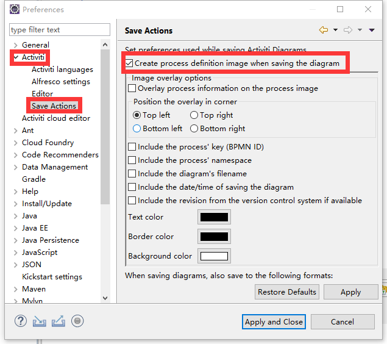

# 1. activiti5 软件环境

1. jdk1.6以上

2. 支持的数据库

   * h2
   * mysql
   * oracle
   * postgres
   * mssql
   * db2

3. activiti5jar包

    [activiti-5.22.0.zip](activiti-5.22.0.zip) 

# 2. Eclipse 中安装插件 Activiti

1. 在eclipse中菜单help->Install New software中，点击add
2. 输入要安装的插件的名字和路径
   * Name:Activiti BPMN 2.0 designer（随便起个名字）
   * Location: http://activiti.org/designer/update/

> * 勾选后,画完流程图可以生成一张图片
>   

# 数据库

mysql5.7

