## 整合管理知识领域概述

|                | **启动过程组**  | **规划过程组**      | **执行过程组**                            | **监控过程组**                         | **收尾过程组**    |
| -------------- | --------------- | ------------------- | ----------------------------------------- | -------------------------------------- | ----------------- |
| **4.整合管理** | 4.1制定项目章程 | 4.2制定项目管理计划 | 4.3指导与管理项目工作 4.4管理项目知识 | 4.5监控项目工作 4.6实施整体变更控制 | 4.7结束项目或阶段 |

> 项目整合管理

项目整合管理包括多隶属于项目管理过程组的各种过程和项目管理活动进行 <u>识别、定义、组合、统一和协调</u>的各个过程。在项目管理中，整合艰巨 <u>统一、合并、沟通和建立联系</u>的性质，这些行为应该 <u>贯穿项目始终</u>

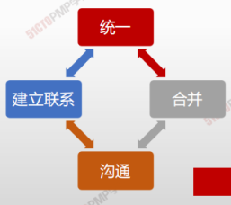

> **项目经理是整合者**

 

整合是指协调与统一。项目整合管理是项目管理的核心，是为了实现项目各要素之间的项目协调，并在互相矛盾、互相竞争的目标中寻找最佳平衡点。

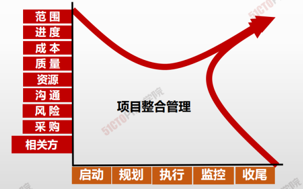

整合管理通过项目资源的整合，将其它领域的相关要素有机地结合在一起，随着项目沿着其生命周期演化，这些**要素将围绕项目的目标而不断结合**起来。其特点：<u>全生命周期、综合性、全局性</u>

> 只要存在结合部，就需要整合。项目管理的思维就是整合

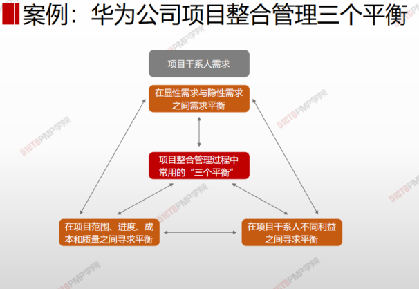

| -    | 知识领域           | 解释                                                         |
| ---- | ------------------ | ------------------------------------------------------------ |
| 4.1  | 制定项目章程       | 编写一份<u>正式批准</u>项目并且<u>授权项目经理</u>在项目活动中使用组织资源的文件的过程。 |
| 4.2  | 制定项目管理计划   | 定义、准备和协调项目计划的<u>所有组成部分</u>，并把它们<u>整合为一份综合项目管理计划</u>的过程。 |
| 4.3  | 指导与管理项目工作 | 为实现项目目标而领导和<u>执行</u>项目管理计划中<u>所确定的工作</u>，并<u>实施已批准变更</u>的过程。 |
| 4.4  | 管理项目知识       | 使用现有知识并生成新知识,以实现项目目标,并且帮助组织学习的过程。 |
| 4.5  | 监控过程           | 跟踪、审查和报告<u>整体项目进展</u>，以实现项目管理计划中确定的绩效目标的过程 |
| 4.6  | 实施整体变更控制   | 审查所有<u>变更</u>请求，<u>批准</u>变更，<u>管理</u>对可交付成果、组织过程资产、项目文件和项目管理计划的变更，并对变更处理结果进行国通的过程。 |
| 4.7  | 结束项目或阶段     | <u>终结</u>项目、阶段或合同的<u>所有</u>活动的过程           |

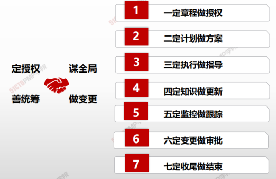

> 七个定
>
> 1. 一定章程做授权
> 2. 二定计划做方案
> 3. 三定执行做指导
> 4. 四定知识做更新
> 5. 五定监控做跟踪
> 6. 六定变更做审批
> 7. 七定收尾做结束

---

# 制定项目章程

> **项目章程：**是**<u>定制一份正式批准</u>项目或阶段的文件，**并记录能反映相关方需要和期望的<u>初步要求</u>的过程。它在项目执行组织与发起组织（或客户，如果是外部项目的话）之间建立起伙伴关系

- 项目章程是组织 <u>正式批准</u>项目的文件,<u>标志着项目的正式启动</u>。
- 项目章程经启动者签字，**即标志着项目获得批准。**
- 项目章程 <u>授权项目经理</u>在活动中动用组织的资源。
- 项目章程可 <u>由发起人编制</u>，或者有项目经理与发起机构合作编制。
- **项目有项目以外的机构来启动**
- **项目启动者或发起人应该具有一定的职权**，能为项目获取资金并提供资源。

## 4W1H

| 4W1H             | 制定项目章程                                                 |
| ---------------- | ------------------------------------------------------------ |
| what 做什么  | 编写一份正式批准项目并授权项目经理在项目活动中使用组织资源的文件。 作用：明确项目与组织战略目标之间的直接联系，确立项目的正式地位，并展 示组织对项目的承诺。 |
| why 为什么做 | 1澄清需求，把协议/SOW转化为项目章程； 2确定项目总体要求，项目概述； 3任命项目经理，授权项目经理可以动用组织资源； 4确定项目成功标准。 |
| who 谁来做   | 项目章程可由发起人编制，或者由项目经理与发起机构合作编制。 必须发起人批准。 |
| how 如何做   | 借鉴过去经验，结合本项目实际。 **专家判断、数据收集、人际关系与团队技能、会议** |

## 输入/工具技术/输出

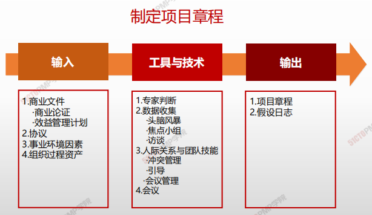

1. 输入
   1. 商业文件
      - 商业论证
      - 效益管理计划
   2. 协议
   3. 事业环境因素
   4. 组织过程资产
2. 工具与技术
   1. 专家判断
   2. 数据收集
      - 头脑风暴
      - 焦点小组
      - 访谈
   3. 人际关系与团队技能
      - 冲突管理
      - 引导
      - 会议管理
   4. 会议

3. 输出
   1. 项目章程
   2. 假设日志

### 输入

#### 商业论证

确定项目是否达到了经济可行性研究的预期结果

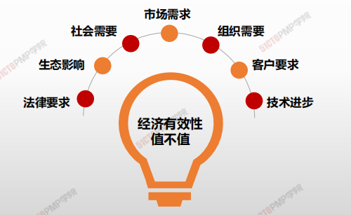

#### 效益管理计划

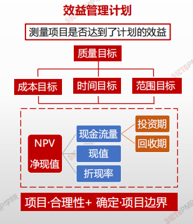

#### 协议

协议定义了项目启动的初衷，协议有很多种形式：

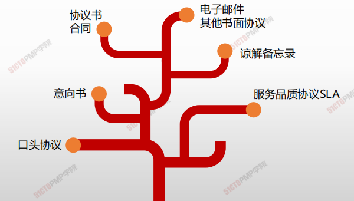

### 工具技术

#### 专家判断

专家判断是有关专家根据自己的知识与经验对问题做出的判断

> 专家判断是最常用的工具与技术

> 专家判断 <u>适用于一切管理和技术工作</u>

> 专家判断来自于 具有相应专业知识、专业实践或培训经历的任何小组或个人

> 专家判断来自执行组织的内部或外部，项目团队的内部或外部

#### 头脑风暴

在短时间内获得大量创意，适用于团队环境，需要引导者进行引导

> 头脑风暴有两个部分构成：创意产生和创意分析

> 正常融洽和不受任何限制的气氛
>
> 打破常规，积极思考，畅所欲言，充分发表看法

#### 焦点小组

召集相关方和主题专家讨论项目风险、成功标准和其他议题，比一对一访谈更有利于互助交流。

> • 群体访谈，可以有6-10个被访谈者参加
>
> • 被访谈者通常是同一个领域的主题专家

> • 由主持人带领被访谈者开展互动讨论，更关注集体意见

#### 访谈

访谈是指通过与相关方直接交谈来了解高层级需求、假设条件、制约因素、审批标准以及其他信息。

> • 提出预设和即兴的问题，并记录他们的回答
>
> • 通常采取“一对一”的访谈，可以1:1(常用)、1:N、N:N

> • 相关方愿意且能说清楚需求
> • 有助于识别和定义项目可交付成果的特征和功能

#### 引导

#### 会议

**会议是指导与管理项目工作、监控项目工作、实施整体变更控制和结束项目或阶段的工具**

- 会议既可以是面对面的，也可以是远程虚拟的。

- 在项目执行、监控和收尾过程中，需要定期或不定期开会。

|                                           | 召开时间                              | 会议目的                                                     |
| ----------------------------------------- | ------------------------------------- | ------------------------------------------------------------ |
| 项目启动会议 （ Initiating Meeting ） | 启动阶段结束时召开项目启 动会议。 | 发布章程、任命项目经理，标志着项目的开始。                   |
| 项目开工会议 （kick-off meeting ）    | 项目管理计划完成后、实施之前。        | • 项目团队成员互相认识。 • 介绍项目背景及计划，正式批准综合性项目管理计划，并在相关方之间达成共识。 • 落实具体项目工作，明确个人和团队职责范围，获得团队成员承诺，为进入项目执行阶段做准备。 |

### 输出

#### 项目章程

- 项目章程是由项目启动者或发起人发布的，正式批准项目成立，并授权项目经理使用组织资源开展项目活动的文件。

- 它记录了关于项目和项目预期交付的产品、服务或成果的高层级信息。

  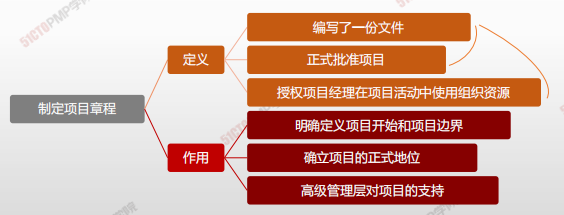

  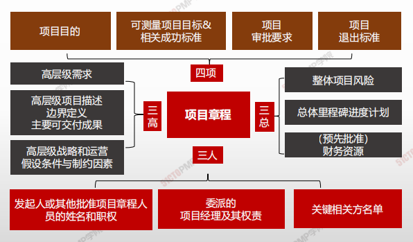

#### 假设日志

- **在项目启动之前编制商业论证时，识别高层级的战略和运营假设条件与制约因素。**
- **这些假设条件与制约因素应纳入项目章程。**
- **较低层级的活动和任务假设条件在项目期间随着诸如定义技术规范、估算、进度和风险等活动的开展而生成。**
- **假设日志用于记录整个项目生命周期中的所有假设条件和制约因素**

# 小结

1. 掌握制定项目章程过程的含义和作用掌握商业论证的意义
2. 了解协议、事业环境因素和组织过程资产对项目启动的重要影响
4. 掌握头脑风暴、焦点小组、访谈等数据收集技术掌握项目章程的含义和包含的主要内容
6. 了解假设日志

---

# 制定项目管理计划

> * **必须做什么？（范围确定）**
> * **什么时候来做？（进度管理）**
> * **有谁来做？（资源落实和保障）** 
> * **必须做的多好？（质量）**
> * **应该怎么做，怎么管，怎么控**

- **项目管理计划确定项目的执行、监控和收尾方式，其<u>内容会因项目所在的应用领域和复杂程度而异</u>。**
- **项目管理计划<u>可以是概括或详细的</u>。**
- **<u>项目管理计划应足够强大</u>，可以应对不断变化的项目环境。**
- **<u>项目管理计划应基准化</u>，即，至少应规定项目的范围、时间和成本方面的基准，以便据此考核项目执行情况和管理项目绩效。**
- **<u>在确定基准之前，可能要对项目管理计划进行多次更新</u>，且这些更新<u>无需遵循正式流程。</u>但是，一旦确定了基准，就只能通过实施整体变更控制过程进行更新。**
- **在项目收尾之前，<u>该计划需要通过不断更新来渐进明细</u>，并且这些更新需要得到控制和批准。**

## 4W1H

| 4W1H             | 制定项目章程                                                 |
| ---------------- | ------------------------------------------------------------ |
| what 做什么  | 定义、准备和协调项目计划的所有组成部分，并把它们整合为一份综合项目管理计划的过程。 <u>作用</u>：生成一份综合文件，用于确定所有项目工作的基础及其执行方式。 |
| why 为什么做 | 制定一个衡量项目的标尺，指导团队如何开展项目管理工作，每份子计划都说明了如何进行该知识领域的项目管理工作。 |
| who 谁来做   | 项目经理带领项目管理团队编写，除了项目进度表由项目经理即管理团队批准外，其它子计划和基准均需公司高管批准。 |
| how 如何做   | 项目管理计划可以是概括或详细的，而每个组成部分的详细程度取决于具体项目的要求。项目管理计划应基准化。对隶属于项目集或项目组合的项目，则应<该制定与项目集或项目组合管理计划相一致的项目管理计划。 专家判断、数据收集、人际关系与团队技能、会议 |

## 输入/工具技术/输出

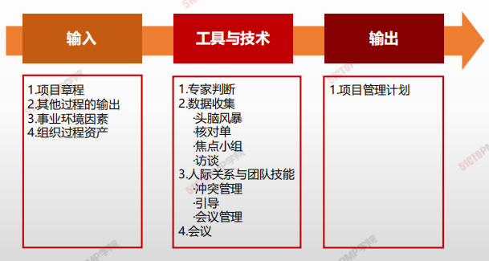

1. 输入
   1. 项目章程
   2. 其他过程的输入
   3. 事业环境因素
   4. 组织过程资产
2. 工具与技术
   1. 专家判断
   2. 数据收集
      - 头脑风暴
      - 核对单
      - 焦点小组
      - 访谈
   3. 人际关系与团队技能
      - 冲突管理
      - 引导
      - 会议管理
   4. 会议

3. 输出
   1. 项目管理加护

### 输出

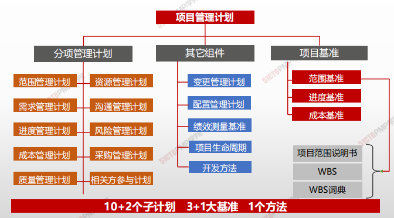

**需求收集 → 确定范围 → 分解范围 → 排列顺序 → 估算资源 → 估算时间 → 考虑人员 → 考虑采购 → 考虑风险 → 确定工期 → 确定成本 → 规划质量 → 规划沟通 → 规划整体变更 → 整合为一 → 得到批准**

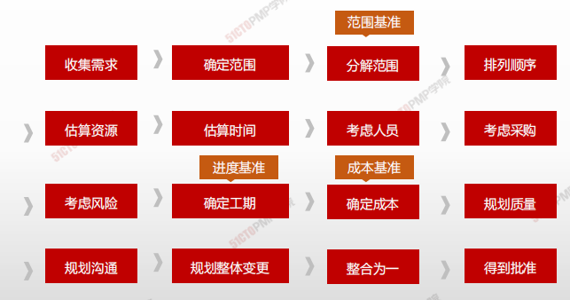

---

# 制定项目管理计划

> * 指导与管理项目工作包括制定计划的项目活动，以完成项目可交付成果并达成既定目标
> * 指导与管理项目工作还要求回顾所有项目变更的影响并实施已经批准的变更，包括纠正措施、预防措施和缺陷补救

## 4W1H

| 4W1H                | 制定项目章程                                                 |
| ------------------- | ------------------------------------------------------------ |
| what 做什么     | 为实现项目目标而领导和执行项目管理计划中所确定的工作，并实施已批准变更。 <u>**作用：**</u>对项目工作和可交付成果开展综合管理，以提高项目成功的可能性。 |
| why 为什么做    | 执行计划的项目活动，以完成项目可交付成果并达成既定目标。     |
| who 谁来做      | 项目经理与项目管理团队。                                     |
| when 什么时候做 | 计划制定后，按照计划执行。                                   |
| how 如何做      | 需要分配可用资源并管理其有效使用，也需要执行因分析工作绩效数据和信息而提出的项目计划变更。指导与管理项目工作过程会受项目所在应用领域的直接影响，按项目管理计划中的规定，开展相关过程，完成项目工作，并产出可交付成果。 <u>**专家判断、项目管理信息系统、会议**</u> |

## 输入/工具技术/输出

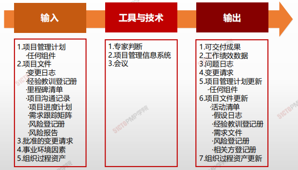

1. 输入
   1. 项目管理计划

      - 任何组件

   2. 项目文件

      - 变更日志

      - 经验教训登记册

      - 里程碑清单

      - 项目沟通记录
      - 项目进度计划
      - 需求跟踪矩阵
      - 风险登记册
      - 风险报告

   3. 批准的变更请求

   4. 事业环境因素

   5. 组织过程资产
2. 工具与技术
   1. 专家判断
   2. 项目管理信息系统
   3. 会议
   
3. 输出

   1. 可交付成果
   2. 工作绩效数据
   3. 问题日志
   4. 变更请求
   5. 项目管理计划更新
      - 任何组件
   6. 项目文件更新
      - 活动清单
      - 假设日志
      - 经验教训登记册
      - 相关方登记册
   7. 组织过程资产更新

### 工具与技术

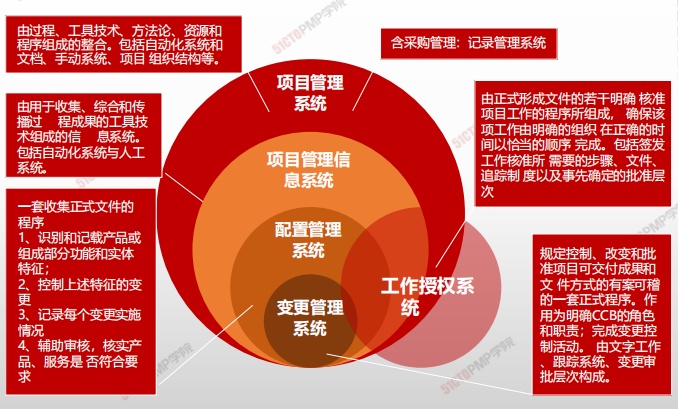

### 输出

#### 可交付成果

在完成某一过程、阶段或项目是**必须产出**的任何**独特**的并**可核实**的产品、成果或服务能力。

> 可交付成果的形式也是多种多样的，有些是有形的，可直接验证的；而有些却是无形的，抽象的服务。

> * IT项目可交付成果
> * 一个IT项目的可交付成果可以是文档、端口、一个系统架构、一个完整的系统等等。

> 完成第一版是，就应该使用变更控制；
>
> 用配置管理工具和程序对可交付成果进行多版本控制；

#### 问题日志

问题日志可以帮助项目经理有效跟进和管理问题，确保得到调查和解决。

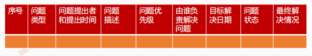

- 作为本过程的输出，问题日志首次被创建，尽管在项目期间任何时候都可能发生问题。

# 小结

1. 指导与管理项目工作过程执行的是项目管理计划和已批准的变更请求，并在过程中收集项目绩效数据

2. 项目的大多数预算和资源都耗费于此，投入最高

3. 项目管理信息系统PMIS的组成和作用

4. 可交付成果必须可核实，符合质量预期

5. 问题日志是一种记录和持续跟进所有问题的项目文件，**1.** 

  **管理项目知识是利用已有的组织知识来改进项目成果，**

  **并且使当前项目创造的知识可用于支持组织运营和未**

  **来的项目或阶段**

  **2.** 

  **知识的两种分类：显性和隐形知识**

  **3.** 

  **项目创造出新的知识应该随时记录到经验教训登记册**

  **4.** 

  **知识管理这个工具和技术主要是利用人际互动来管理**

  **隐形知识**

  **5.** 

  **信息管理这个工具和技术用于管理显性知识**

  **6.** 

  **加入互动功能，更有利于信息获取和分享**

  **7.** 

  **在项目或阶段结束时，把相关信息归入经验教训知识**

  **库，成为组织过程资产的一部分**应责任到人，落实到位

---

# 05.管理项目知识

## 管理项目知识

> * 知识通常分为“显性知识”和“隐性知识”两种。
> * 知识管理指管理显性和隐性知识，旨在重复使用现有知识并生成新知识。有助于达成这两个目的的关键活动是知识分享和知识集成（不同领域的知识、情境知识和项目管理知识）。

> **显性知识：**
>
> **易使用文字、图片和数字进行编撰的知识**
>
> **隐性知识：**
>
> **个体知识以及难以明确表达的知识，如信念、洞察力、经验和“诀窍”**

> **如何分享知识？**
>
> 从组织的角度来看，知识管理指的是确保项目团队和其他相关方的技能、经验和专业知识在项目开始之前、开展期间和结束之后得到运用。
>
> **知识管理最重要的环节就是营造一种相互信任的氛围**，**激励人们分享知识或关注他人的知识**。
>
> 在实践中，联合使用知识管理工具和技术（用于人际互动）以及信息管理工具和技术（用于编撰显性知识）来分享知识。

### 4W1H

| 4W1H                 | 制定项目章程                                                                                                              |
| -------------------- | ------------------------------------------------------------------------------------------------------------------- |
| 
what 做什么
   | 
使用现有知识并生成新知识，以实现项目目标，并且帮助组织学习的过程。 <strong>作用：</strong>利用已有的组织知识来创造或改进项目成果，并且使当前项目创造的知识可用于支持组织运营和未来的项目或阶段。
 |
| 
why 为什么做
   | 管理显性和隐性知识，旨在重复使用现有知识并生成新知识。有助于达成这两个目的的关键活动是知识分享和知识集成（不同领域的知识、情境知识和项目管理知识）。                                          |
| 
who 谁来做
    | 项目经理与项目管理团队。                                                                                                        |
| 
when 什么时候做
 | 本过程需要在整个项目期间开展                                                                                                      |
| 
how 如何做
    | 
在实践中，联合使用知识管理工具和技术（用于人际互动）以及信息管理工具和技术（用于编撰显性知识）来分享知识。 <strong>专家判断、知识管理、信息管理、人际关系与团队技能</strong>
           |

### 输入/工具技术/输出

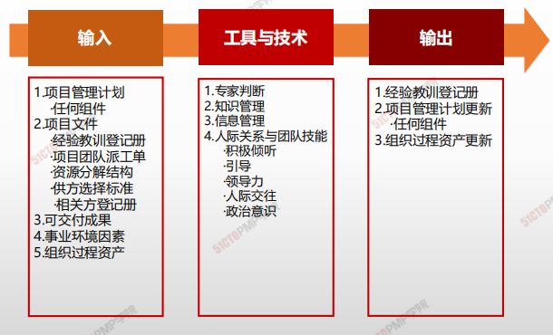

1. 输入
   1. 项目管理计划
      * 任何组件
   2. 项目文件
      * 经验教训登记册

* 项目团队派工单 - 项目分解结构
* 供方选择标准 - 相关方登记册
  3. 可交付成果
  4. 事业环境因素
  5. 组织过程资产

2. 工具与技术
   1. 专家判断
   2. 知识管理
   3. 信息管理
   4. 人际关系与团队技能
      * 积极倾听
      * 引导
      * 领导力
      * 人际交往
      * 政治意识
3. 输出
   1. 经验教训登记册
   2. 项目管理计划更新
   3. 组织过程资产更新

### 文件实例

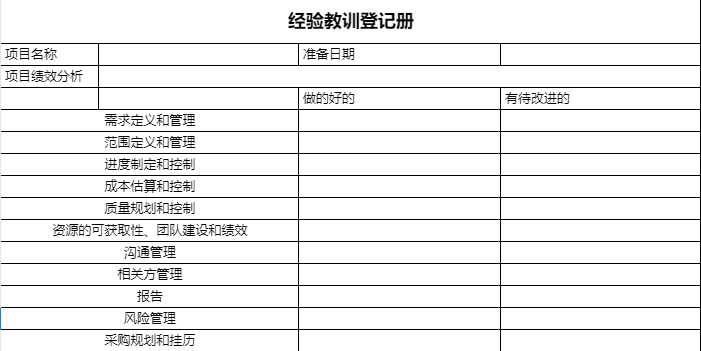

## 小结

1. 管理项目知识是利用已有的组织知识来改进项目成果，并且使当前项目创造的知识可用于支持组织运营和未来的项目或阶段
2. 知识的两种分类：显性和隐形知识
3. 项目创造出新的知识应该随时记录到经验教训登记册
4. 知识管理这个工具和技术主要是利用人际互动来管理隐形知识
5. 信息管理这个工具和技术用于管理显性知识
6. 加入互动功能，更有利于信息获取和分享
7. 在项目或阶段结束时，把相关信息归入经验教训知识库，成为组织过程资产的一部分

---

# 06.监控项目工作

## 制定项目管理计划

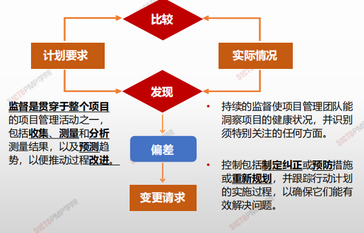

> * **监督是贯穿于整个项目**的项目管理活动之一，包括**收集、测量和分析**测量结果，以及 **预测**趋势，以便推动过程\*\*改进\*\*
> * 持续的监督使项目管理团队能洞察项目的健康状况，并识别须要特殊关注的任何方面。
> * 控制包括\*\*制定纠正**或**预防**措施或**重新规划\*\*，并跟踪行动计划的实施过程，以确保它们能有效解决问题

### 4W1H

| 4W1H                 | 制定项目章程                                                                                                                     |
| -------------------- | -------------------------------------------------------------------------------------------------------------------------- |
| 
what 做什么
   | 
跟踪、审查和报告整体项目进展，以实现项目管理计划中确定的绩效目标的过程。 <strong>作用：</strong>让相关方了解项目的当前状态并认可为处理绩效问题而采取的行动，以及通过成本和进度预测，让相关方了解未来项目状态。
 |
| 
why 为什么做
   | 持续的监督使项目管理团队能洞察项目的健康状况，并识别须特别关注的任何方面。                                                                                      |
| 
who 谁来做
    | 项目经理与项目管理团队。                                                                                                               |
| 
when 什么时候做
 | 本过程需要在整个项目期间开展。                                                                                                            |
| 
how 如何做
    | 
包括收集、测量和分析测量结果，以及预测趋势，以便推动过程改进。 <strong>专家判断、数据分析、决策、会议</strong>
                                                 |

### 输入/工具技术/输出

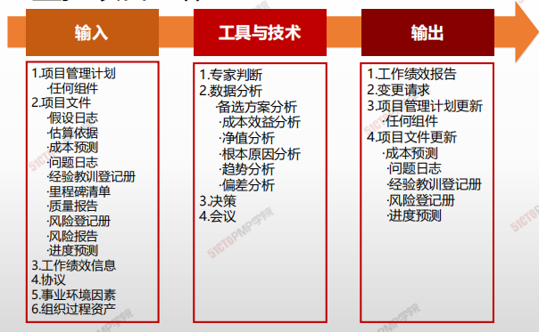

1. 输入
   1. 项目管理计划
      * 任何组件
2. 项目文件
   * 假设日志
   * 估算依据
   * 成本预测
   * 问题日志
   * 经验教训登记册
   * 里程碑清单
   * 质量报告
     * 风险等级册
     * 风险报告
     * 进度预测
   * 工作绩效信息
   * 协议
3. 事业环境因素 6. 组织过程资产
4. 工具与技术
   1. 专家判断
   2. 数据分析
      * 备选方案分析
      * 成本效益分析
      * 净值分析
      * 根本原因分析
      * 趋势分析
      * 偏差分析
   3. 决策
   4. 会议
5. 输出
   2. 工作绩效报告
   3. 变更请求
   4. 项目管理计划更新
      * 任何组件
   5. 项目文件更新
      * 成本预测
      * 问题日志
      * 经验教训登记册
      * 风险登记册
      * 进度预测
   6. 组织过程资产更新

#### 工具与技术

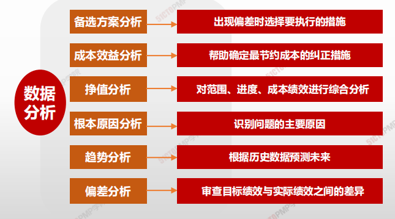

#### 输出

**工作绩效报告**

为制定决策、采取行动或引起关注而汇编工作绩效信息所形成的实物或电子项目文件。

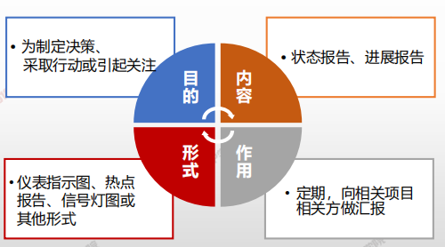

*

## 小结

1. 监控覆盖全局：启动、规划、执行、收尾等
2. 偏差分析就是审查目标绩效与实际绩效之间的差异或偏差
3. 趋势分析就是根据以往结果预测未来绩效，如进度或成本
4. 偏差分析关注现在，趋势分析关注未来，趋势分析通常基于偏差分析
5. 各个子监控过程的工作绩效数据汇编成工作绩效报告
6. 监控项目工作过程的一项重要输出是变更请求

---

# 制定项目管理计划

- 实施整体变更控制过程贯穿项目始终，项目经理对此承担最终责任。
- 在整个项目生命周期的任何时间，参与项目的任何相关方都可以提出变更请求
- 尽管也可以口头提出，但所有变更请求都必须以书面形式记录，并纳入变更管理和配置管理系统中。
- 每项记录在案的变更请求都必须由一位责任人批准、推迟或否决，这个责任人通常是项目发起人或项目经理。必要时，应该由变更控制委员会（CCB）来开展实施整体变更控制过程。
- 变更请求得到批准后，可能要求调整项目管理计划和其他项目文件。
- 某些特定的变更请求，在CCB批准之后，可能还需要得到客户或发起人的批准。

## 4W1H

| 4W1H                | 制定项目章程                                                 |
| ------------------- | ------------------------------------------------------------ |
| what 做什么     | 审查所有变更请求、批准变更，管理对可交付成果、项目文件和项目管理计划的变更，并对变更处理结果进行沟通的过程。 <u>**作用：**</u>确保对项目中已记录在案的变更做综合评审。 |
| why 为什么做    | 如果不考虑变更对整体项目目标或计划的影响就开展变更，往往会加 |
| who 谁来做      | 项目管理团队进行，不涉及基准的、有储备的变更项目团队批准； 涉及基准的无储备的变更由CCB批准。 |
| when 什么时候做 | 本过程需要在整个项目期间开展。                               |
| how 如何做      | 遵循整体变更控制流程、步骤，审查对项目文件、可交付成果或项目管理计划的所有变更请求，并决定对变更请求的处置方案。 专家判断、变更控制工具、数据分析、决策、会议 |

## 输入/工具技术/输出

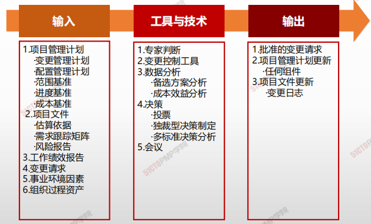

1. 输入
   1. 项目管理计划

      - 变更管理计划
      - 配置管理计划
      - 范围基准
      - 进度基准
      - 成本基准
   2. 项目文件
      - 估算依据
      - 需求跟踪矩阵
      - 风险报告
   3. 工作绩效报告
   4. 变更请求
   5. 事业环境因素
   6. 组织过程资产
2. 工具与技术
   1. 专家判断
   2. 变更控制工具
   3. 数据分析
      - 备选方案分析
      - 成本效益分析
   4. 决策
      - 投票
      - 独裁型决策制定
      - 多标准决策分析
   5. 会议
3. 输出
   1. 批准的变更请求
   2. 项目管理计划更新
   3. 项目文件更新

### 输入

#### 请求变更

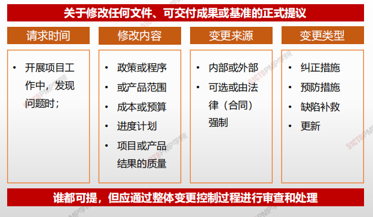

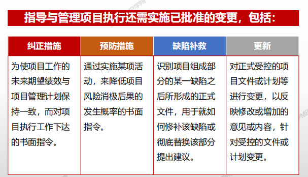

### 工具与技术

#### 变更控制工具

为了便于开展配置和变更管理，可以使用一些手动或自动化的工具。工具应支持以下配置管理活动

### 输出

#### 批准的变更请求

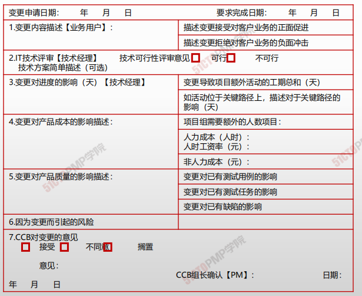

#### 变更日志

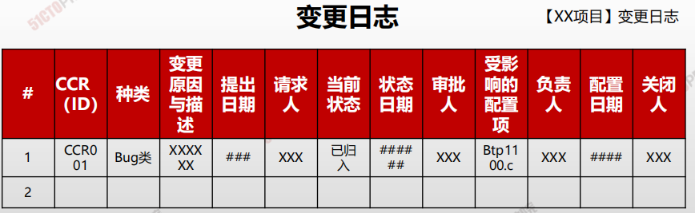

---

# 实施整体变更控制规则

## 实施整体变更控制的态度和规则

### 态度

- 变更是不可避免的
- 积极主动的去影响引起变更要素
- 确保变更对项目有利，尽量防止不必要的变更
- 变更，无论大小，都必须经过实施整体变更控制过程的审批
- 很小的变更，能引起很大的后果

### 规则

- 任何项目相关方都可以提出变更请求
- 变更请求也可口头提出
- 所有的变更请求都必须
  - 以书面形式记录
  - 提交实施整体变更控制过程审批

## **项目变更控制委员会（CCB）的职责**

**是决策机构，不是作业机构。通常，CCB的工作是通过**

**评审手段来决定项目是否变更，但不提出变更方案。**

## **项目经理的职责**

**响应变更提出者的要求，评估变更对项目的影响及应对方案，要求由技术要求转化为资源需求，供授权人决策；**

**依据评审结果实施即调整项目基准，确保项目基准反映项目实施情况**

## 实施整体变更控制总体流程

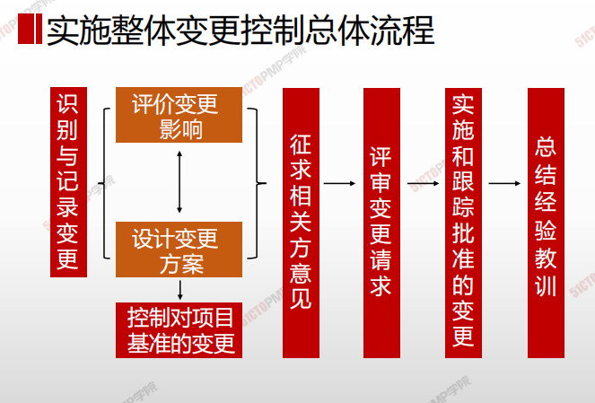

## 实施整体变更控制详细流程

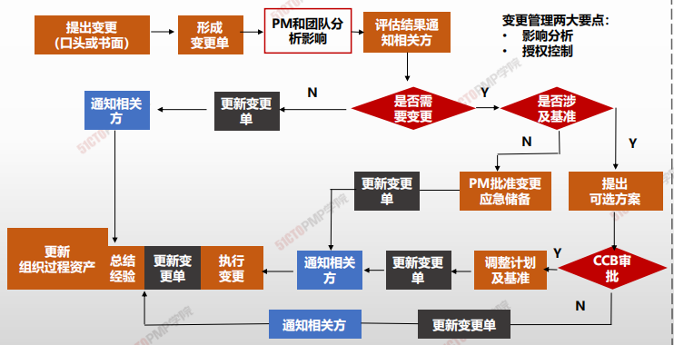

## 变更类型和审批权限

|变更类型| 批准| 备注|
|--|--|--|
|项目章程| 签署或批准该章程的人||
|项目目标或项目基准的变更 |变更控制委员会|PM可分析变更的情况提出意见|
|与合同相关的变更 |客户||
|项目计划内的变更 (可通过赶工或快速跟进来解决) |项目经理||
|紧急情况下变更 |项目经理| 后补相关手续|

## 变更应对分析

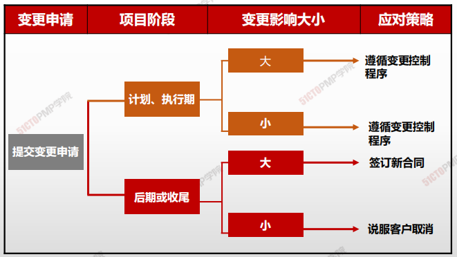

---

# 结束项目或阶段

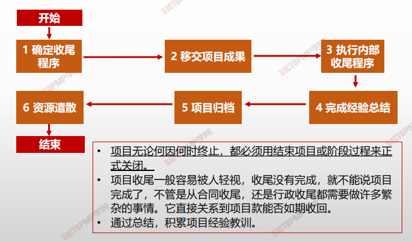

> - 项目无论何因何时终止，都必须用结束项目或阶段过程来正式关闭。
>
> - 项目收尾一般容易被人轻视，收尾没有完成，就不能说项目完成了，不管是从合同收尾，还是行政收尾都需要做许多繁杂的事情。它直接关系到项目款是否能够如期收回
>
> - 通过总结，积累项目经验教训。

## 4W1H

| 4W1H                | 制定项目章程                                                 |
| ------------------- | ------------------------------------------------------------ |
| what 做什么     | 终结项目、阶段或合同的所有活动的过程。 作用：存档项目或阶段信息，完成计划的工作，释放组织团队资源以 展开新的工作。 |
| why 为什么做    | 移交产品、积累经验，留下知识财富，完成现有工作、开展新的工作 |
| who 谁来做      | 项目管理团队/项目团队（如果项目规模比较小的话）。 合同收尾是项目经理和合同管理人员的共同责任。 |
| when 什么时候做 | 项目或阶段末进行，合同收尾在管理收尾之前                     |
| how 如何做      | 在结束项目时，项目经理需要回顾项目管理计划，确保所有项目工作都已完成以及项目目标均已实现。如果项目在完工前就提前终止，结束项目或阶段过程还需要制定程序，来调查和记录提前终止的原因。 **<u>专家判断、数据分析、会议</u>** |

## 输入/工具技术/输出

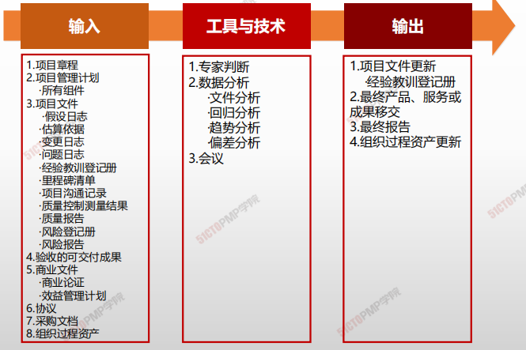

1. 输入

   1. 项目章程
   2. 项目管理计划
      - 所有组件
   3. 项目文件
      - 假设文件
      - 估算依据
      - 变更日志
      - 问题日志
      - 经验教训登记册
      - 里程碑清单
      - 项目沟通记录
      - 质量控制测量结果
      - 质量报告
      - 风险登记册
      - 风险报告
   4. 验收的可交付成果
   5. 商业文件
      - 商业论证
      - 效益管理计划
   6. 协议
   7. 采购文档
   8. 组织过程资产

2. 工具与技术

   1. 专家判断
   2. 数据分析
      - 文件分析
      - 回归分析
      - 趋势分析
      - 偏差分析
   3. 会议

3. 输出

   1. 项目文件更新
      * 经验教训登记册
   2. 最终产品、服务或成果移交
   3. 最终报告
   4. 组织过程资产更新

   

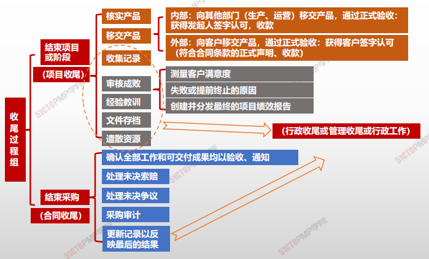

### 输出

#### 最终报告

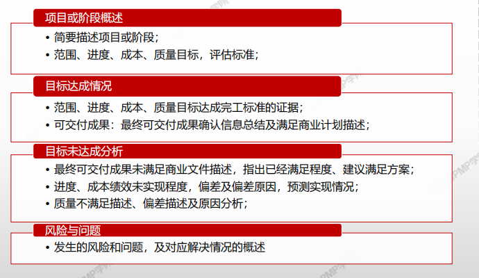

---

