# 范围管理概述

|                | **启动过程组** | **规划过程组**                                            | **执行过程组** | **监控过程组**             | **收尾过程组** |
| -------------- | -------------- | -------------- | --------------------------------------------------------- | -------------- | -------------------------- | -------------- |
| **5.范围管理** |                | 5.1规划范围管理5.2收集需求 5.3定义范围 5.4创建WBS |                | 5.5确认范围 5.6控制范围 |                |

> 确认项目范围管理对项目管理的意义：
>
> 1. **项目范围定义不清往往是导致项目失败的首要原因。**
> 2. 项目范围管理是项目**各项计划、控制的基础**。
> 3. 项目范围管理确定了项目的**具体工作任务**，有助于清楚**责任划分**和**任务派分**。
> 4. **清楚了项目的工作具体范围和具体内容，为提高成本、进度和资源的准确性打下基础。**

## 确定范围：减法思维

- 在追求理想的过程中忍痛割爱，**最终的结果是形成必须交付的工作或服务**。
- 根据约束限制逐步缩减
- 兼顾**约束边界**的互动关系

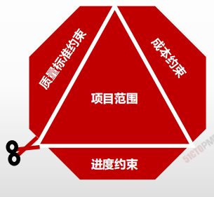

| / | 过程 | 定义 |
| ---- | ---- |---- |
|5.1 |规划范围管理|为记录如何定义、确认和控制项目范围及产品范围，而创建范围管理计划的过程。|
|5.2| 收集需求|为实现项目目标而确定、记录并管理相关方的需要和需求的过程。|
|5.3| 定义范围| 制定项目和产品详细描述的过程。|
|5.4| 创建 WBS|将项目可交付成果和项目工作分解为较小的、更易于管理的组件的过程。|
|5.5 |确认范围| 正式验收已完成的项目可交付成果的过程。|
|5.6 |控制范围 |监督项目和产品的范围状态，管理范围基准变更的过程。|

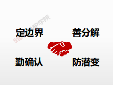

1. **一谋：规划范围—找行动方案**  
2. **收集需求是求全**  
3. **定义范围是求细** 
4. **工作分解是求分**  
5. **确认范围是求果** 
6. **控制范围是求控**

---

# 规划范围管理

## 4W1H

| 4W1H                | 规划范围管理                                                 |
| ------------------- | ------------------------------------------------------------ |
| what 做什么     | 记录如何定义、确认和控制项目范围及产品范围，而创建范围管理计划的过程。 **<u>作用：</u>**在整个项目期间对如何管理范围提供指南和方向。 |
| why 为什么做    | 指导范围管理知识领域其他过程如何开展。                       |
| who 谁来做      | 项目管理团队/项目团队。                                      |
| when 什么时候做 | 制定项目章程后，**范围管理其他过程之前**                     |
| how 如何做      | 制定范围管理计划和细化项目范围始于对下列信息的分析：项目章程中的信息、项目管理计划中已批准的子计划、组织过程资产中的历史信息和相关事业环境因素。 **专家判断、数据分析、会议** |

## 输入/工具技术/输出

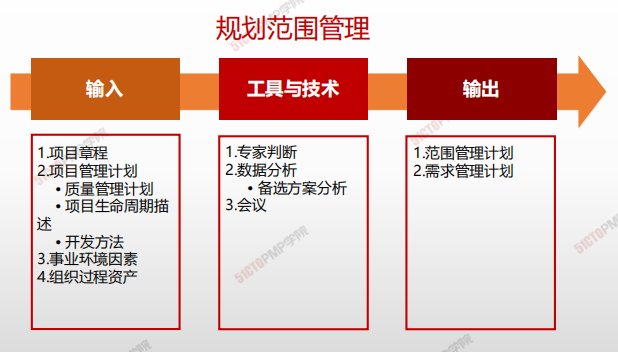

1. 输入
   1. 项目章程
   2. 项目管理计划
      - 质量管理计划
      - 项目生命周期描述
      - 开发方法
   3. 事业环境因素
   4. 组织过程资产
2. 工具与技术
   1. 专家判断
   2. 数据收集
      - 备选方案分析
   3. 会议

3. 输出
   1. 范围管理计划
   2. 需求管理计划

### 输出

#### 范围管理计划

项目范围计划编制：对项目管理团队 **如何管理项目范围** 提供了指导

- 项目管理团队要把与范围相关的决策在项目管理计划中进行记录
- 根据具体项目工作的需要，项目范围管理计划可以是正式的或非正式的、很详细的或粗略的

>  **范围管理计划包括在项目管理计划中，或者是对其的补充范围管理计划**：**描述将如何定义、制定、监督、控制和确认项目范围。**

#### 范围管理计划(模板)

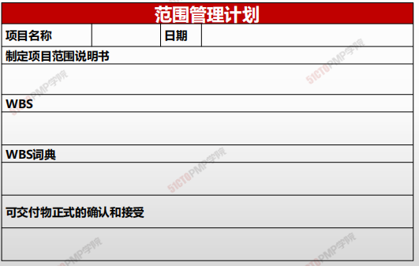

#### 需求管理计划(模板)

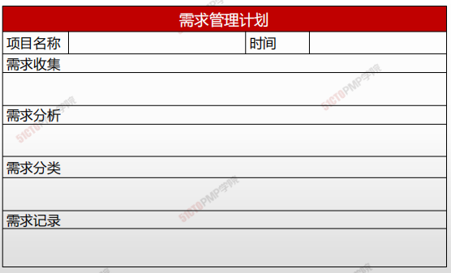

### 范围管理计划 vs. 需求管理计划

| 范围管理                                                     | 需求管理                                                     |
| ------------------------------------------------------------ | ------------------------------------------------------------ |
| 范围管理包含一系列子过程，用以确保项目包含且只包含达到项目成功所必须完成的工作，范围管理主要关注项目内容的定义和控制，即<u>包括什么，不包括什么。</u> | 需求管理是通过调查与分析，获取用户需求并定义产品需求，<u>确保各方对需求的一致理解，管理和控制需求的变更，以及需求的跟踪。</u> |

| 范围管理计划 | 需求管理计划 |
| ------------ | ------------ |
|      描述如何定义、制订、监督、控制和确认项目范围。 1. 制定详细范围说明书 2. 如何从详细的项目范围说明书创建WBS 3. 维护和批准WBS 4. 如何对已经完成项目的可交付物进行正式的确认和接受        |     需求管理计划是对项目的需求进行定义、确定、记载、核实管理过程和控制的行动指南。包括： 1. 如何规划、跟踪和汇报各种需求活动 2. 需求管理需要使用的资源 3. 培训计划：需求定义、需求分析、需求验证、 需求管理及相关工具、配置管理等 4. 项目相关方参与需求管理的策略 5. 判断项目范围与需求不一致的准则和纠正规程 6. 需求跟踪结构：双向跟踪 7. 配置管理活动         |

> 联系 ：
>
> * 首先通过需求收集来获取项目的需求，在此基础上确定项目的范围、进行项目范围管理
> * 其次需求的变更会引起项目范围的变更

# 小结

1. **规划范围管理在整个项目中对如何管理范围提供指南和方向**
2. **该过程生成：范围管理计划和需求管理计划**
3. **范围管理计划描述如何进行范围管理**
4. **需求管理计划描述如何分析、记录和管理需求**

---

# 03.收集需求

## 收集需求

* 根据特定协议或其他强制性规范，产品、服务或成果必须具备的条件或能力
* 需求是发起人、客户和其他相关方的已量化且书面记录的需要和期望
* 需求必须是具体的、书面的、不是全部需要

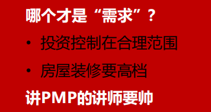

### 项目需求收集/定义的困难有哪些

**需求中遇到的艰难险阻：**

* 我们提供的(功能)就是你要的！
* 我认为我知道你的需求
* 猜测客户需求
* 无休止的客户需求
* 我不知道我要什么，只有我看到了我才知道
* 快速开发模型给我看看
* 需求没有被记录下来，没有得到重视和落实

**如何解决？**

* 遵行良好的需求收集/定义/管理流程和步骤
* 提供培训给负责需求管理的个人
* 邀请用户的经常性参与
* 书面记录需求并确认
* 验证需求
* 举行正式的需求评审
* 严格管理需求变更

### 收集需求

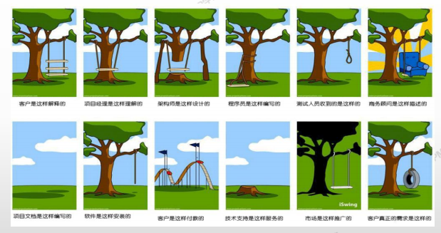

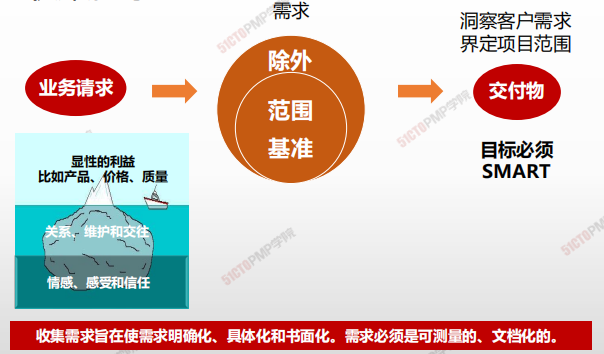

> 收集需求在使需求明确化、具体化和书面化。需求必须是可测量的、文档化的。

> 如何挖掘真实需求
>
> * 把握本质的需求，洞悉客户真正的需要

### 4W1H

| 4W1H                 | **收集需求**                                                                                                                  |
| -------------------- | ------------------------------------------------------------------------------------------------------------------------- |
| 
what 做什么
   | 
实现目标而确定、记录并管理相关方的需要和需求的过程。 <strong>作用：</strong>为定义产品范围和项目范围奠定基础。
                                                |
| 
why 为什么做
   | 让相关方积极参与需求的探索和分解工作，并仔细确定、记录和管理对产品、服务或成果的需求，能直接促进项目成功。需求将成为工作分解结构（WBS）的基础，也将成为成本、进度、质量和采购规划的基础。                            |
| 
who 谁来做
    | 项目管理团队                                                                                                                    |
| 
when 什么时候做
 | 项目章程制定后，相关方初步识别后，规划范围管理后                                                                                                  |
| 
how 如何做
    | 
应该足够详细地探明、分析和记录这些需求，将其包含在范围基准中，并在项目执行开始后对其进行测量。 专家判断、数据收集、数据分析、决策、数据表现、人际关系与团队 <strong>技能、系统交互图、原型法</strong>
 |

### 输入/工具技术/输出

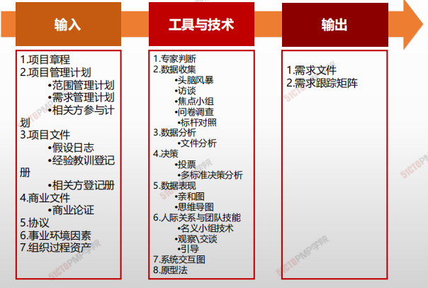

1. 输入
   1. 项目章程
   2. 项目管理计划
      * 范围管理计划
      * 需求管理计划
      * 相关方参与计划
   3. 项目文件
      * 假设日志
      * 经验教训登记册
      * 相关方登记册
   4. 商业文件
      * 商业论证
   5. 事业环境因素
   6. 组织过程资产
2. 工具与技术
   1. 专家判断
   2. 数据收集
      * 头脑风暴
      * 访谈
      * 焦点小组
      * 问卷调查
      * 标杆对照
   3. 数据分析
      * 文件分析
   4. 数据表现
      * 亲和图
      * 思维导图
   5. 人际关系与团队技能
      * 名义小组技术
      * 观察、交谈
      * 引导
   6. 系统交互图
   7. 原型法
3. 输出
   1. 需求文件
   2. 需求跟踪矩阵

#### 工具与技术

**数据收集 - 问卷调查**

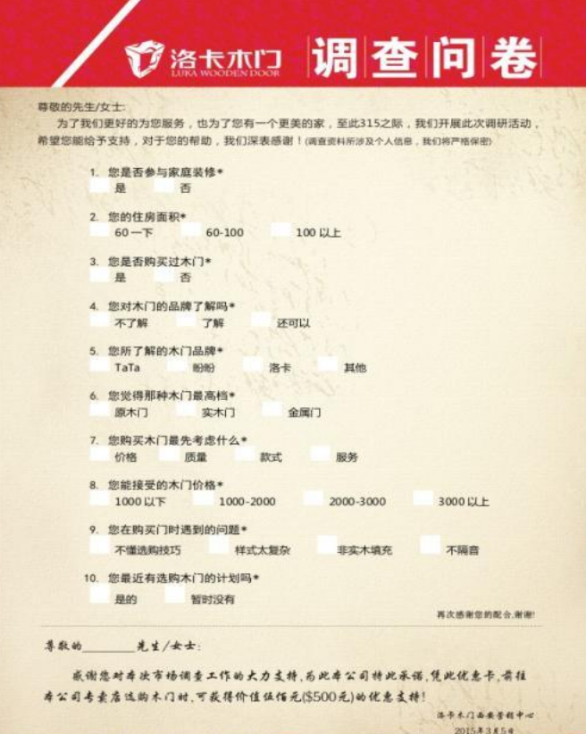

> 设计一系列书面问题，向众多受访者快速收集信息。
>
> * 受众多样化
> * 快速完成调查
> * 适合展开系统分析
> * 受访者地理位置分散

**数据收集 - 文件分析**

> 分析现有文档，识别与需求相关地信息，来挖掘需求
>
> * 协议
> * 商业计划
> * 业务流程或接口文档
> * 业务规则库
> * 现行流程
> * 市场文献
> * 问题日志
> * 政策和程序
> * \*\*法规文件，\*\*如法律、法令
> * 建议邀请书
> * 用例

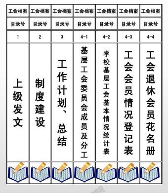

**数据收集 - 决策**

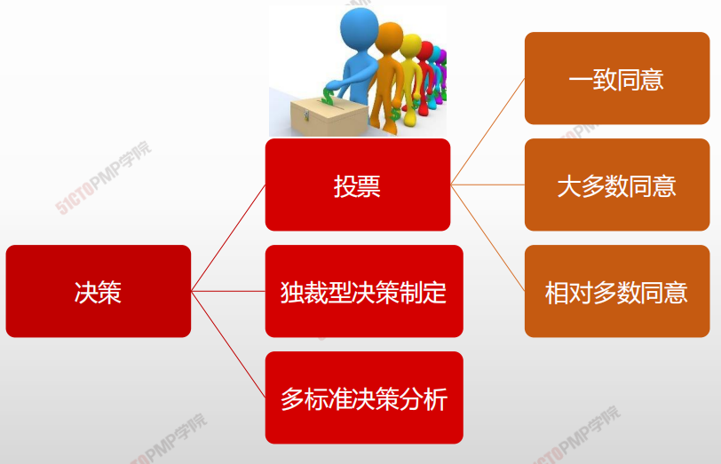

> 借助决策矩阵，用系统分析方法建立诸如风险水平、不确定性和价值收益等多种标准，以对众多创意进行评估和排序

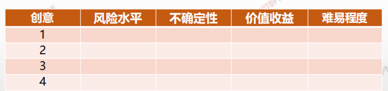

**数据收集 - 亲和图**

> **用来对大量创意 进行分组技术，以便进一步审查和分析**

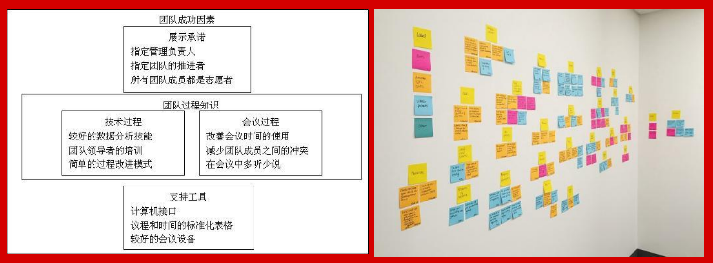

**数据收集 - 思维导图**

> 把从头脑风暴获得的创意合成一张图，用以反应创意之间的共性与差异，激发新创意

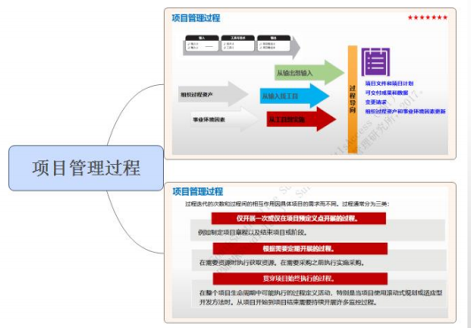

**人际关系与团队技能 - 名义小组技术**

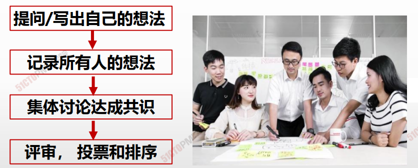

> 更加结构化的头脑风暴
>
> 通过投票排序得到最有用的创意

**人际关系与团队技能 - 引导 （联合应用开发）**

> 把业务主题专家（SME）和开发团队集中在一起，以收集需求和改进软件开发过程（软件行业常用）

> **快速定义跨职能需求并协调相关方的需求差异**

**人际关系与团队技能 - 引导（质量功能展开QFD）**

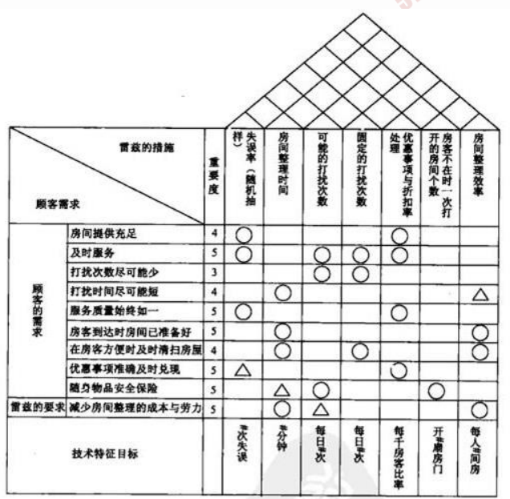

> * 制造业则采用QFD来帮助确定新产品的关键特征
> * QFD从收集客户需求（又称“客户声音：）开始，然后客观地对这些需求进行分类和排序

**人际关系与团队技能 - 引导（用户故事）**

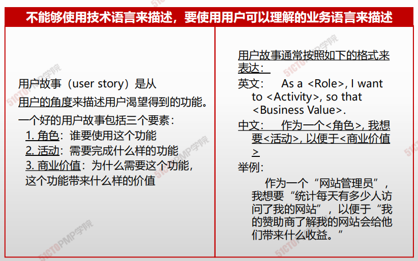

**人际关系与团队技能 - 观察和交谈**

**旁站式观察**，也称工作**跟踪体验式**（参与式）&不愿或说不清需求&挖掘深层潜在需求

**需求收集 - 系统交互图**

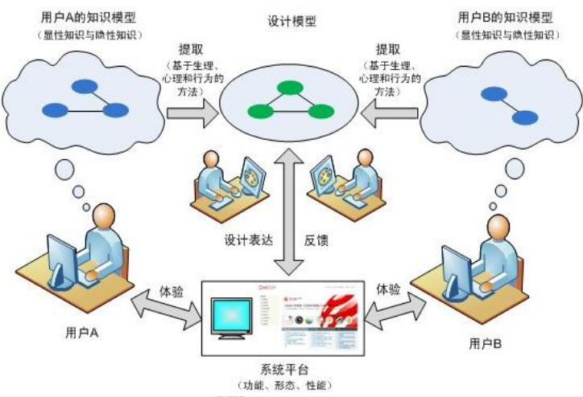

> * 对产品范围的可视化描述显示业务系统及其任何其他系统（行动者）之间的交互方式
> * 显示了业务系统的输入、输入提供者、业务系统的输出和输出接受者。

#### 输出

**需求文件**

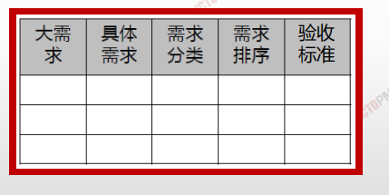

* 描述各种单一需求将如何满足与项目相关的业务需求
* 随着有关需求信息的增加而**逐步细化**
* 主要内容包括：
  * ✓ 业务需求
  * ✓ 相关方需求
  * ✓ 解决方案需求
  * ✓ 项目需求
  * ✓ 过渡和就绪
  * ✓ 质量需求

**需求与项目目标的逻辑关系**

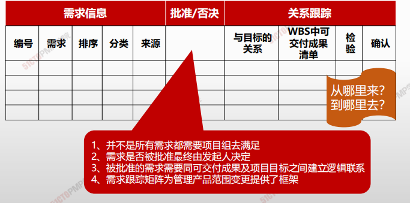

> ### 需求文件
>
> * 需求文件描述各种单一需求将如何满足与项目相关的业务需求
> * **用于生成范围说明书**

> ### 需求跟踪文件
>
> * 需求跟踪矩阵是吧产品需求从其来源连接到满足的可交付成果的一种表格
> * **用于验收可交付成果**

## 小结

1. 需求是根据特定协议或其他强制性规范，产品、服务或成果必 须具备的条件或能力
2. 所有相关方都可以提出需求，需求要量化并书面记录
3. 收集需求是为实现目标而确定、记录并管理相关方的需要和需 求的过程
4. 需求文件描述各种单一需求将如何满足与项目相关的业务需求
5. 需求跟踪矩阵确保经批准的每一项需求在项目结束时都能得到 实现

---

# 04.定义范围

## 定义范围

### 4W1H

| 4W1H                 | **定义范围**                                                                           |
| -------------------- | ---------------------------------------------------------------------------------- |
| 
what 做什么
   | 
制定项目和产品详细描述的过程。 作用：描述产品、服务或成果的边界和验收标准。
                                   |
| 
why 为什么做
   | 准备好详细的项目范围说明书，对项目成功至关重要。                                                           |
| 
who 谁来做
    | 项目经理带领项目管理团队制定，应该获得发起人/客户和关键相关人的批准。                                                |
| 
when 什么时候做
 | 收集需求之后                                                                             |
| 
how 如何做
    | 
应根据项目启动过程中记载的主要可交付成果、假设条件和制约因素来编制详细的项目范围说明书。 专家判断、数据分析、决策、人际关系与团队技能、产品分析
 |

### 输入/工具技术/输出

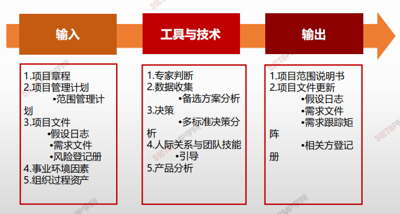

1. 输入
   1. 项目章程
   2. 项目管理计划
      * 范围管理计划
   3. 项目文件
      * 假设日志
      * 需求文件
      * 风险登记册
   4. 事业环境因素
   5. 组织过程资产
2. 工具与技术
   1. 专家判断
   2. 数据收集
      * 备选方案分析
   3. 决策
      * 多标准决策分析
   4. 人际关系与团队技
      * 引导
   5. 产品分析
3. 输出
   1. 项目范围说明书
   2. 项目文件更新
      * 假设日志
      * 需求文件
      * 需求跟踪矩阵
      * 相关方登记册

> #### 价值工程
>
> 在产品开发设计阶段即进行的价值与成本革新活动，因为仍在**工程设计阶段，故称为价值工程**

> #### 价值分析
>
> 一旦开始量产后，往往为了成本或利润压力，非进行详尽的价值分析难以发掘可以降低成本或提高价值的改善点。此节点以后持续的分析是降低成本的主要手法，就成为价值分析

> **不同阶段、相同目的：提高价值、减低成本**

#### 项目章程和项目范围说明书的内容

| 项目章程                                                         | 项目范围说明书      |
| ------------------------------------------------------------ | ------------ |
| 项目目的                                                         | 项目范围描述（渐进明细） |
| 可测量的项目目标和相关的成功标准                                             | 项目可交付成果      |
| 高层级需求                                                        | 验收标准         |
| 高层级项目描述、边界定义以及主要可交付成果                                        | 项目的除外责任      |
| 整体项目风险整体项目风险                                                 |              |
| 总体里程碑进度计划总体里程碑进度计划项目的除外责任                                    |              |
| 预先批准的财务资源预先批准的财务资源                                           |              |
| 主要相关方清单主要相关方清单                                               |              |
| 项目审批要求（例如，用什么标准评价成功，由谁对项目成功项目审批要求（例如，用什么标准评价成功，由谁对项目成功整体项目风险 |              |
| 下结论，由谁来签署项目结束）                                               |              |
| 项目退出标准（比如，结束或取消项目或阶段前应满足的条件）                                 |              |
| 委派的项目经理及其职责和职权                                               |              |
| 发起人或其他批准项目章程的人员姓名和职权                                         |              |

## 小结

1. 定义范围是制定项目和产品详细描述的过程
2. 项目范围说明书包含项目范围和产品范围
3. 范围说明书是指导规划、执行、评价变更请求是否超过项目边界的基准
4. 项目范围说明书必须由关键相关方签字，代表就项目范围所达成的共识

---

# 创建WBS

## 4W1H

| 4W1H                | **创建 WBS**                                                 |
| ------------------- | ------------------------------------------------------------ |
| what 做什么     | 把项目可交付成果和项目工作分解成较小、更易于管理的组件的过程。 作用：为所要交付的内容提供架构。 |
| why 为什么做    | WBS 是对项目团队为实现项目目标、创建所需可交付成果而需要实施的全部工作范围的层级分解。WBS 组织并定义了项目的总范围，代表着经批准的当前项目范围说明书中所规定的工作，可以针对WBS的工 作包安排进度、估算成本和实施监控。 |
| who 谁来做      | 项目管理团队                                                 |
| when 什么时候做 | 制定项目范围说明书后。                                       |
| how 如何做      | 工作包对相关活动进行归类。 <u>专家判断、分解</u>         |

## 输入/工具技术/输出

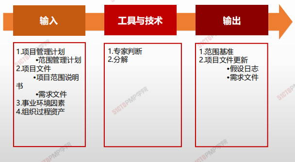

1. 输入
   2. 项目管理计划
      - 范围管理计划
   3. 项目文件
      - 项目范围说明书
      - 需求文件
   5. 事业环境因素
   6. 组织过程资产
2. 工具与技术
   1. 专家判断
   2. 分解
   
3. 输出
   1. 范围基准
   2. 项目文件更新
      - 假设日志
      - 需求文件

### 工具与技术

#### 分解

> - 分解就是把项目可交付成果划分为更小、更便于管理的组成部分，直到工作和可交付成果被定义到工作包的层次。工作包是分解结构的底层，是能够可靠的估算和管理工作成本和活动持续时间的位置。
> - 工作包的详细程度因项目大小和复杂度而异。

#### 工作分解结构（WBS）的意义

> 1. 确定工作范围
> 2. 配备人员
> 3. 编制资源预算
> 4. 监视进程
> 5. 明确阶段里程碑
> 6. 具体内容验证

* WBS是项目工作的“组织架构图”，WBS提供了一个逻辑关系图反映项目目标
* 工作分解结构保证了项目结构的**系统性和完整性**。
* 通过WBS建立完整的项目保证体系，便于执行和实现项目目标
* 通过WBS**使项目相关人员对项目一目了然**，方便跟踪费用，进度，绩效。
* 通过WBS能够明确项目相关方的界面，便于**责任划分**和落实
* 为**项目沟通提供依据，**可以用于与相关方沟通项目状态，提高项目整体团队沟通

#### 分解的步骤和形式

##### 分解的步骤

1. 识别和分析可交付成果及相关工作
2. 确定工作分解结构的结构与编排方法
3. 自上而下逐层细化分解
4. 为工作分解机构组成部分定制和分配标志编码
5. 核实工作分解的程度是必要且充分的。确保没有遗漏工作，也没有增加多余的工作

##### 分解的形式

1. 按照生命周期各个阶段进行分解；
2. 按产品或项目可交付成果分解；
3. 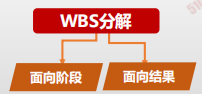

##### 示例

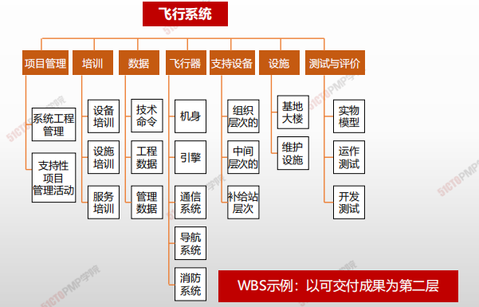

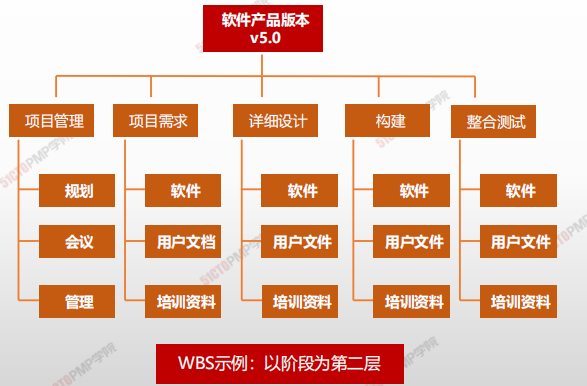

##### WBS词典

WBS词典中的内容可
能包括（但不限于）：

* 账户编码标识
* 工作描述
* 假设条件和制约因素
* 负责的组织
* 进度里程碑
* 相关的进度活动
* 所需资源
* 成本估算
* 质量要求
* 验收标准

> 工作分解结构词典是在创建工作分解结构过程中产生并用于支持工作分解结构的文件。
>
> 工作分解结构词典对工作分解结构组成部分（包括工作包和控制账户）进行更详细的描述。

##### 控制账户/规划包/工作包视图

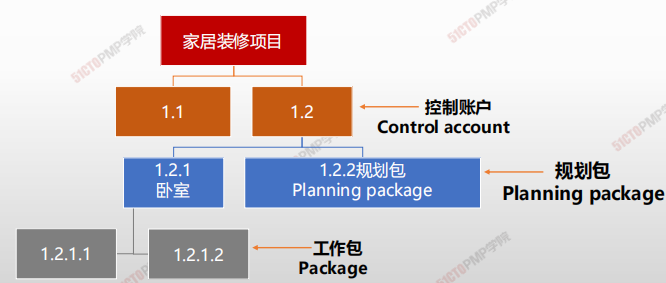

##### 分解和验证准则

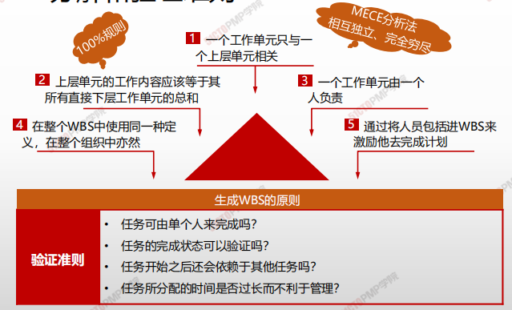

##### 小结

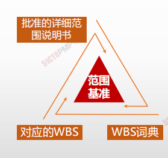

* 范围基准是进度基准和成本基准的基础
* 工作包时间不宜超过2周或者80小时，层级不宜超过20层，小的项目4～6层就可以了
  应该让团队成员积极参与WBS的创建
* 一个WBS项只能由一个人负责，即使许多人都可能在其上工作，也只能由一个人负责，其他人只能是参与者

# 小结

1. WBS是以可交付成果为导向的工作层级分解
2. WBS可按照生命周期或成果进行分解
3. 控制账户是一个管理控制点，把范围、预算和进度
加以整合，并与挣值相比较，以测量绩效
4. 工作包位于WBS最底层
5. 规划包低于控制账户而高于工作包，未来会进一步
分解为工作包

---

# 控制范围

## 4W1H

| 4W1H                | **创建 WBS**                                                 |
| ------------------- | ------------------------------------------------------------ |
| what 做什么     | 监督项目和产品的范围状态，管理范围基准变更的过程。 <u>作用：在整个项目期间保持对范围基准的维护。</u> |
| why 为什么做    | 防止范围失控，变更实际发生时，管理变更，变更不可避免，必须强制实施变更控制，防止范围蔓延，杜绝范围镀金。项目管理团队 |
| who 谁来做      | 项目管理团队。                                               |
| when 什么时候做 | 项目或阶段末，项目结束前进行。                               |
| how 如何做      | 控制项目范围确保所有变更请求、推荐的纠正措施或预防措施都通过实施整体变更控制过程进行处理。在变更实际发生时，也要采用控制范围过程来管理这些变更。控制范围过程应该与其他控制过程协调开展。数据分析 |

## 输入/工具技术/输出

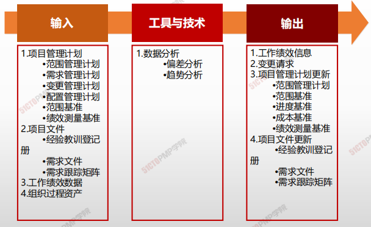

1. 输入
   2. 项目管理计划
      - 范围管理计划
      - 需求管理计划
      - 变更管理计划
      - 配置管理计划
      - 范围基准
      - 绩效测量基准
   3. 项目文件
      - 经验教训登记册
      - 需求文件
      - 需求跟踪矩阵
   5. 工作绩效数据
   6. 组织过程资产
2. 工具与技术
   1. 数据分析
      * 偏差分析
      * 趋势分析

3. 输出
   1. 工作绩效信息
   2. 变更请求
   3. 项目管理计划更新
      - 范围管理计划
      - 范围基准
      - 进度基准
      - 成本基准
      - 绩效测量基准
   4. 项目文件更新
      - 经验教训登记册
      - 需求文件
      - 需求跟踪矩阵

### 工具与技术

#### 偏差分析

> 偏差分析用于将基准与实际结果进行比较，以确定偏差是否处于临界值区间或是否有必要采取纠正或预防措施；

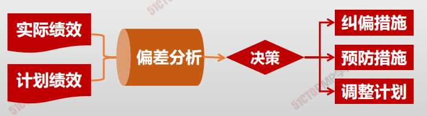

#### 趋势分析

> 趋势分析旨在审查项目绩效随时间的变化情况，以判断绩效是正在改善还是正在恶化。

#### 控制质量、控制范围和确认范围的区别

|                  | 控制质量                             | 控制范围                   | 确认范围                                                     |
| ---------------- | ------------------------------------ | -------------------------- | ------------------------------------------------------------ |
| **所属知识领域** | 质量管理                             | 范围管理                   | 范围管理                                                     |
| **由谁展开**     | 项目团队                             | 项目团队                   | 项目发起人或客户                                             |
| **何时展开**     | 在项目执行期间持续展开               | 在项目执行期间持续展开     | 在项目执行期间定期展开，即在可交付成果完成并核实为质量合格后及时展开 |
| **为何展开**     | 检查工作过程和可交付成果的技术正确性 | 检查该做的工作是否都该做了 | 检查可交付成果能否通过验收                                   |

#### 范围变更的原因

1. 一个外部事件（例如政府规定的变更）
2. 产品范围定义的一个过失或疏忽
3. 项目范围定义的过失或疏忽
4. 为应对一个风险而实施一个应急计划
5. 一个增值的变更（应用新技术降低成本）

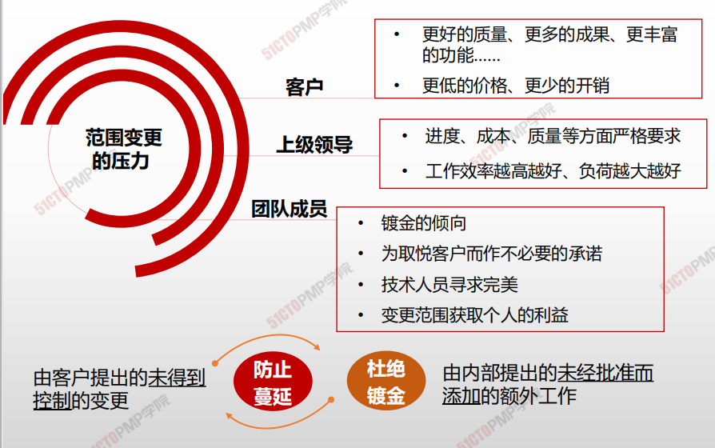

#### 范围控制经验

* **随时为变更做好准备**
* **能不变则不变**

* **如果一定要变，必须确保利于目标**

* **确保所有的变更都经过正式批准**

* **确保变更及时通知到所有相关干系人**

* **探究变更根本原因，丰富组织过程资产**

# 小结

1. 所有范围变更请求需要由实施整体变更控制过程来审查和处理
2. 未得到控制的变更通常称为项目范围蔓延
3. 镀金是指项目团队超出范围定义，主动增加额外的工作而得不   到任何经济补偿的行为
4. PMI理念：防止蔓延，杜绝镀金行为

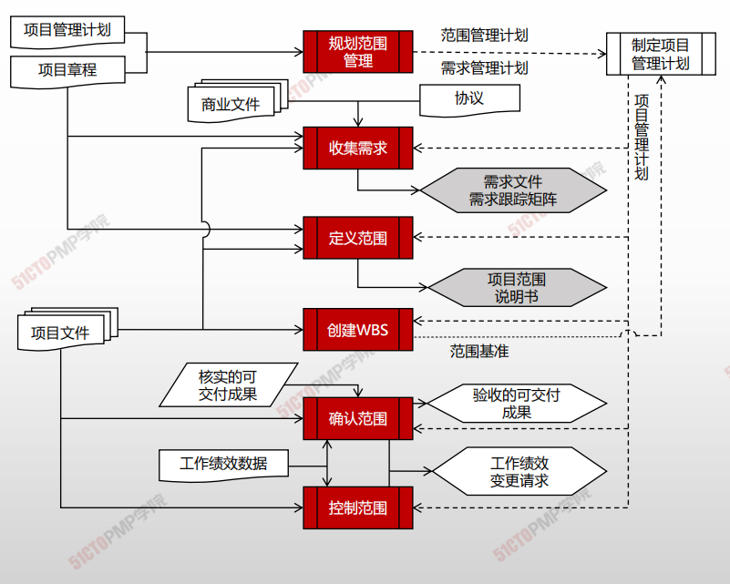

---

