# 项目进度管理概述

|                | **启动过程组** | **规划过程组**                                               | **执行过程组** | **监控过程组** | **收尾过程组** |
| -------------- | -------------- | ------------------------------------------------------------ | -------------- | -------------- | -------------- |
| **6.进度管理** |                | 6.1规划进度管理 6.2定义活动 6.3排列活动顺序 6.4估算活动持续时间 6.5制定进度计划 |                | 6.6控制进度    |                |

> 烧水泡茶典型示例
>
> 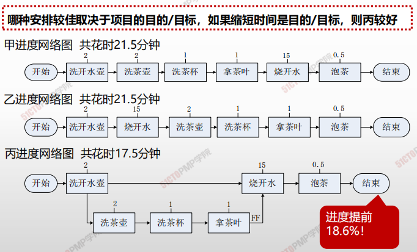

| 6.1  | 规划进度管理     | 为规划、编制、管理、执行和控制项目进度而制定政策、程序和文档的过程。 |
| ---- | ---------------- | ------------------------------------------------------------ |
| 6.2  | 定义活动         | 识别和记录为完成项目可交付成果而采取的具体行动的过程。       |
| 6.3  | 排列活动顺序     | 识别和记录项目活动之间的关系的过程                           |
| 6.4  | 估算活动持续时间 | 根据资源估算的结果，估算完成单项活动所需工作时段树的过程。   |
| 6.5  | 制定进度计划     | 分析活动顺序、持续时间、资源需求和进度制约因素，创建项目进度模型、从而落实项目执行和监控的过程 |
| 6.6  | 控制进度         | 监督项目状态，以更新项目进度和管理进度基准变更的过程。       |

## 1. 一谋

> 规划进度管理

## 2. 四备

> 一备
>
> ​	定义出清单
>
> 	1. 活动清单
>  	2. 里程碑清单
>
> 二备
>
> ​	排序出路线
>
> 三备
>
> ​	资源出参数
>
> 四备
>
> ​	历时出长短

## 3. 二反复

> 1. 反复进行进度计划编制更新
> 2. 反复进行进度控制与优化

---

# 规划进度管理

## 4W1H

| 4W1H                | 规划进度管理                                                 |
| ------------------- | ------------------------------------------------------------ |
| what 做什么     | 为规划、编制、管理、执行和控制项目进度而制定政策、程序和文档的过程。 <u>作用：</u>为如何在整个项目期间管理项目进度提供指南和方向 |
| why 为什么做    | 指导进度管理知识领域的其他过程如何开展，提供指南和方向。     |
| who 谁来做      | 项目管理团队。                                               |
| when 什么时候做 | 项目章程制定后，项目进度管理知识领域之前                     |
| how 如何做      | 制定政策、程序和文档 <u>专家判断、数据分析、会议</u>      |

## 输入/工具技术/输出

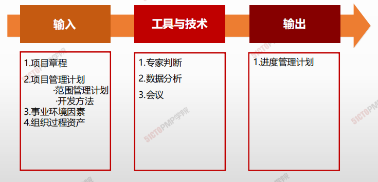

1. 输入
   1. 项目章程
   2. 项目管理计划
      - 范围管理计划
      - 开发计划
   3. 事业环境因素
   4. 组织过程资产
2. 工具与技术
   1. 专家判断
   2. 数据分析
   3. 会议
3. 输出
   1. 进度管理计划

## 输出

### 进度管理计划

<u>进度管理计划的内容</u>

- 项目进度模型制定
- 进度计划的发布和迭代长度
- 准确度
- 计量单位
- 组织程序链接
- 项目进度模型维护
- 控制临界值
- 绩效测量规则
  - 确定完成百分比的规则
  - EVN技术
  - 进度绩效测量指标
- 报告格式

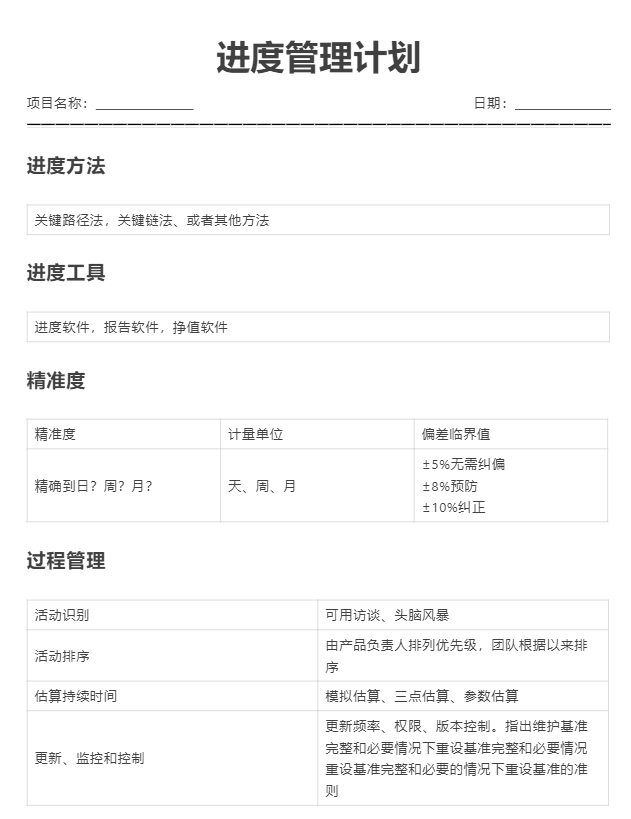

---

# 规划进度管理

## 4W1H

| 4W1H                | 规划进度管理                                                 |
| ------------------- | ------------------------------------------------------------ |
| what 做什么     | 识别和记录为完成项目可交付成果和须采取的具体行动的过程。 <u>作用：</u>将工作包分解为进度活动，作为对项目工作进行进度估算、规划、执行、监督和控制的基础 |
| why 为什么做    | 对活动才能更详细更准确的分配资源和时间、成本，作为后续的基础。 |
| who 谁来做      | 项目管理团队。                                               |
| when 什么时候做 | 范围基准确定后                                               |
| how 如何做      | 工作包分解为进度活动。 <u>专家判断、分解、滚动式规划、会议</u> |

## 输入/工具技术/输出

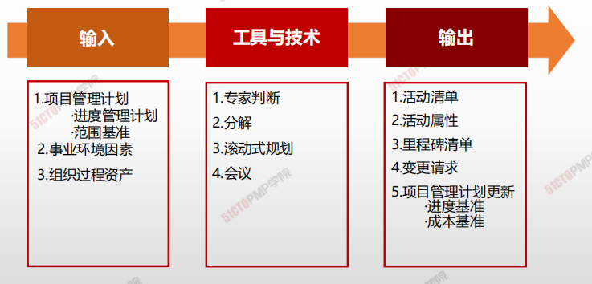

1. 输入
   1. 项目管理计划
      - 进度管理计划
      - 范围基准
   2. 事业环境因素
   3. 组织过程资产
2. 工具与技术
   1. 专家判断
   2. 分解
   3. 滚动式规则
   4. 会议
3. 输出
   1. 活动清单
   2. 活动属性
   3. 里程碑清单
   4. 变更请求
   5. 项目管理计划更新
      - 进度基准
      - 成本基准

#### 定义活动

|                                                           | 通过工作分解结构（WBS），将项目分解为一系列更小、更易管理的活动 |                                                            |
| --------------------------------------------------------- | ------------------------------------------------------------ | ---------------------------------------------------------- |
| 自 顶 向 下 ， 逐 步 细 化 | 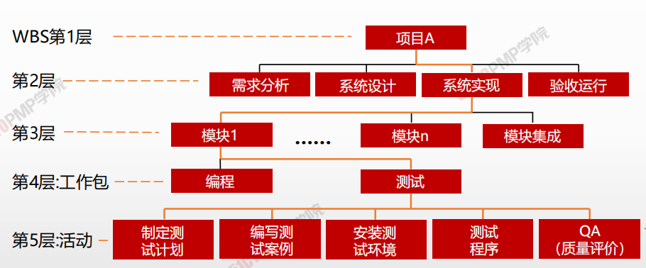 | 渐 进 明 细 ， 更 加 可 控 |

#### 分解活动

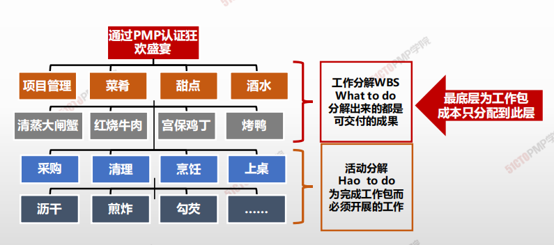

>  工作分解WBS，分解出来的都是可交付的成果

> 活动分解，为完成工作包而必须开展的工作

#### 滚动式规划

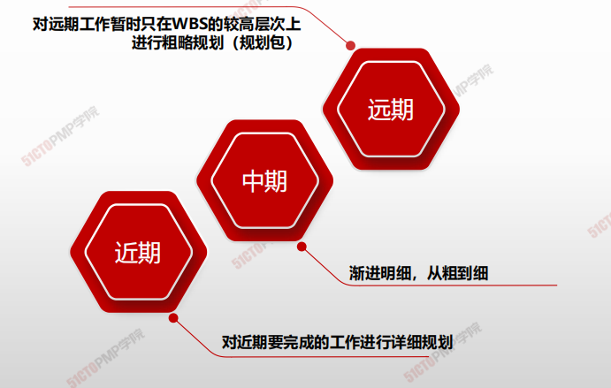

#### 活动清单示例

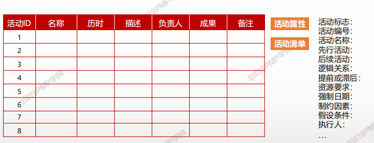

- **活动清单**是**一份包含项目所需的全部进度活动的清单**。活动清单中应该包每个活动的标志和足够详细的工作描述，使项目团队成员知道应当完成哪些工作。
- **活动属性**是指每项活动所具有的多重属性，用来**扩充对活动的描述**。活动属性的数量因应用领域而异

#### 活动属性

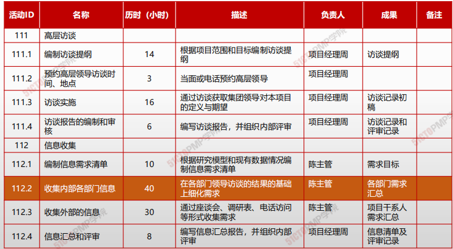

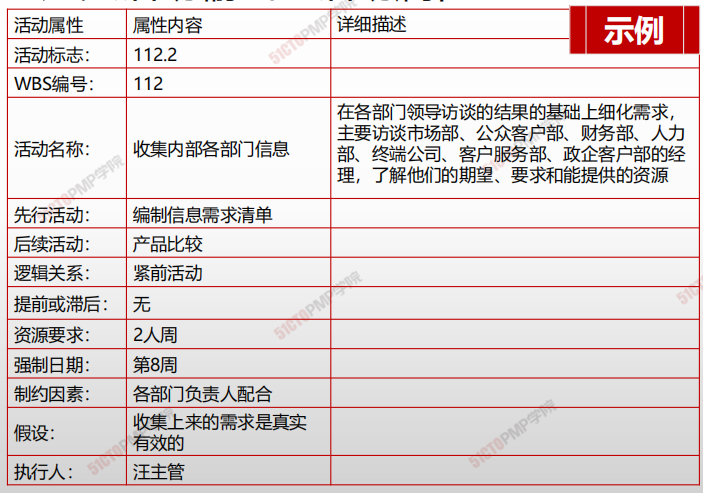

#### 活动里程碑

里程碑是项目中重大事件，通常是指一个或多个主要交付物的完成。

里程碑的突出特征是：到达此里程碑的没有歧义。

里程碑的作用：

- <u>计划：</u>与项目整体目标保持一致，并分解为阶段性目标；
- <u>控制：</u>里程碑通常为强制约束，控制项目各个阶段的目标实现；
- <u>沟通：</u>与管理干系人良好沟通；
- <u>责任：</u>明确规定了项目各方的责任义务；
- <u>报告：</u>简明、生动、通俗、实用。

---

# 排列活动顺序

## 4W1H

| 4W1H                | 排列活动顺序                                                 |
| ------------------- | ------------------------------------------------------------ |
| what 做什么     | 识别和记录项目活动之间的关系的过程。 <u>作用：</u>定义工作之间的逻辑顺序，以便在既定的所有项目制约因素下获得最高的效率 |
| why 为什么做    | 为了指定合理的、符合实际情况的进度计划                       |
| who 谁来做      | 项目管理团队。                                               |
| when 什么时候做 | 定义活动之后。                                               |
| how 如何做      | 处理首尾两项，每项活动都至少有一项紧前活动和一项紧后活动，并且逻辑关系适当 <u>紧前关系绘图法、确定和整合依赖关系、提前量和滞后量、项目管理信息系统</u> |

## 输入/工具技术/输出

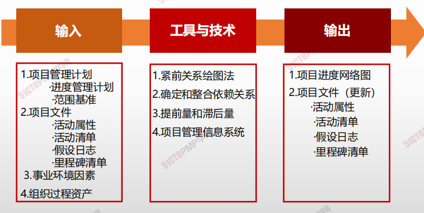

1. 输入
   1. 项目管理计划
      - 项目管理计划
      - 范围基准
   2. 项目文件
      - 活动属性
      - 活动清单
      - 假设日志
      - 里程碑清单
   3. 事业环境因素
   4. 组织过程资产
2. 工具与技术
   1. 紧前关系绘图法
   2. 确定整合依赖关系
   3. 提前量和滞后量
   4. 项目管理信息系统
3. 输出
   1. 项目进度网络图
   2. 项目文件（更新）
      - 活动属性
      - 活动清单
      - 假设文件
      - 里程碑清单

## 四种逻辑关系

| 关系            | 图                                                           |
| --------------- | ------------------------------------------------------------ |
| 完成—开始（FS） |  |
| 完成—完成（FF） | 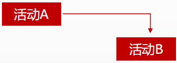 |
| 开始—开始（SS） |  |
| 开始—完成（SF） |  |

### 提前量和滞后量

> 提前量：是相对于紧前活动，紧后活动可以提前的时间量

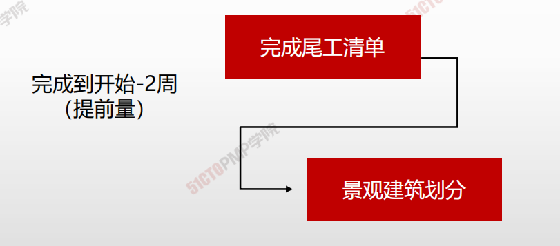

> 滞后量：是相对于紧前活动，紧后活动需要推迟的时间量

### 四种依赖关系

| 依赖关系       | 解释                                                         | 示例                                                         |
| -------------- | ------------------------------------------------------------ | ------------------------------------------------------------ |
| 强制依赖关系   | 工作中固有的依赖关系工程化、强制性规律                       | 如：软件需求分析必须在对应的软件设计之前完成,又称为硬性依赖关系。 |
| 选择性依赖关系 | 根据项目经验或偏好定义的依赖关系，工序无必然规律，灵活选用   | 如：软件系统测试用例的编写往往在编码开始时进行,又称为软性依赖关系。 |
| 外部依赖关系   | 通常为项目组与项目组外之间的活动关系                         | 如：外部供应商供货                                           |
| 内部依赖关系   | 内部依赖关系是项目活动之间的紧前关系，通常在项目团队的控制中 | 如：只有机器组装完毕，团队才能对其测试。                     |

### 单代号网络图

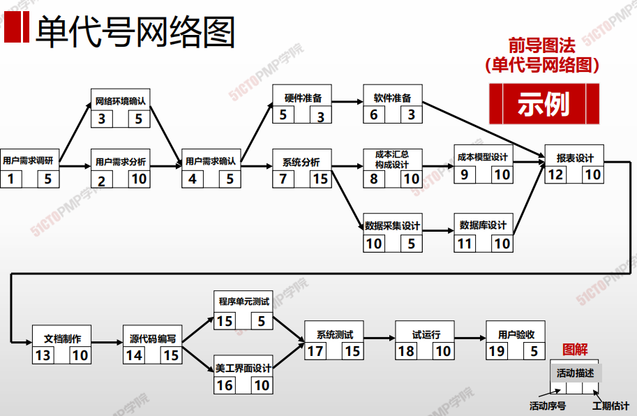

### 双代号网络图

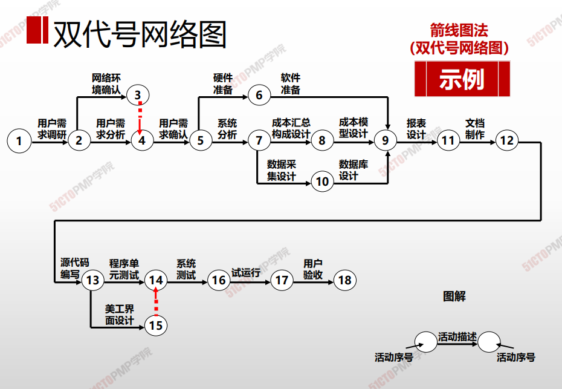

### 单代号与与双代号的转换

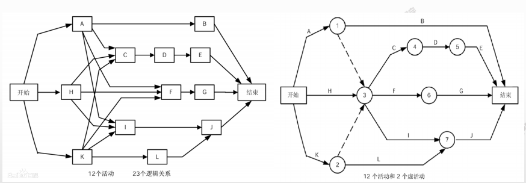

---

# 估算活动持续时间

> 应该由项目团队中**最熟悉具体活动**的个人或小组来进行估算。

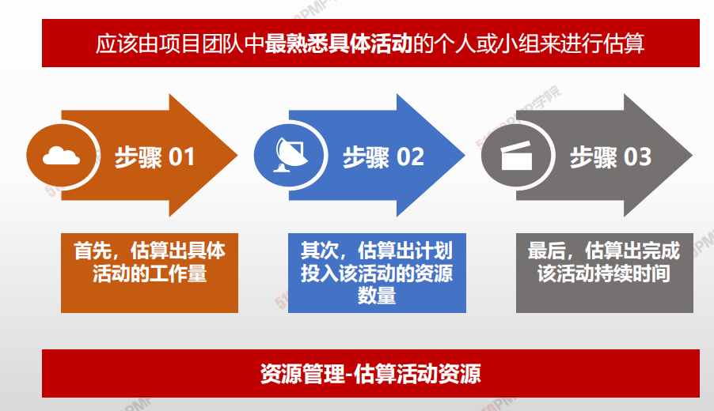

## 4W1H

| 4W1H                | 估算活动持续时间                                             |
| ------------------- | ------------------------------------------------------------ |
| what 做什么     | 根据资源估算的结果，估算完成单项活动所需工作时段数的过程。 <u>作用：确定完成每个活动所需花费的时间量。</u> |
| why 为什么做    | 在工程与设计项目中，随着数据越来越详细，越来越准确，持续时间估算的准确性和质量也会越来越高。 |
| who 谁来做      | 项目管理团队。                                               |
| when 什么时候做 | 活动资源需求记录后。                                         |
| how 如何做      | 估算活动持续时间依据的信息包括：工作范围、所需资源类型与技能水平、估算的资源数量和资源日历，而可能影响持续时间估算的其他因素包括对持续时间受到的约束、相关人力投入、资源类型以及所采用的进度网络分析技术。 <u>专家判断、类比估算、参数估算、自下而上估算、数据分析、决策、会议</u> |

## 输入/工具技术/输出

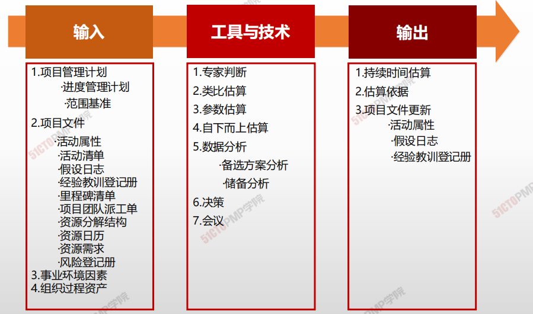

1. 输入
   1. 项目管理计划
      - 进度管理计划
      - 范围基准
   2. 项目文件
      - 活动属性
      - 活动清单
      - 假设文件
      - 经验教训登记册
      - 里程碑清单
      - 项目团队派工单
      - 资源分解结构
      - 资源日历
      - 资源需求
      - 风险登记册
   3. 事业环境因素
   4. 组织过程资产
2. 工具与技术
   1. 专家判断
   2. 类比估算
   3. 参数估算
   4. 自下而上估算
   5. 数据分析
      - 备选方案分析
      - 储备分析
   6. 决策
   7. 会议
3. 输出
   1. 持续时间估算
   2. 估算依据
   3. 项目文件更新
      - 活动属性
      - 假设日志
      - 经验教训登记册

### 专家判断、类比估算

* 类比法适合评估一些与历史项目在应用领域、环境和复杂度相似的项目，通过新项目与历史项目的比较得到估计数据
* 类比法估计结果的精确度取决于历史项目数据的完整性和准确度
* 项目详细信息不足时，例如在项目的早期阶段，就经常使用这种技术来估算项目持续时间，但准确性也较低

### 参数估算

* 参数估算：将应当完成的工作量乘以生产率时，就可以估算出活动历时的时间。
* 参数估算的准确性取决于参数模型的成熟度和基础数据的可靠性。
* 参数估算可以针对整个项目或项目中的某个部分，并可与其他估算方法联合使用。

### 三点估算

> 历时的三点估算：估计活动的最可能、最乐观以及最悲观时间，通过设置权重，运用统计规律降低历时估算的不确定性

**最可能时间：** 

在为计划活动分派的资源、资源生产效率以及资源的可利用性都充分考虑的前提下，对计划活动估算的持续时间

**最乐观时间：** 

当估算最可能持续时间的依据条件形成最有利的组合时，估算出来的持续时间

**最悲观时间：** 

当估算最可能持续时间的依据条件形成最不利的组合时，估算出来的持续时间

> **适用场景：**
>
> 在PERT中，某些或全部活动持续时间事先不能完全肯定，是利用网络顺序逻辑关系和加权历时来估算项目历时的重要技术。适用于不可预知因素较多的、从未做过的新项目或复杂项目

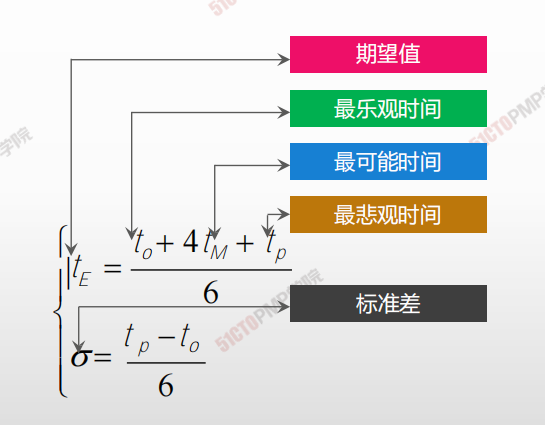

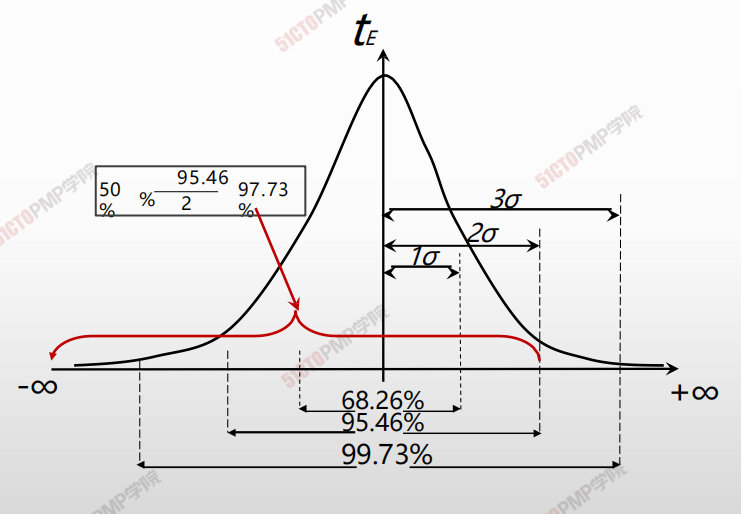

---

# 估算活动持续时间

## 4W1H

| 4W1H                | 估算活动持续时间                                             |
| ------------------- | ------------------------------------------------------------ |
| what 做什么     | 分析活动顺序、持续时间、资源需求和进度制约因素，创建进度模型，从而落实项目执行和监控的过程。 <u>作用：为完成项目活动而制定具有计划日期的进度模型。</u> |
| why 为什么做    | 为项目制定衡量标尺，项目人员确认开始和完成日期与资源日历没有冲突，也与其他项目或任务没有冲突，从而确认计划日期的有效性。 |
| who 谁来做      | 项目管理团队认可和批准。                                     |
| when 什么时候做 | 定义范围/定义活动/排列活动顺序/估算活动资源/估算活动持续时间之后。 |
| how 如何做      | 制定可行的项目进度计划是一个反复进行的过程。 <u>进度网络分析、关键路径法、资源优化、数据分析、提前量和滞后量、进度压缩、项目管理信息系统、敏捷发布规划</u> |

## 输入/工具技术/输出

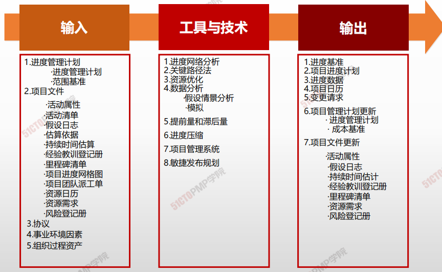

1. 输入
   1. 进度管理计划
      - 进度管理计划
      - 范围基准
   2. 项目文件
      - 活动属性
      - 活动清单
      - 假设日志
      - 估算依据
      - 持续时间估算
      - 经验教训登记册
      - 里程碑清单
      - 项目进度网络图
      - 项目团队派工单
      - 资源日历
      - 资源需求
      - 风险登记册
   3. 协议
   4. 事业环境因素
   5. 组织过程资产
2. 工具与技术
   1. 进度网络分析
   2. 关键路径法
   3. 资源优化
   4. 数据分析
      * 假设情景分析
      * 模拟
   5. 提前量和滞后量
   6. 进度压缩
   7. 项目管理系统
   8. 敏捷发布规划
3. 输出
   1. 进度基准
   2. 项目进度计划
   3. 进度数据
   4. 项目日历
   5. 变更请求
   6. 项目管理计划更新
      - 进度管理计划
      - 成本基准
   7. 项目文件更新
      - 活动属性
      - 假设文件
      - 持续时间估计
      - 经验教训登记册
      - 里程碑清单
      - 资源需求
      - 风险登记册

### 关键路径法CPM（Critical Path Method）

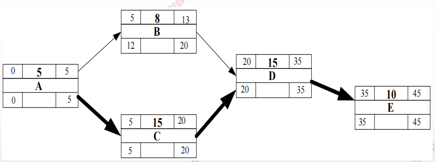

> 网络图中最长工期的那条路线,决定项目最短的完成时间.

* **不考虑任何资源限制的情况下**，沿着项目进度网络路径进行逆推分析，计算出全部活动理论上的最早开始和完成日期、最迟开始和完成日期

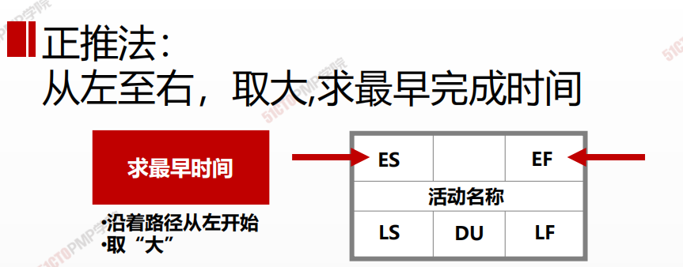

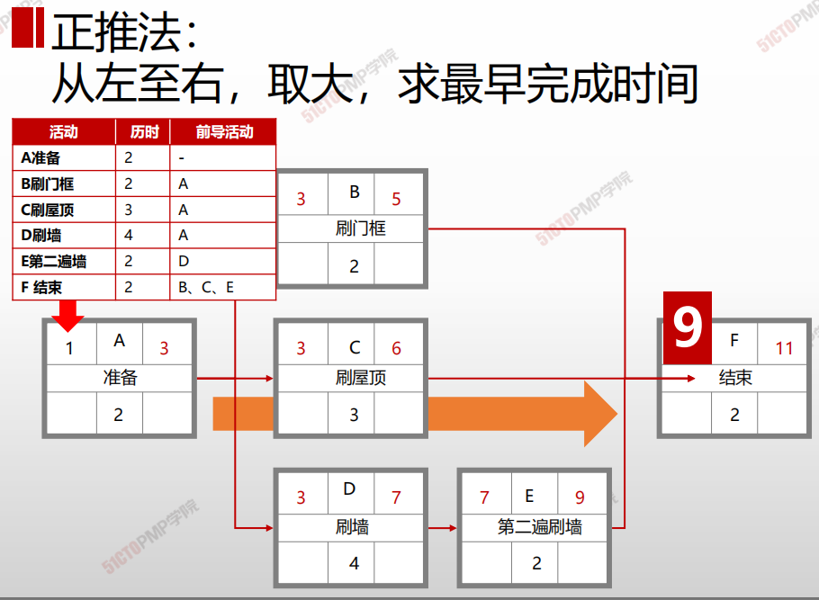

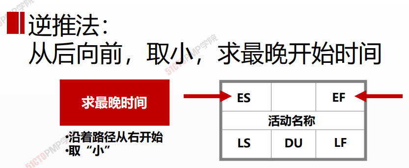

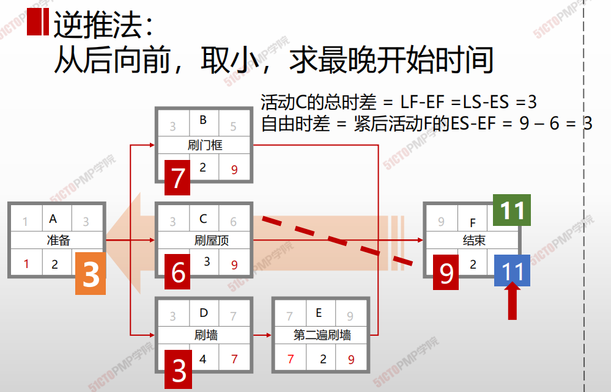

### 进度压缩的两大方法

### **赶工（Crashing）**

通过增加资源，以最小的成本代价来压缩进度工期的一种技术。赶工的例子包括：批准加班、增加额外资源或支付加急费用，来加快关键路径上的活动。赶工只适用于那些通过增加资源就能缩短持续时间的，且位于关键路径上的活动。但赶工并非总是切实可行的，因它可能导致风险和/或成本的增加。

### **快速跟进（Fast Tracking）**

一种进度压缩技术，将正常情况下按顺序进行的活动或阶段改为至少是部分并行开展。例如，在大楼的建筑图纸尚未全部完成前就开始建地基。快速跟进可能造成返工和风险增加，只适用于能够通过并行活动来缩短关键路径上的项目工期的情况。为加快进度而使用提前量通常会增加相关活动之间的协调工作量，并增加质量风险。快速跟进还有可能增加项目成本。

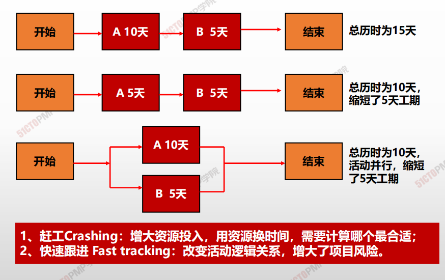

|      | 赶工 | 快速跟进 |
| ---- | ---- | -------- |
|作用 |在不改变项目范围的情况，都可以加快进度工期||
|方法| 通过增加资源减少活动的持续时间，不改变活动的逻辑关系|不增加资源投入，将后续活动提前执行改变活动的逻辑关系|
|成本| 增加当前资源（成本）投入| 不增加当前资源（成本）投入，但是未来风险可能导致成本增加|
|风险 |导致风险增加，属于局部风险 |导致风险增加，属于全局风险|
|活动|关键路径活动，强调单位费率最低的活动|关键路径活动 |

**在不缩减项目范围的前提下，缩短进度工期，满足进度目标。**

### 资源平衡

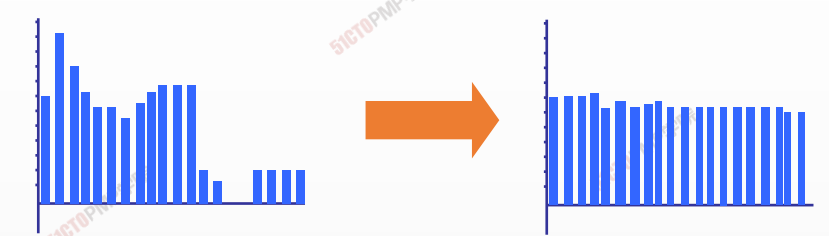

> 如果出现资源短缺，就需要做资源平衡。资源平衡往往导致关键路径的改变，导致工期的延长。
> 如果各事期资源需求量起伏太大，就需要做资源平滑。资源平滑是在各浮动时间允许的范围内，在项目不同时间段调剂资源分配，不会导致项目工期的延长，一般也不会改变关键路径。

> 广义：资源平衡包括资源平滑。资源平滑是资源平衡的一种特殊形式。

## 资源平滑

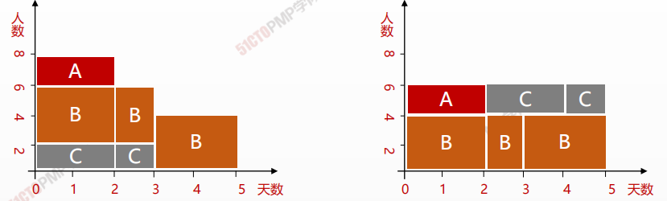

> 使项目资源需求不超过预定的资源限制的一种技术。
>
> 
>
> 相对于资源平衡而言，资源平滑不会改变项目关键路径，完工日期也不会延迟。 
>
> 
>
> 也就是说，活动只在其自由和总浮动时间内延迟。因此，资源平滑技术可能无法实现所有资源的优化。

### 关键链

* 问题提出**帕金森定律**：工作会自动地膨胀占满所有可用的时间。如果安排给一个任务的时间有富余，人们就会放慢节奏消耗掉所有富余时间。
* 解决方案：最早开始法则 所有活动都越早越好，**砍掉每个活动的安全时间，****集中到路径末段** 就是准备项目缓冲。
  * 接驳缓冲Feeding buffer
  * 项目缓冲Project buffer
  * 资源缓冲 Resource buffer

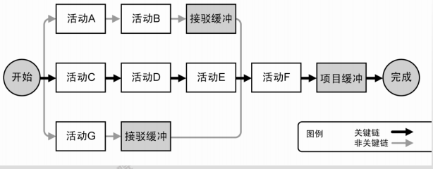

### 甘特图&里程碑

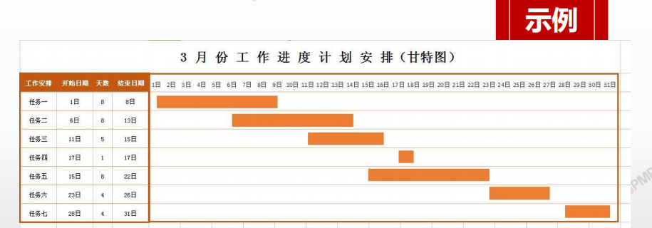

---

# 估算活动持续时间

> * 项目进度控制是依据项目进度计划对项目的实际进展情况进行控制，使项目能够按时完成
> * 进度控制包括定期收集项目完成情况的数据，将实际完成情况与计划进行比较

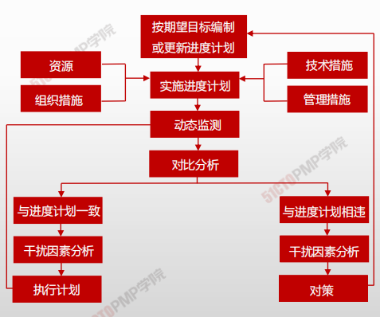

**进度控制的主要步骤**

1. 分析进度，找出那些地方需要采取纠正措施。
2. 确定采取哪些具体纠正措施
3. 修改计划，将纠正措施列入计划
4. 重新估算项目进度，评估采取纠正措施的效果

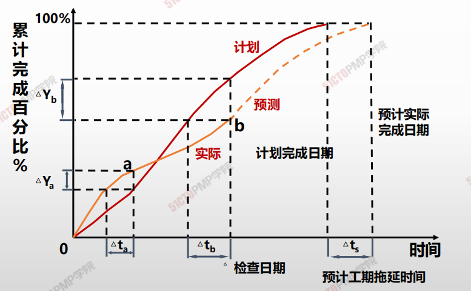

## 4W1H

| 4W1H                | 控制进度                                                     |
| ------------------- | ------------------------------------------------------------ |
| what 做什么     | 监督项目状态，以更新项目进度和管理进度基准变更的过程。 <u>作用：整个项目期间保持对精度基准的维护</u> |
| why 为什么做    | 为实现项目进度目标                                           |
| who 谁来做      | 项目管理团队。                                               |
| when 什么时候做 | 按照计划、基准实时监控，贯穿项目始终                         |
| how 如何做      | 利用项目管理软件和进度计划编制工具，调整时间提前量和后滞量。 <u>数据分析、关键路径法、项目管理信息系统、资源优化、提前量和滞后量、进度压缩</u> |

## 输入/工具技术/输出

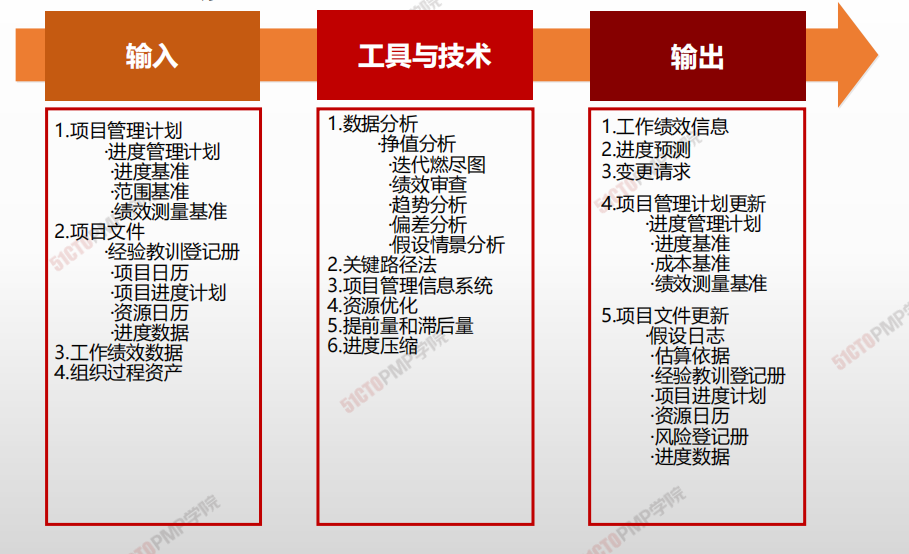

### 迭代燃尽图

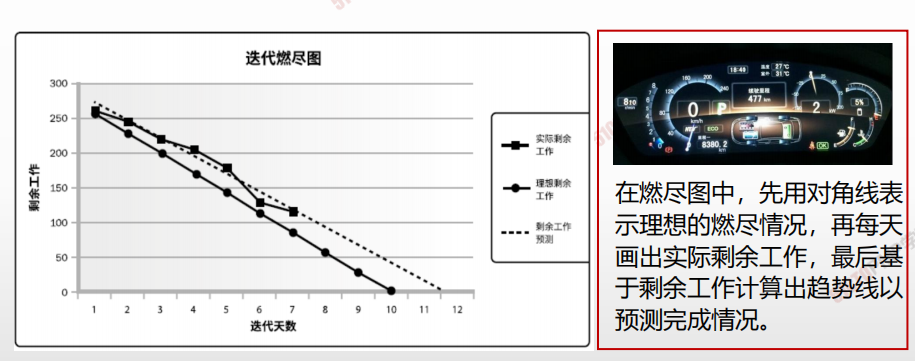

### 项目管理报告

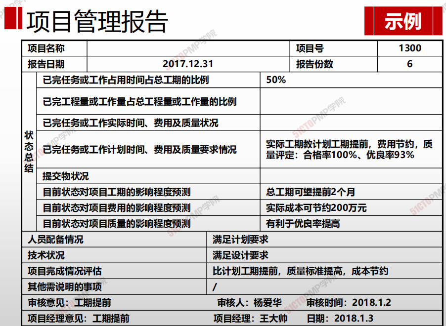

---

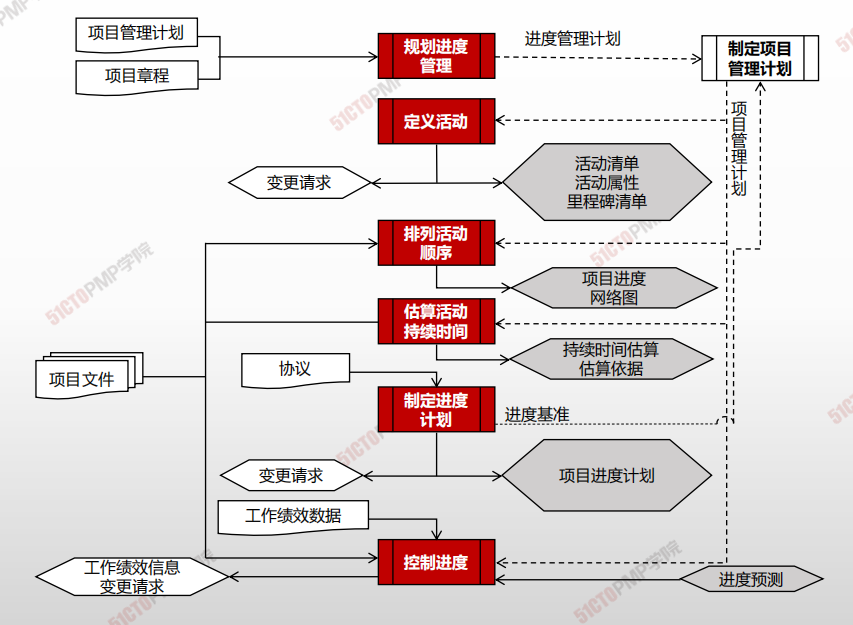

---

