# 项目管理知识领域概述

|||||
| -------------- | ------------------------------------ | ----------- | ----------- |
| **7.成本管理** | 7.1规划成本管理 7.2估算成本  | 7.3制定预算 | 7.4控制成本 |

| 7.1  | 规划成本管理 | 确定如何估算、预算、管理、监督和控制项目成本的过程           |
| ---- | ------------ | ------------------------------------------------------------ |
| 7.2  | 估算成本     | 对项目活动所需货币资源进行估算的过程                         |
| 7.3  | 制定预算     | 汇总所有单个活动或工作包的估算成本，建立一个经批准的成本基准的过程。 |
| 7.4  | 控制成本     | 监督项目状态，以更新项目成本和管理成本基准变更的过程         |

> 一谋
>
> ​	规划成本管理
>
> 二估
>
> ​	成本估算【工作包或活动成本】
>
> 三定
>
> ​	成本预算【求重点、定基准—用来考核的】
>
> 四控
>
> ​	成本控制求挣值—找偏差

## 成本分类

### **可变成本**

随着产量或工作量而变的成本，如人员工资、消耗的耗材。

### **固定成本**

不随生产规模变化的非重复成本，如设备费用、场地租赁费用等。

### **直接成本**

能够<u>直接归属于</u>项目工作的成本，如项目组差旅费用、项目组人员工资和奖金、项目使用的物资等

### **间接成本**

一般管理费用客户或者几个项目<u>共同分担的成本，</u>如员工福利、保安费用、行政部门和财务部门费用等。

## 成本概念

### **储备**

- 应急储备：

  （单项目 - 已知的未知的）和管理储备（公司级 - 未知的未知的），主要为防范风险预留的成本；

- 管理储备：

  是一个单列的计划出来的成本，以备未来不可预见的事情发生时使用。包含成本或进度储备，以降低偏离成本或进度的风险。

### **质量成本**

- 在成本估算中，质量成本是必须考虑的因素。达到产品或服务质量而进行的全部工作所发生的的所有成本，包括为使所产生的产品或服务符合要求的所有工作 <u>及返工的工作</u>
- 分为质量保证成本（预防）和质量故障成本（损失），在项目前期和后期，质量成本较高。

### 沉没成本

- **指业已发生或承诺、无法收回的成本支出，如因事物造成的不可回收的投资。**

- **沉没成本是一种历史成本，对现有决策而言是不可控成本，不会影响当前行为或未来决策。**

- <u>在投资决策时应排除沉没成本的干扰</u>

  

### 机会成本

- 如果选择另一个项目而放弃这一项目收益所引发的成本，为了选择A，放弃B，B的收益就是A的机会成本。

  > **例如一名农民选择养猪就不能选择养鸡，则养猪的机会成本就是放弃养鸡的收益，养鸡的机会成本便会是放弃养猪的收益。**

- 机会必须是决策者可选择的项目
- 机会成本的概念基于固定资源的限制
- 指放弃的机会中收益最高的一个项目

> 任何选择皆有代价！最大的成本是有想法却不尝试的机会成本！

### 全生命周期成本

- 包括开发成本、生产成本、运维成本、处置成本

## 小结

| 成本术语       | 解释                                                         | 举例                                                         |
| -------------- | ------------------------------------------------------------ | ------------------------------------------------------------ |
| 可变成本       | 随生产或工作量而变的成本                                     | 如人员工资、消耗的原材料等                                   |
| 固定成本       | 不随生产规模编号的非重复成本                                 | 如设备费用、场地租赁费用等                                   |
| 直接成本       | 能够直接归属于项目工作的成本                                 | 如项目组差旅费用、项目组人员工资和奖金、项目使用的物资等     |
| 间接成本       | 一般管理费用科目或几个项目共同分担的成本                     | 如员工福利、安保费用、行政部门和财务部门费用等               |
| 沉没成本       | 指业已经发生或承诺、无法回收的成本支出，如因事物造成不可回收的投资<u>沉没成本是一种历史成本，对现有决策而言不可控成本，不会影响当前行为或未来的决策</u>在投资决策时应排除沉没成本的干扰 | 5块钱买了一袋烂苹果，吃一口是坏的，就别心疼钱了，就没必要再吃了 |
| 机会成本       | 如果选择另一个项目而放弃这一项目收益而引发的成本             | 任何选择都是由成本的                                         |
| 全生命周期成本 | 包括开发成本、生产成本、运维成本、处置成本                   | 需要考虑养护、处置的成本如养护轿车                           |

---

# 规划成本管理

## 4W1H

| 4W1H                | 规划成本管理                                                 |
| ------------------- | ------------------------------------------------------------ |
| what 做什么     | 确定如何估算、预算、管理、监督和控制项目成本的过程。 <u>作用：</u>在整个项目期间为如何管理成本提供指南和方向。本过程仅在展开一次或在项目的预定义点展开。 |
| why 为什么做    | 在项目规划阶段的早期就对成本管理工作进行规划，建立各成本管理过程的基本框架，以确保各过程的有效性及各过程质检的协调性 |
| who 谁来做      | 项目团队可能举行规划会议来制定成本管理计划。参会者可能包括项目经理、项目发起人、选定的项目团队成员、选定的相关方、项目成本负责人，以及其他必要人员。 |
| when 什么时候做 | 应该在项目规划阶段的早期就对成本管理工作进行规划，建立各成本管理过程的基本框架。 |
| how 如何做      | 通过规划输入输出，来确认项目成本管理的需求。 <u>专家判断、数据分析、会议</u> |

## 输入/工具技术/输出

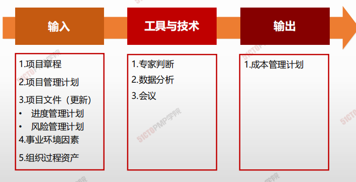

1. 输入
   1. 项目章程
   2. 项目管理计划
   3. 项目文件（更新）
      - 进度管理计划
      - 风险管理计划
   4. 事业环境因素
   5. 组织过程资产
2. 工具与技术
   1. 专家判断
   2. 数据分析
   3. 会议
3. 输出
   1. 成本管理计划

### 成本管理计划

- **计量单位：**是货币，还是人天? 
- **精确度级别：**精确到千位还是万位，包含风险应急金与否；
- **准确度：**估算的准确度；可能包括应急储备。
- **组织程序的链接：**WBS中的各控制帐户都和组织会计体系连接。
- **控制临界值：**获得共识的成本偏差范围，通常用基准的百分比表示。
- **绩效测量规则：**
  1. 是否使用EVM 
  2. 确定WBS中的控制账户
  3. EV的度量方法：0/100，0/50/100，加权里程碑，完成百分比
  4. 计算EAC（完工预测）的公式
  5. 报告格式：成本报告的表格、频次等
- **其他细节和程序。**关于成本管理活动的其他细节包括：
  1. 对筹资方案的说明； 
  2. 处理汇率波动的程序； 
  3. 记录项目成本的程序

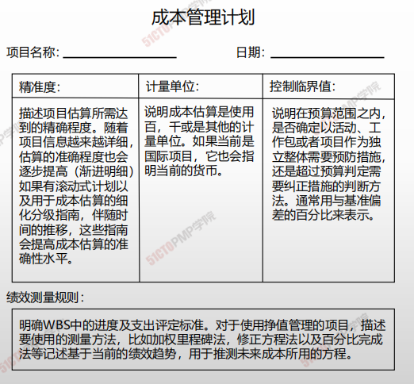

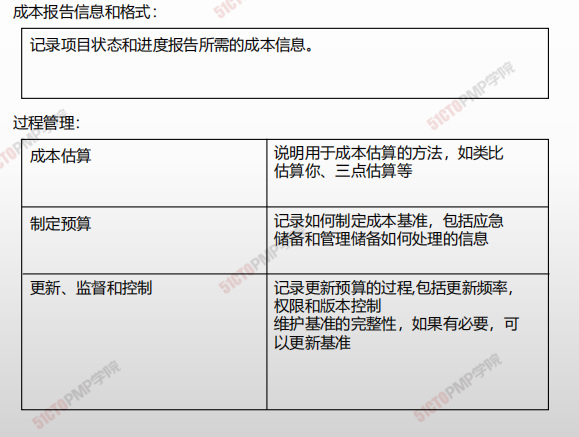

---

# 估算成本

## 4W1H

| 4W1H                | 规划成本管理                                                 |
| ------------------- | ------------------------------------------------------------ |
| what 做什么     | 估算成本是对完成项目工作所需资源成本进行近似估算的过程。 <u>作用：确定项目所需的资金。本过程应根据需要在整个项目期间定期开展。</u> |
| why 为什么做    | 成本预测，在估算成本时，需要识别和分析可用于启动与完成项目的备选成本方案；可以避免在通货膨胀等的风险。 |
| who 谁来做      | 本过程应根据需要在整个项目期间定期开展。                     |
| when 什么时候做 | 应该在项目规划阶段的早期就对成本管理工作进行规划，建立各成本管理过程的基本框架。 |
| how 如何做      | 通过规划输入输出，来确认项目成本管理的需求。 <u>专家判断、数据分析、会议</u> |

## 输入/工具技术/输出

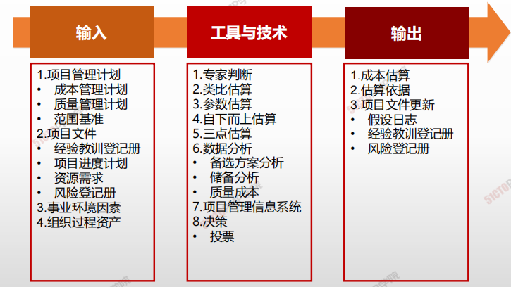

1. 输入
   1. 项目管理计划
      - 成本管理计划
      - 质量管理计划
      - 范围基准
   2. 项目文件
      - 经验教训登记手册
      - 项目进度计划
      - 资源需求
      - 风险等级册
   3. 事业环境因素
   4. 组织过程资产
2. 工具与技术
   1. 专家判断
   2. 类比估算
   3. 参数估算
   4. 自下而上估算
   5. 三点估算
   6. 数据分析
      - 备选方案分析
      - 储备分析
      - 质量成本
   7. 项目管理信息系统
   8. 决策
      - 投票
3. 输出
   1. 成本估算
   2. 估算依据
   3. 项目文件更新
      - 假设日志
      - 经验教训登记册
      - 风险登记册

### 成本估算的方法

|              | 类比估算(自上而下)                                           | 自下而上                                                     | 参数估算                                                     |
| ------------ | ------------------------------------------------------------ | ------------------------------------------------------------ | ------------------------------------------------------------ |
| **定义**     | 对照已经完成的类似项目的实际成本，估算出新项目的总成本。这又被称之为自上而下法。是一种专家评定法。 | 基于WBS体系，先估算各个单位活动或工作包的独立成本然后将单个的估算自下而上层层进行汇总，得到项目整体成本。 | 讲项目特征用于数学模型来预测项目成本。                       |
| **优点**     | <u>方法简易，省时省力，计算成本低</u>                        | <u>成本估算比较准确，符合实际</u>                            | <u>信息采集量小，省事节约费用，易于使用</u>                  |
| **缺点**     | <u>信息量模糊，估算准确度低</u>                              | <u>信息采集量大，耗时费工成本高</u>                          | <u>不校验则准确性无法保证，无法适应变化</u>                  |
| **适用场景** | 在下述情况下非常可靠 1. 以前项目在事实上而不仅仅是在外表上相似 2. 进行估算的个人或团体具有所需要的专门知识 3. 费用最低，可靠性差 | 成本和精度受到单个活动或工作包大小复杂程度的制约，较小的活动在提高估算精度的同时将增加成本 | 在下述情况下非常可靠 1. 用于建立模型的历史信息是准确的 2. 在模型中使用的参数是很容易量化的 3. 模型可按比例调整 |

---

# 制定预算

## 4W1H

| 4W1H                | 制定预算                                                     |
| ------------------- | ------------------------------------------------------------ |
| what 做什么     | 制定预算是汇总所有单个活动或工作包的估算成本，建立一个经批准的成本基准的过程。 <u>作用：确定可据以监督和控制项目绩效的成本基准。</u> |
| why 为什么做    | 确定可据以监督和控制项目绩效的成本基准。                     |
| who 谁来做      | 项目经理与预算小组。                                         |
| when 什么时候做 | 本过程仅开展一次或仅在项目的预定义点开展。                   |
| how 如何做      | 进行制定成本管理计划、资源管理计划、范围基准。制定项目文件、商业文件。数据经过专家相关人员分析，得出预算计划。 <u>专家判断、成本汇总、数据分析、历史信息审核、资金限制平衡、融资</u> |

## 输入/工具技术/输出

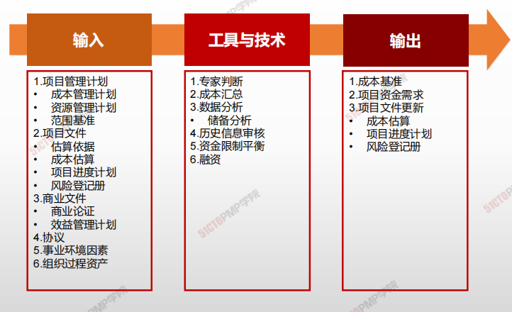

1. 输入
   1. 项目管理计划
      - 成本管理计划
      - 资源管理计划
      - 范围基准
   2. 项目文件
      - 估算依据
      - 成本估算
      - 项目进度计划
      - 风险登记册
   3. 商业文件
      - 商业论证
      - 效益管理计划
   4. 协议
   5. 事业环境因素
   6. 组织过程资产
2. 工具与技术
   1. 专家判断
   2. 成本汇总
   3. 数据分析
      - 储备分析
   4. 历史信息审核
   5. 资金限制平衡
   6. 融资
3. 输出
   1. 成本基准
   2. 项目资金需求
   3. 项目文件更新
      - 成本估算
      - 项目进度计划
      - 风险等级手册

### 应急储备 vs 管理储备

|                      | 应急储备                               | 管理储备                                                 |
| -------------------- | -------------------------------------- | -------------------------------------------------------- |
| **属于的过程**       | 估算成本过程                           | 指定预算过程                                             |
| **用来应对哪些事件** | 预期但不确定的事件，即：一直的未知事件 | 未计划但可能存在的项目范围和成本变化，即：未知的未知事件 |
| **是否属于成本基准** | 属于成本基准                           | 不属于成本基准，但属于项目总预算                         |
| **项目经理处置权利** | 项目经理可以自由使用                   | 必须经过批准才可以动用                                   |
| **是否纳入政治计算** | 纳入                                   | 不纳入                                                   |

### 成本汇总

1. 项目总预算
   1. 管理储备
      1. 未知的未知（管理者的前）
         1. 批准的更改
   2. 绩效计量基准（PMB）
      1. 应急储备
         1. 已知的未知（项目经理的钱）
            1. 已识别风险
      2. 已经分配的预算

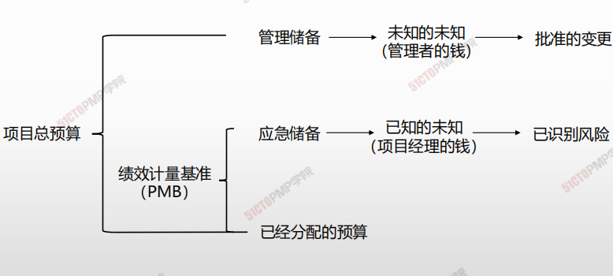

---

# 控制成本

## 4W1H

| 4W1H                | 控制成本                                                     |
| ------------------- | ------------------------------------------------------------ |
| what 做什么     | 控制成本是监督项目状态，以更新项目成本和管理成本基准变更的过程。 <u>作用：在整个项目期间保持对成本基准的维护。</u> |
| why 为什么做    | 在整个项目期间保持对成本基准的维护。                         |
| who 谁来做      | 项目经理与项目小组。                                         |
| when 什么时候做 | 本过程需要在整个项目期间开展。                               |
| how 如何做      | 在成本控制中，应重点分析项目资金支出与相应完成的工作之间的关系。有效成本控制的关键在于管理经批准的成本基准。 <u>专家判断、数据分析、完工尚需绩效指数、项目管理信息系统</u> |

## 输入/工具技术/输出

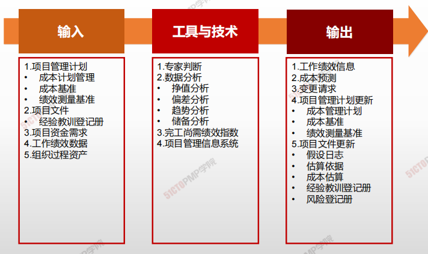

1. 输入
   1. 项目管理计划
      - 成本管理计划
      - 成本基准
   2. 项目文件
      - 经验教训登记册
   3. 项目资金需求
   4. 工作绩效数据
   5. 组织过程资产
2. 工具与技术
   1. 专家判断
   3. 数据分析
      - 挣值分析
      - 偏差分析
      - 趋势分析
      - 储备分析
   4. 完工尚需绩效指数
   5. 项目管理信息系统
3. 输出
   1. 工作绩效信息
   2. 成本预测
   3. 变更请求
   4. 项目挂历计划更新
      - 成本管理计划
      - 成本基准
      - 绩效测量基准
   5. 项目文件更新
      - 假设日志
      - 估算依据
      - 成本估算
      - 经验教训登记册
      - 风险等级册

### 挣值分析

| 挣值（Earned Value） | 表示在测量时点已完成的工作量的计划费用                       |
| -------------------- | ------------------------------------------------------------ |
| **挣值分析**         | 是**测量**执行情况的常用方法，整合了**范围，费用和进度的测量，**从而帮助项目管理者**评价**项目执行情况 |

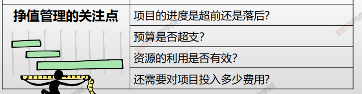

### 挣值管理三个核心概念

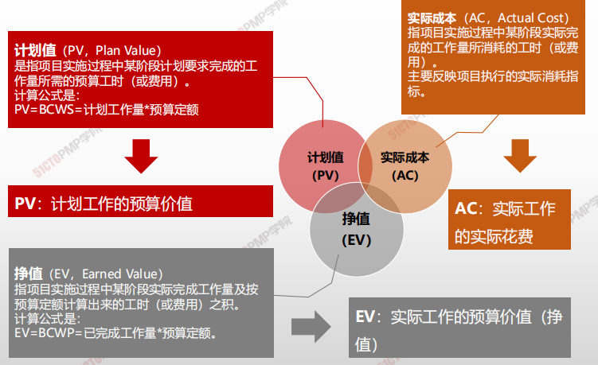

#### 计划值PV

- **计划值**（PV，Plan Value）

  是指项目实施过程中某阶段计划要求完成的工作量所需的预算工时（或费用）。

- 计算公式是：

  - PV = BCWS = 计划工作量*预算定额

> **PV**：计划工作的预算价值

#### 实际成本AC

- **实际成本**（AC，Actual Cost）

  指项目实施过程中某阶段实际完成的工作量所消耗的工时（或费用）。

  主要反映项目执行的实际消耗指标。

> AC：实际工作的实际花费

#### 挣值EV

- **挣值**（EV，Earned Value）

  指项目实施过程中某阶段实际完成工作量及按预算定额计算出来的工时（或费用）之积。

- 计算公式是：
  
  - EV = BCWP = 已完成工作量*预算定额。

> **EV：**实际工作的预算价值（挣值）

### 挣值管理相关公式

|                  | 简称 | 说明         | 公式说明                           |
| ---------------- | ---- | ------------ | ---------------------------------- |
| **完工预算**     | BAC  | 完工预算     | 整个项目的预算（总的PV）           |
| **应该干多少**   | PV   | 计划值       | 实际完成工作的预算值               |
| **干了多少**     | EV   | 挣值         | 实际完成工作的预算值               |
| **花了多少**     | AC   | 实际成本     | 实际花费成本                       |
| **剩下工作成本** | ETC  | 完工尚需估算 | 剩下的工作还需要多钱               |
| **全部工作成本** | EAC  | 完工估算     | 实际成本+完工尚需估算 **AC + ETC** |
|                  | VAC  | 完工估算     | **VAC = BAC - EAC**                |
|                  | SV   | 进度偏差     | 挣值 - 计划值 （**EV - PV**)       |
|                  | SPI  | 进度偏差知识 | 挣值 / 计划值 (**EV / PV**)        |
|                  | CV   | 成本偏差     | 挣值 - 实际成本 (**EV - AC**)      |
|                  | CPI  | 成本偏差指数 | 挣值 / 实际成本 (**EV / AC**)      |

### 使用挣值管理分析绩效

**CV = EV -AC**

**SV = EV - PV**

**CPI = EV / AC**

**SPI = EV / PV**

| 偏差分析     | 偏差为正：>0                         | 偏差为负：<0                         |
| ------------ | ------------------------------------ | ------------------------------------ |
| 成本偏差(CV) | 节约成本                             | 成本超支                             |
| 进度偏差(SV) | 工期提前(货币单位)                   | 工期滞后(货币单位)                   |
| SV和CV同时   | 成本节约，**按此绩效，工期将会提前** | 成本超支，**按此绩效，工期将会滞后** |

| 偏差分析         | 原因分析                                       |
| ---------------- | ---------------------------------------------- |
| CV为正，SV为负   | 资源没到位，没开工，所以省钱，几度落后         |
| CV进为负，SV为正 | 可能在赶工，拿资源换时间，所以花钱多，进度提前 |

| 绩效分析          | 绩效指数>1     | 绩效指数<1     |
| ----------------- | -------------- | -------------- |
| 工期绩效指数(SPI) | 工期提前       | 未完成计划     |
| 成本绩效指数(CPI) | 比计划成本节约 | 比计划成本超支 |

### 预测技术（完工估算）

| 参数名                  | 含义与公式                                                   | 备注   | 记忆法             |
| ----------------------- | ------------------------------------------------------------ | ------ | ------------------ |
| 完工总**预**算值（BAC） | 所有计划成本的和 **BAC = 总的PV**                            | 未做   | 所有的活           |
| 完工**尚需**估算（ETC） | 当前时间点，项目剩余工作完工估算                             | 同左   | 剩下的活           |
| （ETC）                 | ETC = 剩下工作量对应的计划值 = 总计划值 - 已完成的计划值（EV） ，即 ETC = BAC - EV | 非典型 | 悔改，按照计划执行 |
| （ETC`）                | ETC` = 剩下工作量对应计划值 / 成本绩效指数 = ETC / CPI = (BAC - EV) / CPI | 典型   | 一错再错，执迷不悟 |
| 完工估算（EAC）         | 项目整体完工估算成本，等于AC+完工尚需估算 即 EAC = AC + ETC` |        |                    |

- <u>完工预算(Budget at completion, BAC)</u>
- <u>完工估算(Estimate at completion, EAC)</u>
- <u>完工尚需估算(Estimate to complete, ETC)</u>
- <u>完工时偏差 (Variance At Completion, VAC)</u>

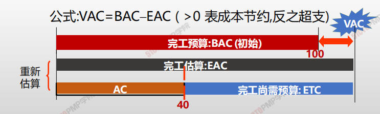

| 情景                                   | 计算公式                               |
| -------------------------------------- | -------------------------------------- |
| 以前估算假设不成立，剩余工作重新估算   | EAC = AC + ETC                         |
| 如果没有骗车或者偏差不典型             | EAC = AC + BAC - EV = BAC - CV         |
| 如果有典型偏差，即以当前CPI完成ETC工作 | EAC = AC + (BAC - EV ) / CPI = BAC/CPI |
| 假设CPI与SPI将同时影响ETC工作          | EAC = AC - (BAC - EV)/ CPI×SPI         |

> CPI = EV / AC

- 完工尚需绩效指数 (**TCPI**) 

  TCPI = (BAV - EV) / (BAC - AC ) 或 (EAC - AC)

  完成剩余工作所需的成本与剩余预算之比

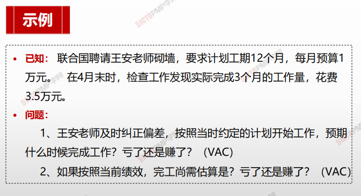

### 预测技术（完工估算）-典型偏差

**典型偏差**：为纠正偏差，一意孤行

**ETC`** = 剩下工作量对应计划值 /  成本绩效指示 = ETC/CPI = (BAC-EV)/**CPI**

### 预测技术（完工估算）-非典型偏差

**非典型偏差**：纠正偏差，按计划进度：

ETC=剩下工作量对应的计划值 =总计划值-已完成工作的计划值（EV），即ETC=BAC-EV=12-3=9万。所有工作将于第13个月完成

### 预测技术

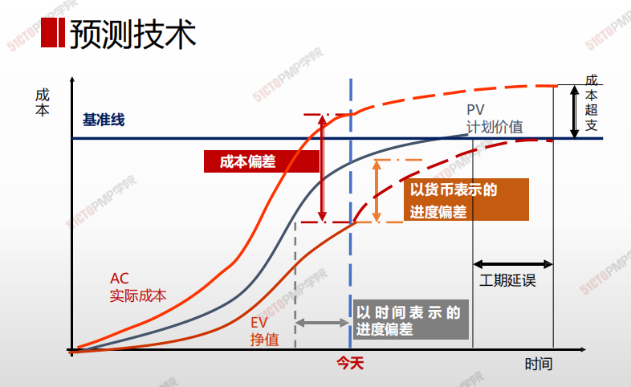

### 挣得进度

**对挣值管理 (EVM)的理论和实践进行扩展，引入挣得进度 (ES)。**

进度指标如SV用货币单位衡量而不是时间单位，这样就不太直观。SV进度偏差（SV=EV-PV）进度偏差为-1000美元，根据这个货币单位的进度偏差数据不太容易直观了解当前进度到底落后多久。二是项目在快要完工到完工这一时间，无论进度落后多少，EV将会越来越接近PV和BAC并最终完工时等于PV和BAC，这样SV将会越来越接近于0并最终最终完工时等于0

**对挣值管理 (EVM)的理论和实践进行扩展，引入挣得进度 (ES)**

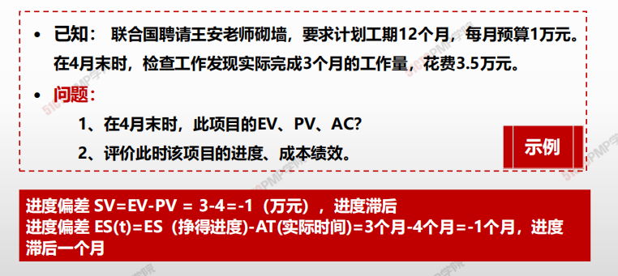

1. 控制成本4W1H
2. 成本控制
3. 成本控制-ITTO：挣值分析
4. 挣值管理三个核心概念
5. 挣值管理相关公式
6. 小练习
7. 使用挣值管理分析绩效（在不引入挣得进度的概念下）
8. 预测技术（完工估算）
9. 预测技术（完工估算）-典型偏差
10. 预测技术（完工估算）-非典型偏差
11. 预测技术

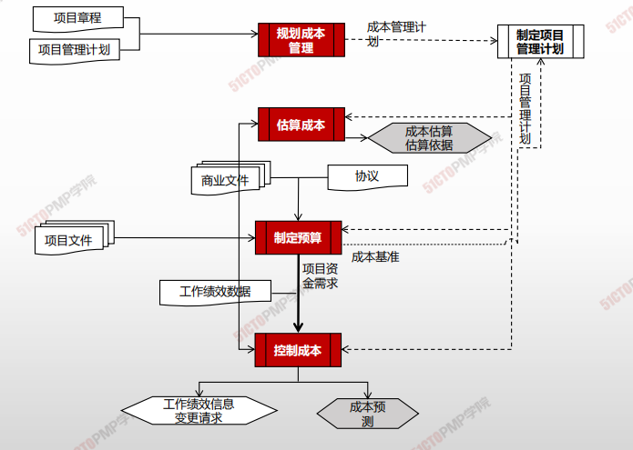

---

