# 质量管理概述

| 8.1  | 规划质量管理 | **识别**项目及其可交付成果的**质量要求和/或标准**，并**书面描述**项目将**如何证明**符合质量要求和/或标准的过程。 |
| ---- | ------------ | ------------------------------------------------------------ |
| 8.2  | 管理质量     | 管理质量是把组织的质量政策用于项目，并将质量挂历计划转化为可执行的质量活动的过程。 |
| 8.3  | 控制质量     | 为了评估绩效，确保项目输出完整、正确，并满足客户的期望，而监督和记录质量管理活动执行结果的过程。 |

## 项目质量管理的核心概念

**代价最大的方法是让客户发现缺陷。这种方法可能会导致担保问题、召回、商誉受损和返工成本。**

- **控制质量过程包括先检测和纠正缺陷，再将可交付成果发送给客户。该过程会带来相关成本，主要是评估成本和内部失败成本。**
- **通过质量保证检查并纠正过程本身，而不仅仅是特殊缺陷。**
- **将质量融入项目和产品的规划和设计中。**
- **在整个组织内创建一种关注并致力于实现过程和产品质量的文化。**

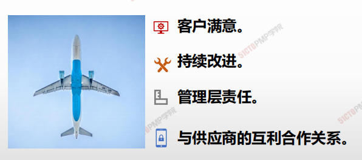

## 项目质量管理概述

1. **QS（遵从组织质量体系）**

2. **QP（制定质量计划 —— 找标准、找方案）**

3. **QM（实施质量管理 —— 强调过程中努力）**

4. **QC （落实质量控制 —— 强调结果处的检查）**

5. **QI （坚持持续改进）**

   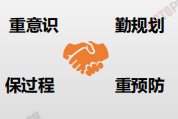

> 质量的定义：**过程、产品或服务满足明确（或隐含）的需求能力的特征。**
>
> ​															—————————————美国质量管理协会

------------------

1. 内在的质量特性：性能、特性、强度、精度。
2. 外在质量特性：外形、包装、色泽、味道。
3. 经济质量特性：寿命、成本、价格、运营维护费用。
4. 环保质量特性：产品对于环境保护或环境污染。

---------

* **质量概念是主观的，也是客观的。**
* **达到用户的要求就是高质量。**
* **质量是可度量的**

## 质量的本质内涵

> 质量是唯一不能妥协的，没有质量的生产是一种破坏！

> 质量考研的是人心，更考验的是人性！

## 质量与等级

* 等级（Grade）偏低“**对用途相同但技术特性不同**的产品或服务的级别**分裂**”
* 质量（Quality）偏低永远是个问题，**等级较低则不见得是个问题**
* 等级低、质量高的产品是许多厂商市场份额的重要杀手锏
* 确定并交付所要求的质量与等级水准乃是项目经理与项目管理团队的职责

* [x] **质量：有无缺陷**
* [x] **等级：功能多少，反应设计意图**

> 低质量是个问题，低等级不一定是个问题

## 属性抽样 vs 变量抽样

* **属性抽样 <u>结果为合格或不合格</u>**
* **变量抽样 <u>表名合格的程度，不下结论，只出结果</u>**

| 属性抽样 | 对一个产品的一个或多个属性的测试。产品的属性可以是重量、规模、功能等。结果或为不合格 |
| -------- | ------------------------------------------------------------ |
| 变量抽样 | 在连续的量表上标明结果所处的位置，以此表明合格的程度一个流程的变化过程被测量并且记录下来，以此决定流程的能力。 |

## 质量管理理论的发展

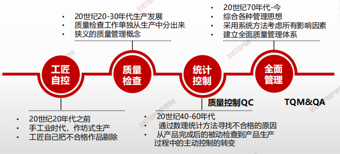

| 传统的质量观点                   | 现代质量管理观点                                     |
| -------------------------------- | ---------------------------------------------------- |
| 质量是检查出来的                 | 质量是规划出来的，而非检查出来的                     |
| 质量就是指产品的质量             | 质量不只是产品还包括过程                             |
| 缺陷是不可避免的                 | 事情一次作对成本最低 - 零缺陷                        |
| 质量管理是质量部门人员的事情     | 质量管理，人人有责                                   |
| 对于质量事故，基层人员负主要责任 | 质量责任高层管理者承担85%                            |
| 质量越高越好                     | 质量就是符合要求、使用、客户满意，需要考虑成本与收益 |
| 改进质量主要靠检查和返工         | 改进质量靠预防和评估                                 |

## 精益生产方式的基本思想 - 及时生产

> 精益生产方式为JIT生产方式、准时制生产方式、适时生产方式或看板生产方式

-----

Just In Time (JIT），翻译为中文是“旨在需要的时候，按需要的量，生产所需的产品”。

精：少而精，不投入多余的生产要素， 只在适当时间生产必要的产品

益：所有经营活动有益有效，具有经济意义(产出)

---

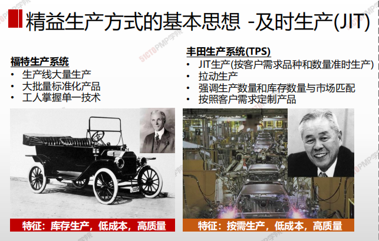

## 质量管理大师：戴明

---

• PDCA循环：*计划P:* 提高当前的实践；*执行D:* 计划的实施；*检查C:* 通过测试来观察是否得到了期望的结果；*行动A:* 实施纠正行动

• 戴明提出“用不间断周期”，即产品设计、制造、测试和销售——市场调查——重新设计

• 戴明认为高质量会带来高生产率，从而能在较长时间内保持竞争力

• 戴明还阐述说：85%的质量问题应由管理层负责，另外15%由团队成员负责。

项目经理负质量管理责任。团队成员负把事情做对的成果责任。

• 鼓励高层参与到质量计划之中

• 预防胜于检查

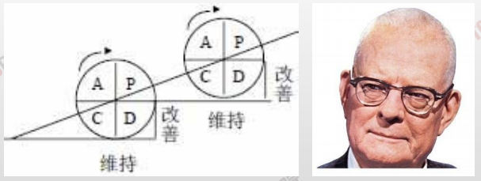

---

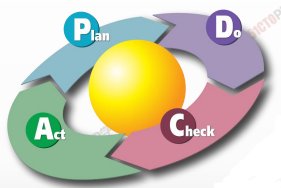

## PDCA 循环

PDCA循环分为四个阶段

**P（计划）：**从问题的定义到行动计划

**D（实施）：**实施行动计划

**C（检查）：**评估结果

**A（处理）：**标准化和进一步推广

### PDCA循环的具体应用

1. **PLAN**
   1. 分析现状，找出存在的问题
      1. 确认问题
      2. 收集和组织数据及材料
      3. 设定目标和方法
   2. 分析产生问题的各种原因或影响因素
   3. 找出影响的主要因素（如：因果图）
   4. 制定措施，提出行动计划
      1. 寻找可能的解决方法
      2. 测试并选择 （模拟）
      3. 提出行动计划和相应的资源
2. **DO**
   1. 实施行动计划
3. **CHECK**
   1. 评估结果（分析数据）
4. **ACT**
   1. 标准化和进一步推广
   2. 下一个改进机会中重新使用PDCA循环

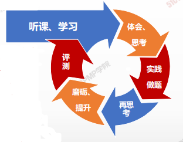

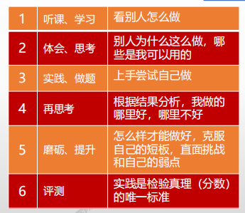

## 质量管理大师：朱兰

---

• 核心思想是“适用性”(Fitness for Use)。 

• 适用性就是通过遵守技术规范，使项目符合项目干系人及客户的期望。

• 定义了质量与等级的区别

• 提出质量计划->质量控制->质量改进的质量

三部曲

• 第一个提出由客户来决定质量

• 质量螺旋：为了获得产品的适用性，需要进行一系列工作活动。同时在这个全过程的不

断循环中螺旋式提高。

• 质量要满足使用

• 内部：便利性、操作性

• 外部：客户

---

## 质量管理大师：克劳士比-零缺陷(Crosby)

---

• 质量的定义为“符合预先的要求”，与需求一致

• 质量源于预防：预防系统保证质量，而不是评估（检验）

• 质量的执行标准是“零缺陷(Zero Defect)”，而不是“这很接近了”的态度

• 质量是用非一致性成本来衡量的：“不一致的代价”，而不是“指数”。

---

---

# 规划质量管理

## 4W1H

| 4W1H                | 规划质量管理                                                 |
| ------------------- | ------------------------------------------------------------ |
| what 做什么     | 识别项目及其可交付成果的质量要求和（或）标准，并书面描述项目将如何证明符合质量要求和（或）标准的过程。 作用：为在整个项目期间如何管理和核实质量提供指南和方向 |
| why 为什么做    | 1、识别项目/产品的质量要求和标准； 2、如何达到标准； 3、为项目质量检验、项目/产品质量验收制定标准。 |
| who 谁来做      | 项目团队可能举行规划会议来制定成本管理计划。参会者可能包括项目经理、项目发起人、选定的项目团队成员、选定的相关方、项目成本负责人，以及其他必要人员。 |
| when 什么时候做 | 应该在项目规划阶段的早期就对成本管理工作进行规划，建立各成本管理过程的基本框架。 |
| how 如何做      | 通过规划输入输出，来确认项目成本管理的需求。 <u>专家判断、数据分析、会议</u> |

## 输入/工具技术/输出

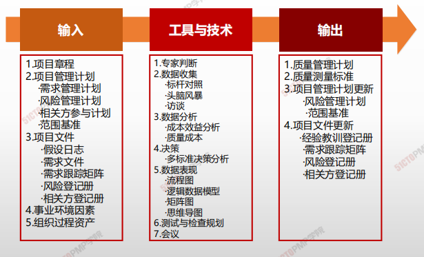

1. 输入

   1. 项目章程
   2. 项目管理计划
      - 需求管理计划
      - 风险管理计划
      - 相关方参与与计划
      - 范围基准
   3. 项目文件
      - 假设日志
      - 需求文件
      - 需求跟踪矩阵
      - 风险登记册
      - 相关方登记册
   4. 事业环境因素
   5. 组织过程资产

2. 工具与技术

   1. 专家判断
   2. 数据收集
      - 标杆对照
      - 头脑风暴
      - 访谈
   3. 数据分析
      - 成本效益分析
      - 质量成本
   4. 决策
      - 多标准决策分析
   5. 数据表现
      - 流程图
      - 逻辑数据模型
      - 矩阵图
      - 思维导图
   6. 测试与检查规划
   7. 会议

3. 输出

   1. 质量管理计划
   2. 质量测量标准
   3. 项目管理计划更新
      - 风险管理计划
      - 范围基准
   4. 项目文件更新
      - 经验教训登记手册
      - 需求跟踪矩阵
      - 风险登记册
      - 相关方登记册

   

## 质量管理计划

质量管理计划包括（但不限于）一下组成部分：

* 项目采用的质量标准
* 项目的质量目标
* 质量角色与职责
* 需要质量审查的项目可交付成果和过程
* 为项目规划的质量控制和质量管理活动
* 项目使用的质量工具
* 有项目有关的主要程序

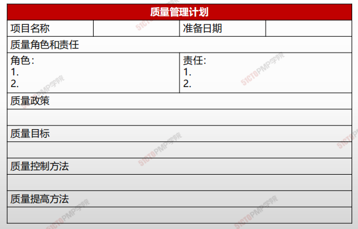

## 质量测量指标

用于**描述项目或产品属性，**以及控制质量过程将如何验证符合程度。

- 质量测量指标的例子包括
  - CPI
  - 缺陷率
  - 故障率
  - 每个代码行的错误
  - 客户满意度分数
  - 测试覆盖率

1. 质量是规划、设计和建造出来的，而不是检查出来的

2. 质量规划的输入、输出和工具与技术

3. 当质量的成本投入与收益回报正好相等时，质量达到最佳

4. 质量成本分为一致性成本和非一致性成本

---

# 03.管理质量

* 管理质量是吧组织的质量政策用于项目，并将质量管理计划转化为可执行的质量活动过程。
* 本过程的主要作用是，提高实现质量目标的可能性，以及识别无效过程和导致质量低劣的原因。
* 管理质量使用控制质量过程的数据和结果向相关方展示项目的总体质量状态。
* 本过程需要在整个项目期间展开
* 管理质量有时被称之为“质量保证”，但”管理质量“的定义比”质量保证“更广，因其可用于非项目工作。
* 在项目管理中，质量保证着着眼于项目使用的过程，旨在高效地执行项目过程，包括遵守和满足标准，向相关方保证最终产品可以满足他们的需求、期望和要求。
* 管理质量包括所有质量保证活动，还与产品设计和过程改进有关。
* 管理质量的工作属于质量成本框架中的 一致性工作

## 4W1H

| 4W1H                 | 质量管理                                                                                                                             |
| -------------------- | -------------------------------------------------------------------------------------------------------------------------------- |
| 
what 做什么
   | 
把组织的质量政策用于项目，并将质量管理计划转化为可执行的质量活动的过程。 作用：提高实现质量目标的可能性，以及识别无效过程和导致质量低劣的原因。管理质量使用控制质量过程的数据和结果向相关方展示项目的总体质量状态
              |
| 
why 为什么做
   | 实现质量预防理念，构建一个框架体系，用过程/流程保证质量。                                                                                                    |
| 
who 谁来做
    | 管理质量被认为是所有人的共同职责，包括项目经理、项目团队、项目发起人、执行组织的管理层，甚至是客户。                                                                               |
| 
when 什么时候做
 | 规划制定后，执行全过程，持续开展保证活动。                                                                                                            |
| 
how 如何做
    | 
项目经理和项目团队可以通过组织的质量保证部门或其他组织职能执行某些管理质量活动。质量保证部门在质量工具和技术的使用方面通常拥有跨组织经验，是良好的项目资源。 数据收集、数据分析、决策、数据表现、审计、面向X的设计、问题解决、质量改进方法
 |

## 输入/工具技术/输出

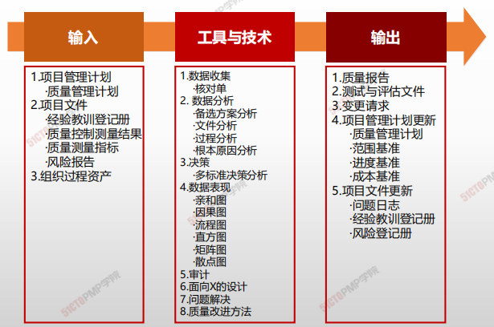

1. 输入
   2. 项目管理计划
      * 质量管理计划
   3. 项目文件
      * 经验教训登记册
      * 质量控制测量结果
      * 质量测量指标
      * 分析按报告
   4. 组织过程资产
2. 工具与技术
   2. 数据收集
      * 核对单
   3. 数据分析
      * 备选方案分析
      * 文件分析
      * 过程分析
      * 根本原因分析
   4. 决策
      * 多标准决策分析
   5. 数据表现
      * 亲和图
      * 因果图
      * 流程图
      * 直方图
      * 矩阵图
      * 散点图
   6. 审计
   7. 面向X的设计
   8. 问题解决
   9. 质量改进方法
3. 输出
   1. 质量报告
   2. 测试与评估文件
   3. 变更请求
   4. 项目管理计划更新
      * 质量管理计划
      * 范围基准
      * 进度基准
      * 成本基准
   5. 项目文件更新
      * 问题日志
      * 经验教训登记册
      * 风险登记册

## 因果分析图、石川图、鱼刺图

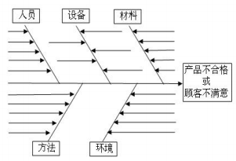

### 鱼刺图

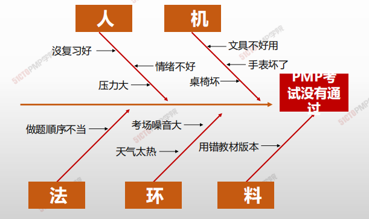

### 流程图

> 用来显示在一个或多个输入转化成一个或多个输出的过程中，所需要的步骤顺序和可能的分支

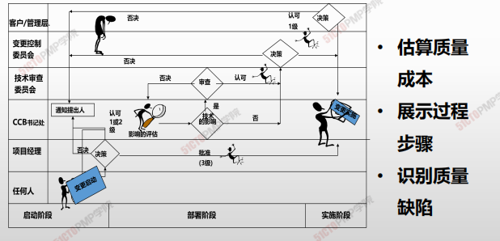

### 方直图

* 描述产品质量分布
* 了解产品质量的波动情况及质量特性的分布规律
* 一种统计报告，可以显示在某个最小值和最大值之间值的等级或范围内值的出现频率

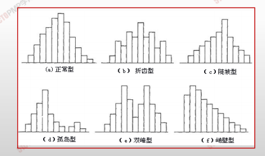

### 帕累托图

* 20%原因 造成 80%的错误
* 帕累托图中数据的重要性以下降的顺序排列
* 按优先顺序表示数据，并将注意力集中在关键数据上，一般来说，**关注在前两个到三个因素就可以解决大部分的问题**

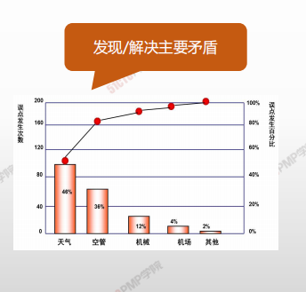

### 散点图

* 显示两种质量特性数据之间的关系以及关系密切程度
* 散点图显示两个变量之间的关系和规律：积极地，消极的，还是两者毫无关系的
* 虽然散点图不能证明一个变量引起另一个变量的变化，但它有助于说明是否存在某种关系，也可以说明这种关系的强度

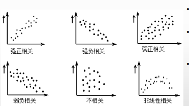

## 审计

用来确定活动是否遵循了组织和项目的政策、过程和程序的一种结构化的、独立的审查过程

* 5个目标：识别良好做法、发现不足、分享经验、改进过程，总结经验
* 可以由内部和外部人员进行

## 面向X的设计（DFX）

是产品设计期间可采用的一系列技术指南，旨在 优化设计的特定方面。

* “X”可以是产品开发的不同方面：如可靠性、调配、装配、制造、成本、服务、可用性、安全性和质量
* 可以降低成本、改进质量、提高绩效和客户满意度

## 问题解决

发现解决问题或应对挑战的解决方案。他包括收集其他信息、具有批判性思维、创造性的、量化的和/或逻辑性的解决方法；

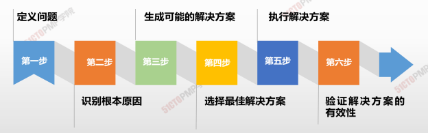

## 质量报告

* 质量报告可能是图形、数据或定性文件，其中包含的信息可帮助其他过程和部门采取纠正措施，以实现目标质量的期望。
* 质量报告的信息可以包含团队上报的质量管理问题，针对过程、项目和产品的改善建议，纠正措施（包括返工、缺陷、漏洞不就、100%检查等），以及时控制质量过程中发现 的情况概述。

---

#  控制质量

## 4W1H

| 4W1H                | 控制质量工作                                                 |
| ------------------- | ------------------------------------------------------------ |
| what 做什么     | 是为了评估绩效，确保项目输出完整、正确且满足客户期望，而监督和记录质量管理活动执行结果的过程。 <u>作用</u>：核实项目可交付成果和工作已经达到主要相关方的质量要 求，可供最终验收。 |
| why 为什么做    | 在用户验收和最终交付之前测量产品或服务的完整性、合规性和适用性。 |
| who 谁来做      | 组织中的质量控制部门或名称相似的组织单元。                   |
| when 什么时候做 | 执行之后，对项目产品、服务或成果进行的检查评估。             |
| how 如何做      | 在整个项目期间应执行质量控制，用可靠的数据来证明项目已经达到发起人和/或客户的验收标准。 <u>工具与技术、数据分析、检查、测试/产品评估、数据表现、会议</u> |

## 输入/工具技术/输出

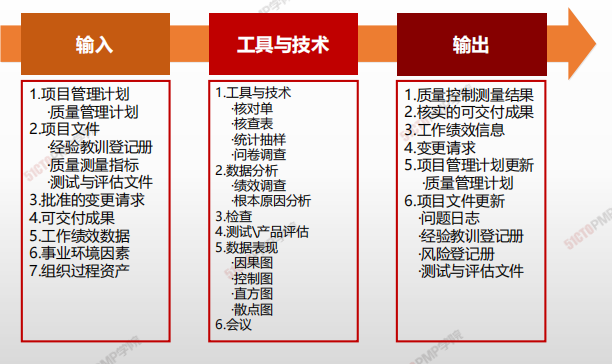

1. 输入

   1. 项目管理计划
      - 质量管理计划
   2. 项目文件
      - 经验教训登记册
      - 质量测量指标
      - 测试与评估文件
   3. 批准的变更请求
   4. 可交付成果
   5. 工作绩效数据
   6. 事业环境因素
   7. 组织过程资产

2. 工具与技术

   1. 数据收集
      - 核对单
      - 核查表
      - 统计抽样
      - 问卷调查

   3. 数据分析
      - 绩效调查
      - 根本原因分析
   2. 检查
   3. 测试、产品评估
   4. 数据表现
      - 因果图
      - 控制图
      - 直方图
      - 散点图
   5. 会议

3. 输出

   1. 质量控制测量结果
   2. 核实的可交付成果
   3. 工作绩效信息
   4. 变更请求
   5. 项目管理计划更新
      - 质量管理计划
   6. 项目文件更新
      - 问题日志
      - 经验教训登记册
      - 风险登记册
      - 测试与评估文件

   

## 核对单

- **核对单是一种结构化工具**
- 通常列出特定组成部分，用来核实所要求的一系列步骤是否已得到执行或检查需求列表是否已得到满足

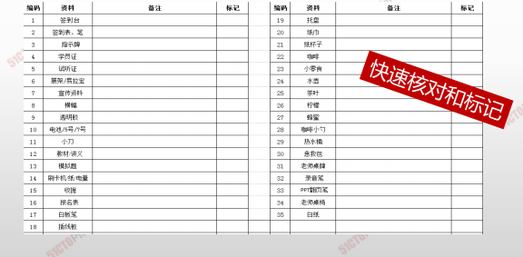

## 核查表

- **<u>核查表、又称计数表</u>**，用于合理排列各种事项，以便有效的收集潜在质量问题的有用数据。在开展检查以识别缺陷是，用核查表收集属性数据就特别方便，例如关于缺陷数量或后果的数据。

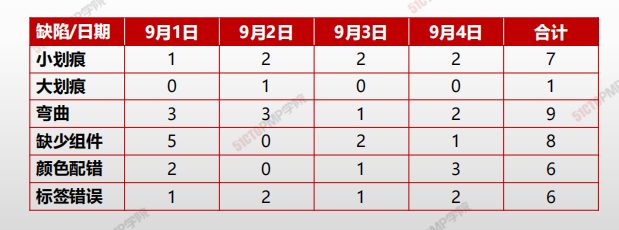

## 统计抽样

- 从 **<u>目标总体中选取部分样本</u>**用于检查，理论基础是概率统计

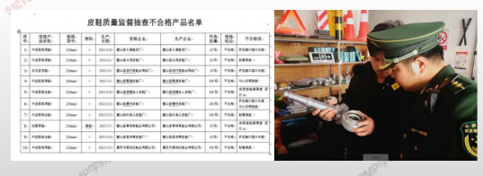

## 测试、产品评估

**<u>与检查一样，核实可交付成果的质量是否合格</u>**

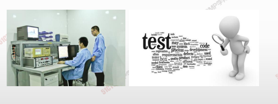

# 根本原因分析

- 确定引起 <u>偏差、缺陷或风险的根本原因</u>的一种分析技术。一项根本原因可能引起多项偏差、缺陷或风险。
- 识别问题的根本原因并且解决问题。消除所有根本原因可以杜绝问题再次发生。

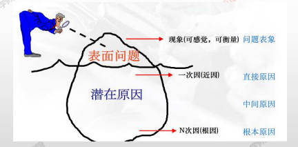

# 控制图

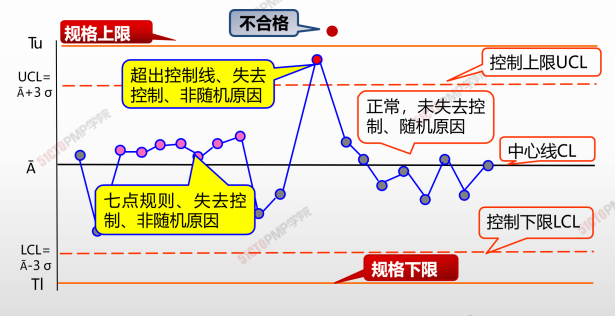

# 管理质量 & 控制质量

| 管理质量（质量保证）                         | 控制质量                               |
| -------------------------------------------- | -------------------------------------- |
| 事中 “ 做 ” 质量                             | 事后 “ 控 ” 质量                       |
| 由工作执行者边执行、边开展                   | 有专门质量控制人员在事后开展           |
| 发现系统原因导致的过程偏差，据此开展过程改进 | 发现特殊原因导致的过程偏差，并加以纠正 |
| 预防工作成果的质量缺陷                       | 发现和补救工作成果的质量缺陷           |
| 从整体着眼的质量管理体系建设                 | 从局部着眼的具体质量问题纠正           |
| 过程控制、机制建立                           | 成果控制、关注纠偏                     |

# 质量管理常用工具特点和适用场景小结

| 质量工具 | 特点和适用场景 |
| -------- | -------------- |
| 因果图、石川图、鱼骨图| 寻找原因/根本原因/所有原因。|
|流程图 |各步骤之间的相互关系+回退根本原因分析+预测可能发生的质量问题。|
|核查表：又称计数表 |在开展检查以识别缺陷时，用核查表收集属性。（表格形式展示居多）趋势图 未来结果预测（预测偏差等）。|
|帕累托图|引起问题的最大最主要原因、80/20法则，是一种特殊形式的直方图。|
|控制图|项目过程是否稳定、是否在可控范围内、项目整体情况。-7点同一侧、7点连续上升/下降、如超出控制线，则均为失控，需要调整；（b）控制上限和下限设在±3西格玛的位置。|
|直方图|过程变量的分布的形状和宽度来确定过程中出现问题的原因，描述集中趋势、特定组内的频率、分散程度和统计分布形状。（柱状形式）|
|散点图|以确定两个变量间是否存在可能的联系。数据点越接近对角线两个变量之间的关系就越密切。|
|亲和图 |根据原因之间的关系（亲和性）进行分组。|
|核对单| 结构化的检查，防止检查过程中遗漏。|

\1. 

控制质量强调核实可交付成果的正确性

\2. 

开展控制质量过程的结果，是核实的可交付成果，

它是确认范围过程的一项输入

\3. 

预防胜于检查

\4. 

统计抽样省时省力，而且减少对产品的破坏

\5. 

质量管理的适用场景和特点

---

# 05.本章总结

***

**规划质量**

* 确定质量标准
* 描述如何达到这些质量标准
* 要发生在规划阶段
* 实施主体是项目管理团队
* 针对的是标准

***

**管理质量**

* 强调质量改善、过程改进，提高干系人对项目达到质量要求的信心_按照计划，做合格质量_
* 判断质量标准是否合适
* _编制测试文件和质量报告_
* 主要发生在规划和执行阶段
* \*实施主体是项目执行团队
* 针对的是过程

***

**控制质量**

* 检查管理工作的质量是否符合要求,提出变更请求
* 检查可交付成果的质量是否符合相关质量标准,提出变更请求
* _主要发生在执行、监控和收尾阶段_
* 实施主体是组织质量控制部门
* \*针对的是结果

***

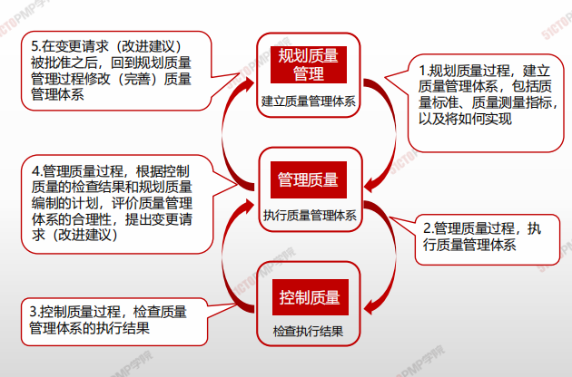

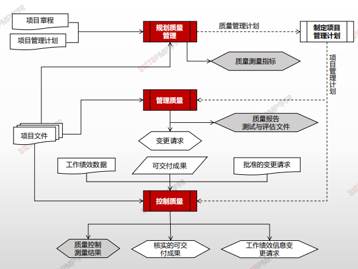

---

