# **华为的成功之道**

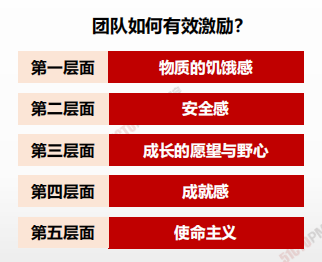

> 欲望的激发和控制，构成了一部华为的发展史，构成了人类任何组织的管理史。一家企业管理的成与败、好与坏，背后所展示的逻辑，都是人性的逻辑、欲望的逻辑。
>
> ​																																		——任正非

## 马斯洛需求层次理论

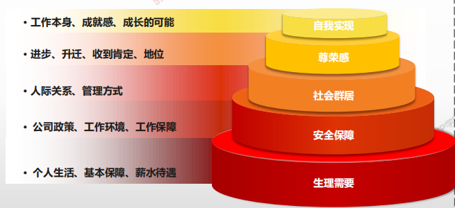

## 马斯洛需求层次理论

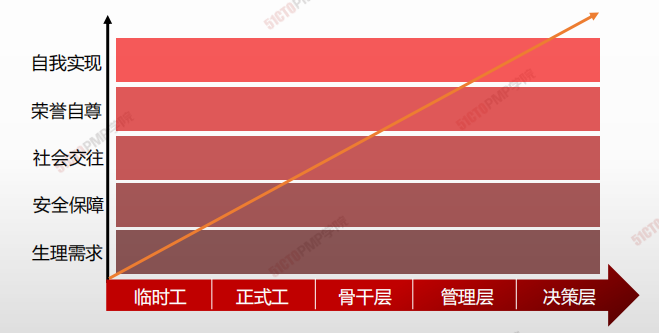

## 赫茨伯格双因素理论

| **卫生因素（外在因素）** | **激励因素（内在因素）** |
| ------------------------ | ------------------------ |
|        • 与上级主管之间的人事关系                   |                    • 工作上的成就感      |
|• 与同级之间的人事关系 |• 工作中得到认可和赞赏|
|• 与下级之间的人事关系|• 工作本身的挑战性和兴趣|
|• 工作环境或条件 |• 工作职务上的责任感|
|• 薪金 |• 工作的发展前途|
|• 个人的生活 |• 个人成长、晋升的机会|
|• 职务、地位||

## 赫茨伯格双因素理论

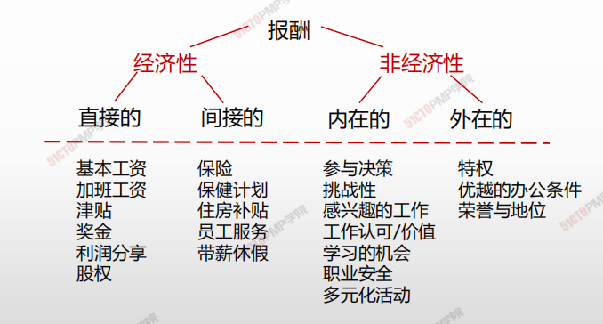

## 麦克格雷-X、Y理论

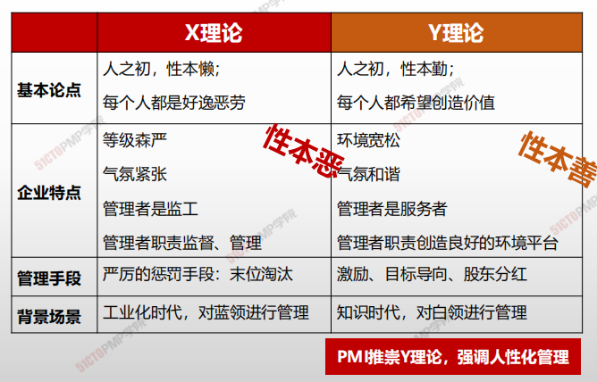

## 激励理论核心观点

| 提出人                                       | 理论名称         | 核心观点                                                     |
| -------------------------------------------- | ---------------- | ------------------------------------------------------------ |
| **马斯洛**                                   | **需求层次理论** | 人的需求分为从低到高五个层次，生理、安全、社会需求、尊重和自我实现，激励来自没有满足的需求。 |
| **赫茨伯格**                                 | **激励理论**     | 1、把劳动者的需求分为两类可激励因素，保健因素（外在）和激励因素（内在）。 2、保健因素良好不会使员工得到激励，但恶劣的的保健因素会损害员工的积极性。 3、激励因素存在会使员工得到激励，没有激励，员工不会努力工作。 |
| **麦克格利格**                               | **X理论**        | X理论对人的看法是悲观的、消极的 ,应该进行严格的管理、指挥、监视和控制 ，监管导向。 |
|                                              | **Y理论**        | Y理论对人的看法是乐观的、积极的，人们愿意工作并有所成就感,能自我激励,渴望承担责任，激励导向。 |
| **北美著名心理学家和行为科学家维克·-弗鲁姆** | **期望理论**     | 人们相信努力能产生成功的结果，并取得相应的报酬。人们在工作中的积极性或努力程度（激发）力量M是效价V和期望值E的乘积M=V×E  (1)工作能提供给他们真正需要的东西； (2）他们欲求的东西是和绩效联系在一起的； (3）只要努力工作就能提高他们的绩效。 |
| **日裔美国学者W.大内**                       | **Z理论**        | 任何企业组织都应该对他们的内部的社会结构进行变革，使之既能满足新的竞争住需要，又能满足各个雇员自我利益的需要 |
| **戴维·麦克利兰**                            | **成就动机理论** | 以三个因素反映需要与目标之间的关系的：权利需要、亲和需要、成就需要。管理者应该根据各人更重视的需要来制定激励措施： • 为成就需要者设立具有挑战性但可实现的目标 • 为权力需要者提供较能体现地位的工作环境 • 为亲和需要者提供合作而非竞争的工作环境 |

**1.华为的成功之道**

**2.马斯洛需求层次理论**

**3.赫茨伯格双因素理论**

**4.麦克格雷-X、Y理论**

**5.激励理论核心观点**

---

# 项目资源管理概述

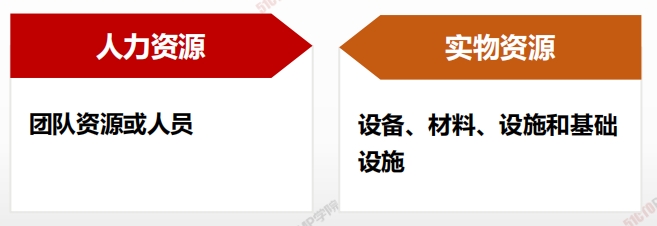

> 包括识别、获取和管理所需资源以成功完成项目的各个过程，这些过程有助于确保项目经理和团队在正确的时间和地点使用正确的资源。

| 9.1  | 规划资源管理 | 定义如何估算、获取、管理和利用实物以及团队项目资源的过程。   |
| ---- | ------------ | ------------------------------------------------------------ |
| 9.2  | 估算活动资源 | 估算执行项目所需的团队资源，以及材料、设备和用品的类型和数量的过程。 |
| 9.3  | 获取资源     | 获取项目所需的团队成员、设施、设备、材料、用品和其他资源的过程。 |
| 9.4  | 建设团队     | 提高工作能力，促进团队成员互助，改善团队整体氛围，以提高项目绩效的过程。 |
| 9.5  | 管理团队     | 跟踪团队成员工作表现，提供反馈，解决问题并管理团队变更，以优化项目绩效的过程。 |
| 9.6  | 控制资源     | 确保按计划为项目分配实物资源，以及根据资源的使用计划监督资源实际使用情况，并采取必要纠正措施的过程。 |

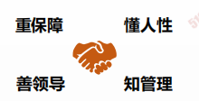

1. <u>**定（定角色、定资源规划）**</u>
2. **<u>估（活动资源）</u>**
3. **<u>筹（获取资源）</u>**
4. **<u>建（团队建设使其成长）</u>**
5. **<u>管（绩效用人、绩效考核、有效激励</u>**
6. **<u>控（资源调整和控制）</u>**

---

# 02.规划资源管理

## 4W1H

| 4W1H                 | **规划资源管理**                                                                     |
| -------------------- | ------------------------------------------------------------------------------ |
| 
what 做什么
   | 
规划资源管理是定义如何估算、获取、管理和利用团队以及实物资源的过程。 作用：根据项目类型和复杂程度确定适用于项目资源的管理方法和管理程度
 |
| 
why 为什么做
   | 资源规划用于确定和识别一种方法，以确保项目的成功完成有足够的可用资源，从而对项目成本、进度、风险、质量和其他项目领域造成显著影响。              |
| 
who 谁来做
    | 项目管理团队。                                                                        |
| 
when 什么时候做
 | 项目早期。                                                                          |
| 
how 如何做
    | 
有效的资源规划需要考虑稀缺资源的可用性和竞争，并编制相应的计划。 专家判断、数据表现、组织理论、会议
                   |

## 输入/工具技术/输出

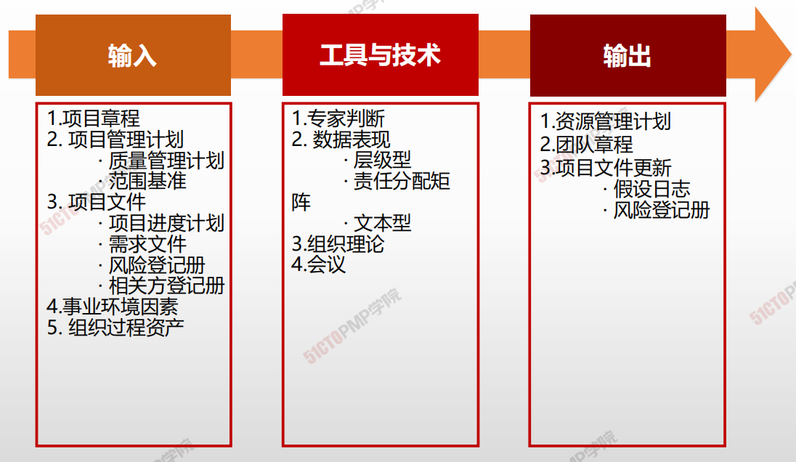

1. 输入
   1. 项目章程
   2. 项目管理计划
      * 质量管理计划
      * 范围基准
   3. 项目文件
      * 项目进度计划
      * 需求文件
      * 风险登记册
   4. 事业环境因素
   5. 组织过程资产
2. 工具与技术
   1. 专家判断
   2. 数据表现
      * 层级行
      * 责任分配矩阵
      * 文本型
   3. 组织理论
   4. 会议
3.  输出

    1. 资源管理计划
    2. 团队章程
    3. 项目文件更新
       * 假设日志
       * 风险登记册

    ### 三种组织结构图的职位描述

组织结构图和职位描述，最常用的有三种方式：

\*\*层级型、矩阵型和文本格型\*\*的角色描述

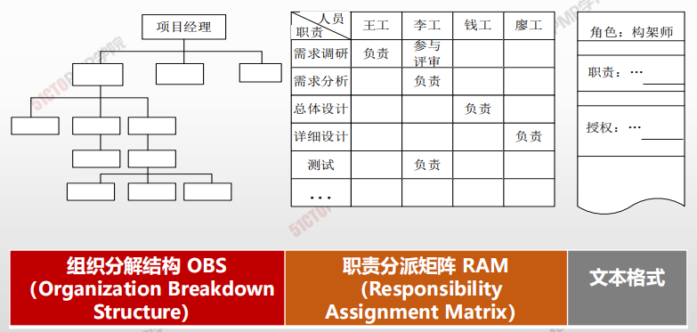

## 责任分配矩阵(RAM)-RACI矩阵

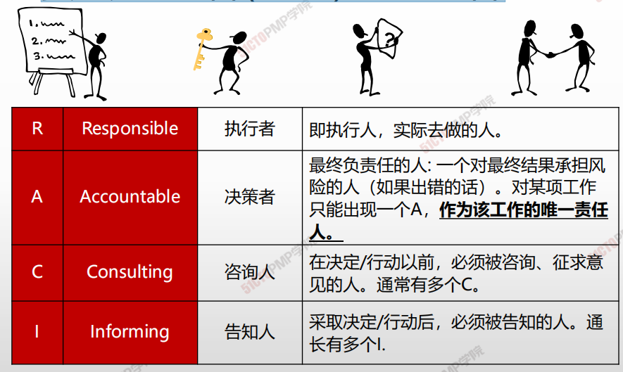

## 责任分配矩阵(RAM)

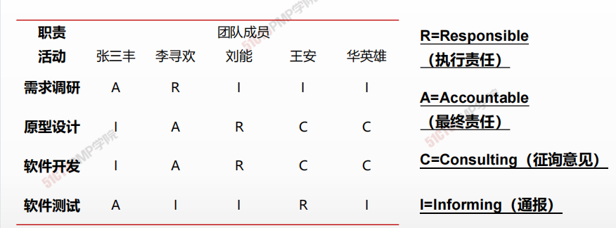

* 可以采用责任分配矩阵显示工作包或活动与项目团队成员之间的关系。矩阵图可以\*\*确保任何一项任务都只有一个人负责，\*\*从而避免混乱。
* 在大型项目中，可在多个层次上制定责任分配矩阵。高层次的RAM定义各小组分别负责WBS哪部分工作。低层次的RAM可在各小组内为具体活动分配角色，职责和职权。

## 规划资源管理-输出：资源管理计划

资源管理计划提供了关于如何分类、分配、管理和释放项目资源的指南。

资源管理计划分为团队管理计划和实物资源管理计划。

资源管理计划可能包括（但不限于）：

* \*\*识别资源。\*\*用于识别和量化项目所需的团队和实物资源的方法。
* \*\*获取资源。\*\*关于如何获取项目所需的团队和实物资源的指南。
* **角色与职责。**
* \*\*项目组织图。\*\*项目组织图以图形方式展示项目团队成员及其报告关系。
* \*\*项目团队资源管理。\*\*关于如何定义、配备、管理和最终遣散项目团队资源的指南。
* \*\*培训。\*\*针对项目成员的培训策略。
* \*\*团队建设。\*\*建设项目团队的方法。
* \*\*资源控制。\*\*依据需要确保实物资源充足可用、并未项目需求优化实物资源采购，而采用的方法。包括有关整个项目生命周期期间的库存、设备和用品管理的信息。
* \*\*认可计划。\*\*将给予团队成员哪些认可和奖励，以及何时给予。

## 团队章程

\*\*团队章程是为团队创建团队价值观、共识和工作指南的文件。\*\*团队章程可能但不限于：

* 团队价值观
* 沟通指南
* 决策标准和过程
* 处理过程
* 会议指南
* 团队共识

***

* 对于接受行为确定了明确的期望
* 有助于减少误解，提高生产力
* 团队成员可以了解彼此重要的价值观

***

1. 规划资源管理是定义如何估算、获取、管理和利用团队以及实物资源的过程
2. 组织图与职位描有三种格式，即层级型、矩阵型和文本型
3. 组织分解结构（OBS）用图形的形式从上至下地描述团队中的角色和关系
4. 责任分配矩阵RAM用来显示分配给每个工作包的项目资源
5. RAM的一种特殊形式是RACI矩阵，把人员与任务之间的责任关系分为四类
6. 团队章程是为团队创建团队价值观、共识和工作指南的文件

---

# 03.估算活动资源

## 4W1H

| 4W1H                 | 估算活动资源                                                                                   |
| -------------------- | ---------------------------------------------------------------------------------------- |
| 
what 做什么
   | 
估算执行项目所需的团队资源，以及材料、设备和用品的类型和数量的过程。 作用：明确完成项目所需的资源种类、数量和特性。本过程应根据需要在整个项目期间定期开展。
 |
| 
why 为什么做
   | 资源不同影响项目的进度也会不同，估算活动资源为了制定合理、符合实际情况的进度计划                                                 |
| 
who 谁来做
    | 项目管理团队。                                                                                  |
| 
when 什么时候做
 | 定义活动之后，排列活动顺序之后                                                                          |
| 
how 如何做
    | 
利用发布的估算数据，自下而上估算资源。专家判断、自下而上的估算、类比估算、参数估算、数据分析、 项目管理信息系统、会议
                    |

## 输入/工具技术/输出

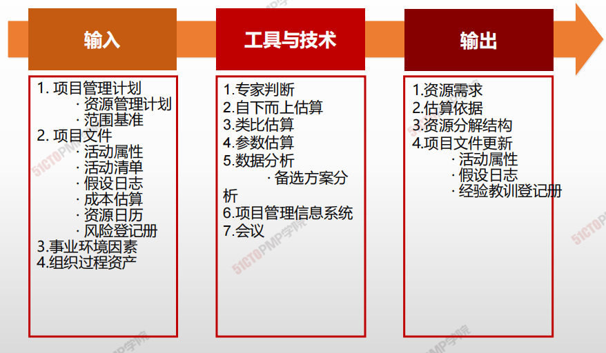

1. 输入
   2. 项目管理计划
      * 质量管理计划
      * 范围基准
   3. 项目文件
      * 活动属性
      * 活动清单
      * 假设日志
      * 成本估算
      * 资源日历
      * 风险等级册
   4. 事业环境因素
   5. 组织过程资产
2. 工具与技术
   1. 专家判断
   2. 自下而上估算
   3. 类比估算
   4. 参数估算
   5. 数据分析
      * 备选方案分析
   6. 项目管理信息系统
   7. 会议
3. 输出
   1. 资源需求
   2. 估算依据
   3. 资源分解结构
   4. 项目文件更新
      * 活动属性
   5. 假设日志
      * 经验教训登记册

## 资源分解结构

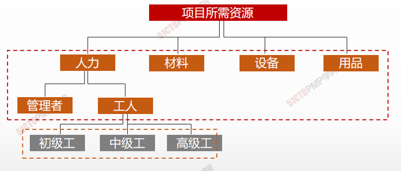

资源分解结构是 资源依类别和类型的 层级展现。资源类别包括（但不限于）人力、材料、设备和用品，资源类型则包括技能水平、要求证书、等级水平或适用于项目的其他类型。

## 资源直方图

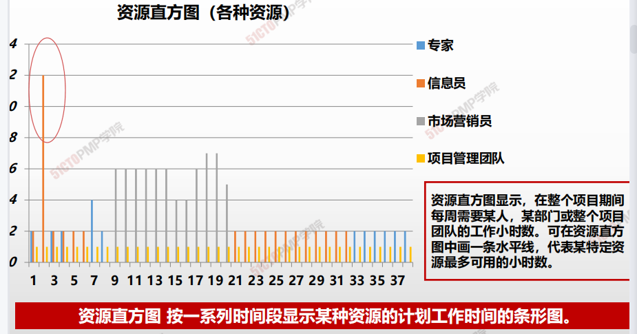

---

# 获取资源

## 4W1H

| 4W1H                | 获取资源                                                     |
| ------------------- | ------------------------------------------------------------ |
| what 做什么     | 获取项目所需的团队成员、设施、设备、材料、用品和其他资源的过程。 作用：概述和指导资源的选择，并将其分配给相应的活动。 |
| why 为什么做    | 为开展项目工作配备资源，组成团队。                           |
| who 谁来做      | 项目所需资源可能来自项目执行组织的内部或外部。内部资源由职能经理或资源经理负责获取（分配），外部资源则是通过采购过程获得 |
| when 什么时候做 | 项目早期，从项目经理确定开始，项目团队逐渐组建               |
| how 如何做      | 多种方式引入资源。 决策、人际关系与团队技能、预分派、虚拟团队 |

## 输入/工具技术/输出

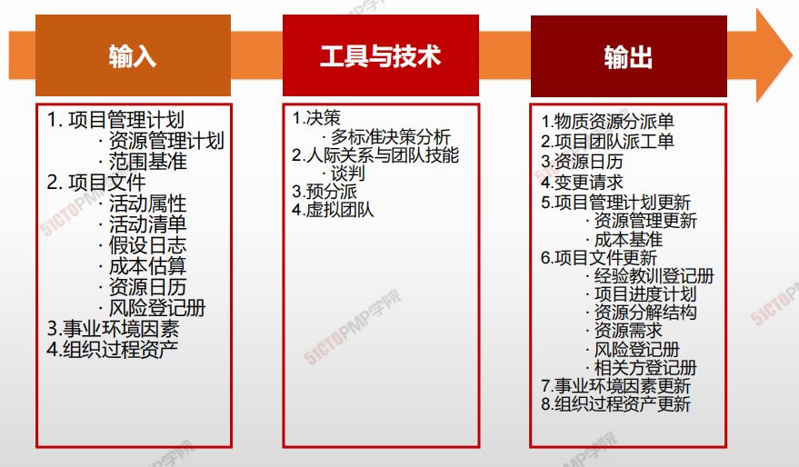

1. 输入

   1. 项目管理计划
      - 资源管理计划
      - 范围基准
   2. 项目文件
      - 活动属性
      - 活动清单
      - 假设文件
      - 成本估算
      - 资源日历
      - 风险登记册
   3. 事业环境因素
   4. 组织过程资产

2. 工具与技术

   1. 决策
      - 多标准决策分析
   2. 人际关系与团队技能
      - 谈判
   3. 预分派
   4. 虚拟团队

3. 输出

   1. 物质资源分派单
   2. 项目团队派工单
   3. 资源日历
   4. 变更请求
   5. 项目管理计划更新
      - 资源管理更新
      - 成本基准
   6. 项目文件更新
      - 经验教训登记册
      - 项目进度计划
      - 资源分解结构
      - 资源需求
      - 风险等级册
      - 相关方登记册
   7. 事业环境因素更新
   8. 资质过程资产更新

   

## 虚拟团队

> 存在共同目标、单在完成角色任务的过程中很少或没时间面对面工作的一群人。沟通管理更为重要

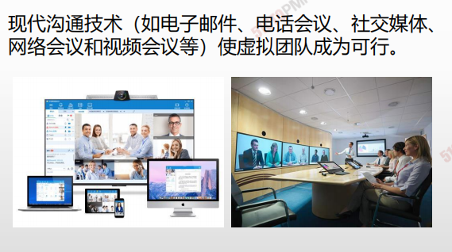

- **提高组建团队的灵活性**

- **开展本不能开展的项目**
- **需要特别好的沟通计划**
- **需要真正的团队建设**

## 资源日历

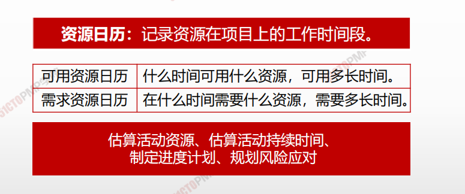

---

# 团队建设

## 4W1H

| 4W1H                | 团队建设                                                     |
| ------------------- | ------------------------------------------------------------ |
| what 做什么     | 是提高工作能力，促进团队成员互动，改善团队整体氛围，以提高项目绩效的过程。 <u>作用</u>：改进团队协作、增强人际关系技能、激励员工、减少摩擦以及提升整体项目绩效。 |
| why 为什么做    | 项目经理应该能够定义、建立、维护、激励、领导和鼓舞项目团队，使团队高效运行，并实现项目目标。 |
| who 谁来做      | 项目经理。                                                   |
| when 什么时候做 | 伴随项目团队组建，建设项目团队工作开始。                     |
| how 如何做      | 项目管理团队应该利用文化差异，在整个项目生命周期中致力于发展和维护项目团队，并促进在相互信任的氛围中充分协作；通过建设项目团队，可以改进人际技巧、技术能力、团队环境及项 目绩效。 <u>集中办公、虚拟团队、沟通技术、人际关系与团队技能、认可与奖励、培训、个人和团队评估、会议</u> |

## 团队的定义和特点

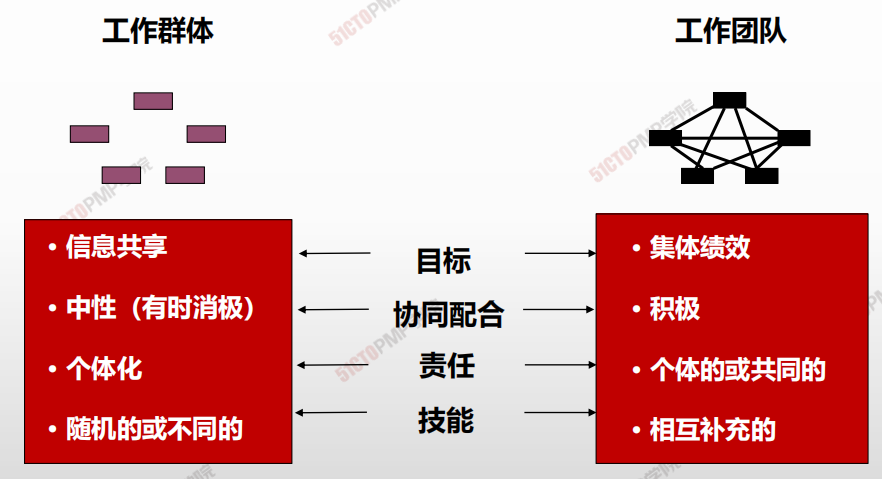

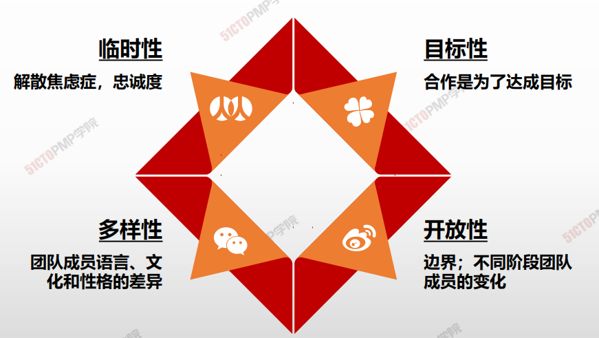

## 成功的项目团队的特点

- 团队目标明确，成员清楚自己工作对目标的贡献；
- 团队的组织结构清晰，岗位明确；
- 有成文的工作流程和方法、流程简介有效；
- 项目经理对团队成员有明确的考核和评价标准，评价结果
- 工头制定并遵守组织纪律；
- 协同工作，知识共享。

**PMI**<u>团队理念</u>

- 团队和个人的共同发展
- 不能简单牺牲团队成员的利益来完成项目
- 成员尽早参与项目计划和决策的积极作用
- 角色定位，人尽其才
- 项目经理软技巧重要性，正向的管理和领导
- 积极、主动面对项目中出现的问题

## Bruce Tuckmans 模型

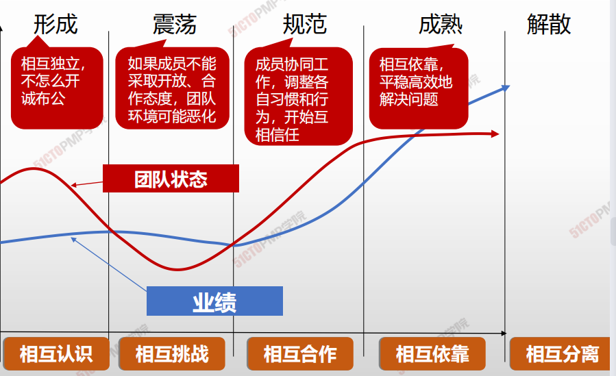

## 团队不同阶段领导风格

| 阶段                     | 成员情绪                    | 典型疑问、行为                                               | PM重点                  | PM风格                                 |
| ------------------------ | --------------------------- | ------------------------------------------------------------ | ----------------------- | -------------------------------------- |
| 形成阶段 Forming     | 兴奋、期望、 焦虑、怀疑 | 我的目的是什么？ 我的角色和任务是什么？ 我能和别人合得来吗？ | 指导、分析              | 指导型 Directive style             |
| 震荡阶段 Storming    | 挫折、愤怒、 紧张、对立 | 我的职责是什么？ 我该如何配合别人？ 我知道他的缺点，可不 知道如何帮他？ | 冲突管理、运 用影响 | 影响型 Selling or  Influence style |
| 规范阶段 Normalizing | 明确、信任、 规范、交流 | 关系确立 接受团队规则 逐步有凝聚力                   | 帮助建立关系            | 参与型 Participative  style        |
| 成熟阶段 Performing  | 开放、沟通、 积极、激情 | 具有集体感、荣誉感 积极开放 配合默契                 | 授权                    | 授权型 Delegate style              |

## 输入/工具技术/输出

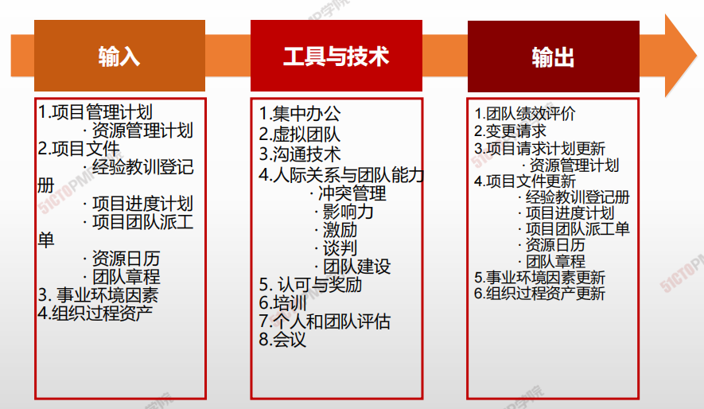

1. 输入

   1. 项目管理计划
      - 资源管理计划
   2. 项目文件
      - 经验教训登记册
      - 项目进度计划
      - 项目团队派工单
      - 资源日历
      - 团队章程
   3. 事业环境因素
   4. 组织过程资产

2. 工具与技术

   1. 集中办公
   2. 虚拟团队
   3. 沟通技术
   4. 人际关系与团队能力
      - 冲突管理
      - 影响力
      - 激励
      - 谈判
      - 团队建设
   5. 认可与奖励
   6. 培训
   7. 个人和团队评估
   8. 会议

3. 输出

   1. 团队绩效评价
   2. 变更请求
   3. 项目请求计划更新
      - 资源管理计划
   4. 项目文件更新
      - 经验教训登记册
      - 项目进度计划
      - 项目团队派工单
      - 资源日历
      - 团队章程
   5. 事业环境因素更新
   6. 组织过程资产更新

   

## 集中办公

- 把**许多或全部最活跃的成员**安排在同一地点办公
- 集中办公可以是临时的或贯穿整个项目
- 借助团队会议室-**作战室**开展集中办公，也称为**紧密矩阵**

## 团队绩效评价

>  以任务和结果为导向，项目结果完成符合要求，这是高效团队的特征

评价团队有效性的指标可包括：

个人技能的改进，从而使成员更有效地完成工作任务；

团队能力的改进，从而使团队成员更好地开展工作；

团队成员离职率的降低；

团队凝聚力的加强，从而使团队成员开放地分享信息和经验，并互相帮助，

来提高项目绩效

1. 建设团队是提高工作能力，促进团队成员互动，
改善团队整体氛围，以提高项目绩效的过程团
队协作是项目成功的关键因素，而建设高效的
项目团队是项目经理的主要职责之一
2. 塔克曼阶梯理论认为：团队发展通常要经过形
成、震荡、规范、成熟、 解散五个阶段
3. 不论是集中办公还是虚拟团队，沟通都至关重
要
4. 项目管理团队应该对项目团队的有效性进行正
式或非正式的评价

---

# 06.团队管理

## 4W1H

| 4W1H                 | 获取资源                                                                                         |
| -------------------- | -------------------------------------------------------------------------------------------- |
| 
what 做什么
   | 
跟踪团队成员工作表现，提供反馈，解决问题并管理团队变更，以优化项目绩效的过程。 作用：影响团队行为、管理冲突以及解决问题。
                      |
| 
why 为什么做
   | 影响团队行为、管理团队冲突，解决各种问题，关注团队成员个人技能，保证项目绩效，从而保证项目目标的实现。                                          |
| 
who 谁来做
    | 项目经理。                                                                                        |
| 
when 什么时候做
 | 贯穿项目生命周期始终                                                                                   |
| 
how 如何做
    | 
需要综合运用各种技能，特别是沟通、冲突管理、谈判和领导技能。项目经理应该向团队成员分配富有挑战性的任务，并对优秀绩效进行表彰。 人际关系与团队技能、项目管理信息系统
 |

## 输入/工具技术/输出

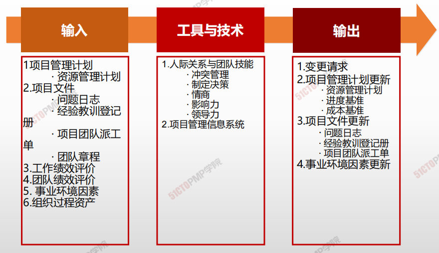

1. 输入
   1. 项目管理计划
      * 资源管理计划
   2. 项目文件
      * 问题日志
      * 经验教训登记册
      * 项目团队派工单
      * 团队章程
   3. 工作绩效评价
   4. 团队绩效评价
   5. 事业环境因素
   6. 组织过程资产
2. 工具与技术
   1. 集中办公
      * 冲突管理
      * 制定决策
      * 情商
      * 影响力
      * 领导力
   2. 项目管理信息系统
3. 输出
   2. 变更请求
   3. 项目请求计划更新
      * 资源管理计划
      * 进度基准
      * 成本基准
   4. 项目文件更新
      * 经验教训登记册
      * 问题日志
      * 项目团队派工单
   5. 事业环境因素更新

## 冲突管理

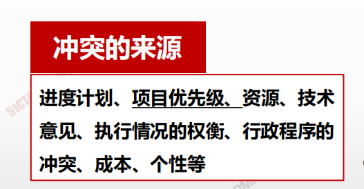

| 来            | 源                               |
| ------------ | ------------------------------- |
| 进度计划         | 项目任务的进度安排、任务的排序和事件选择存在不同意见      |
| 项目优先级        | 相关方在任务的优先级顺序上有不同的意见（项目前期）       |
| 资源稀缺         | 资源匮乏（项目前期）                      |
| 技术意见与执行情况的权衡 | 在技术问题与执行情况权衡上，存在不一致意见           |
| 行政程序上的冲突     | 在如何管理项目的问题上，发生的项目管理和行政管理程序之间的冲突 |
| 成本           | 在涉及到工作分解结构上，来支持部门的成本估算上的冲突      |
| 个人工作风格、个性    | 人际关系方面的冲突（项目中期）                 |

| 传统的冲突观念     | 现代冲突的观念       |
| ----------- | ------------- |
| 冲突时麻烦制造者引起的 | 冲突是人和人之间不可避免的 |
| 是坏事         | 经常是有益的        |
| 应避免         | 是变化带来的自然结果    |
| 必须被压制       | 是能够并且应被管理的事情  |

> 假如意见分歧成为负面因素，应该首先由项目团队成员负责解决：
>
> * 如果冲突升级，项目经理应提供协助，促成满意的解决方案，采用
>
> 直接和合作的方式，尽早并且通常在私下处理冲突。
>
> * 如果破坏性冲突继续存在，则可使用正式程序，包括采取惩戒措施

> **八字方针：”直接“、”合作“、”尽早“、”私下“管理冲突。**

## 冲突管理策略

| 解决方式    | 特点             | 说明                                                  | 其他                           |
| ------- | -------------- | --------------------------------------------------- | ---------------------------- |
| 解决问题/合作 | 赢-赢            | 综合考虑不同的观点和意见，采用合作的态度和开放式对话引导各方达成共识和承诺，这种方法可以带来双赢局面。 | **最好的冲突解决方式**                |
| 面对      | 赢-赢            | 双方把问题摆到桌面上谈开，通过协商，共同决定选择某个方案，放弃另一个方案。               |                              |
| 妥协/调解   | 各让一步、不输不赢      | 为了暂时或部分解决冲突，寻找能让各方都在一定程度上满意的方案，但这种方法有时会导致“双输”局面。    | 冲突各方都有一定程度满意、但冲突各方没有任何一方完全满意 |
| 缓和/包容   | 求同存异           | 强调一致而非差异；为维持和谐与关系而退让一步，考虑其他方的需要。                    | 保持一种友好的气氛，但是回避了解决冲突的根源。      |
| 撤退/回避   | 双输，矛盾被搁置“离他远点” | 从实际或潜在冲突中退出，将问题推迟到准备充分的时候，或者将问题推给其他人员解决。            | 短期可以，长远来看不好。降温或解决问题条件不成熟。    |
| 强制/命令   | 赢-输 单赢-“我就要赢！” | 以牺牲其他方为代价，推行某一方的观点；只提供赢 — 输方案。                      | 通常是利用权力来强行解决紧急问题，会破坏团队气氛。    |

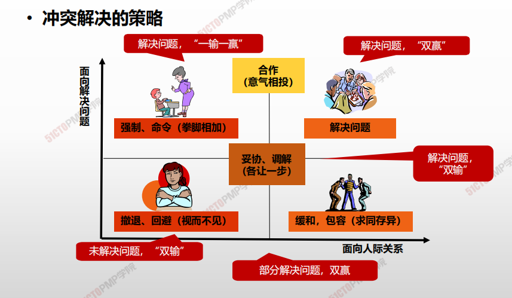

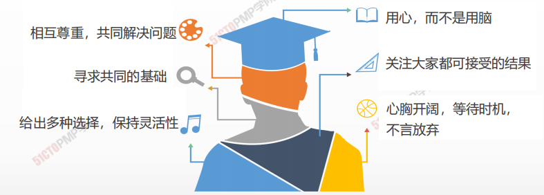

> * 把问题摆到桌子上；对事不对人；
> * 以最有利于团队和项目的方式解决冲突；
> * 寻找有利于现在和未来的解决方法；
> * 冲突最好由当事人自己尽早解决，直接上级可以协助，必要时PM采取强制措施；
> * 违反职业道德引发的冲突，不能靠当事人自己解决。

## 建设团队vs.管理团队

* 建设团队：是基于什么行为能导致良好团队绩效的**预测**，采取这些行为“**推动**”团队发展。
* 管理团队：是基于对实际行为及其效果的**回顾**，采取补充行为“**拉动**”团队发展。更像一个监控过程。

***

1. 管理团队是跟踪团队成员工作表现，提供反馈， 解决问題并管理团队变更，以优化项目绩效的过 程
2. 在项目环境中，冲突不可避免，适当的冲突是有 益的
3. 冲突的解决方案是：撤退/回避、缓和/包容、妥 协/调解、强迫/命令、合作/解决问題
4. 情商是指了解、评价和管理自我情绪、他人情绪 及团体情绪的能力

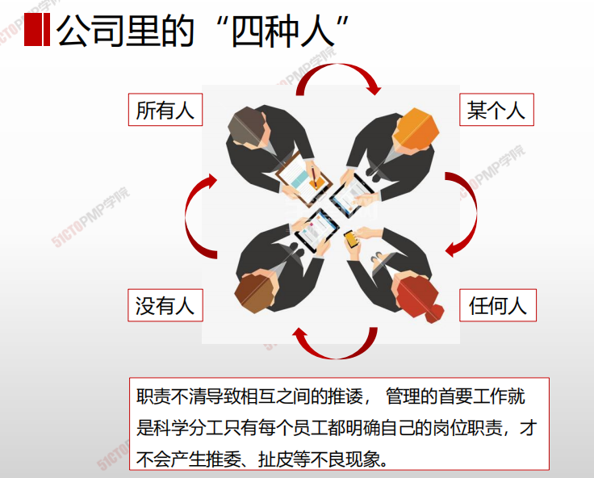

---

# 控制资源

## 4W1H

| 4W1H                | 控制资源                                                     |
| ------------------- | ------------------------------------------------------------ |
| what 做什么     | 是确保按计划为项目分配实物资源，以及根据资源使用计划监督资源实际使用情况，并采取必要纠正措施的过程。 作用：确保所分配的资源适时适地可用于项目，且在不再需要时被释放 |
| why 为什么做    | 应在所有项目阶段和整个项目生命周期期间持续开展控制资源过程，且适时、适地和适量地分配和释放资源，使项目能够毫无延误地向前推进。 |
| who 谁来做      | 高层领导、项目经理和团队成员                                 |
| when 什么时候做 | 本过程需要在整个项目期间开展。                               |
| how 如何做      | 适时、适地和适量地分配和释放资源，使项目能够持续进行。 <u>数据分析、问题解决、人际关系与团队技能、项目管理信息系统</u> |

## 输入/工具技术/输出

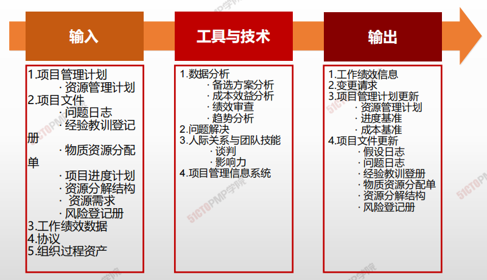

1. 输入

   1. 项目管理计划
      - 资源管理计划
   2. 项目文件
      - 问题日志
      - 经验教训登记册
      - 物质资源分配
      - 项目进度计划
      - 资源分解结构
      - 资源需求
      - 风险登记册
   3. 工作绩效评价
   4. 协议
   6. 组织过程资产
2. 工具与技术

   1. 数据分析
      - 备选方案分析
      - 成本效益分析
      - 绩效审查
      - 趋势分析
   2. 问题解决
   3. 人际关系与团队技能
      - 谈判
      - 影响力
   4. 项目管理信息系统
3. 输出
   1. 工作绩效信息
   2. 变更请求
   3. 项目管理计划更新
      - 资源管理计划
      - 进度基准
      - 成本基准
   4. 项目文件更新
      - 假设日志
      - 问题日志
      - 经验教训登记册
      - 物质资源分配单
      - 资源分解结构
      - 风险登记册

---

1. 控制资源是确保按计划为项目分配实物资源，以
及根据资源使用计划监督资源实际使用情况，并
采取必要纠正措施的过程
2. 控制资源过程关注实物资源，管理团队过程关注
团队成员
3. 巧妇难为无米之炊，只有适时、适地和适量地分
配和释放资源，才能使项目能够毫无延误地向前
推进

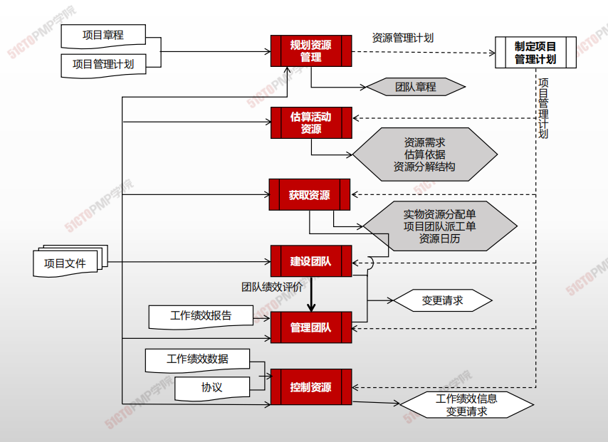

---

