# 项目沟通管理概述

| 10.1 | 规划沟通管理 | 基于每个相关方或相关方群体的信息需求、可用的组织资产，以及具体项目的需求，为项目沟通活动制定恰当的方法和计划的过程。 |
| ---- | ------------ | ------------------------------------------------------------ |
| 10.2 | 管理沟通     | 确保项目信息及时且恰当地收集、生成、发布、存储、检索、管理、监督和最终处置的过程 |
| 10.3 | 监督沟通     | **确保**满足项目及其相关方的**信息需求**的过程               |

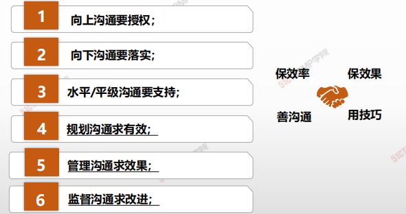

 

- **《大英百科全书》：**沟通是“互相交换信息的行为”

- **英国学者丹尼斯·奎尔：**沟通是“人或团体主要通过符号向其他个人或团体传递信息、观念、态度或情感的过程”

- **美国学者布农：**沟通是“将观念或思想由一个人传递给另一个人的过程，或者是一人自身内的传递，其目的是使接受沟通的人获得思想上的了解”

>  综上：沟通是人与人之间传递信息、传播思想、传达情感的过程。是一个人获得他人思想、情感、见解、价值观的一种途径。是人与人之间交往的一座桥梁，通过这个桥梁。人们可以分享彼此的情感和知识，消除误会，增进了解，达成共同认识或共同协议。

## 管理就是沟通

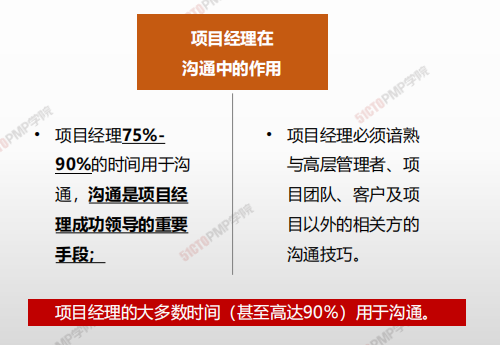

## 沟通中项目经理的角色和作用

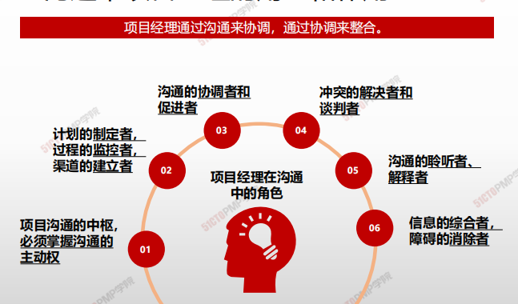

---

# 规划沟通管理

## 4W1H

| 4W1H                | 规划沟通管理                                                 |
| ------------------- | ------------------------------------------------------------ |
| what 做什么     | 基于每个相关方或相关方群体的信息需求、可用的组织资产，以及具体项目的需求，为项目沟通活动制定恰当的方法和计划的过程。 作用：为及时向相关方提供相关信息，引导相关方有效参与项目，而编制书面沟通计划 |
| why 为什么做    | 良好的沟通是项目成功的必须，项目经理必须做好沟通，项目经理75%-90%的时间用来沟通，目的是整合项目工作，达成项目目标 |
| who 谁来做      | 项目经理和项目管理团队                                       |
| when 什么时候做 | 项目早期，项目章程批准后，开始制定项目沟通管理计划           |
| how 如何做      | 需在项目生命周期的早期，针对项目相关方多样性的信息需求，制定有效的沟通管理计划。应该定期审核沟通管理计划，并进行必要的修改。 **专家判断、沟通需求分析、沟通技术、沟通模型、沟通方法、人际关系与团队技能、数据表现、会议** |

## 输入/工具技术/输出

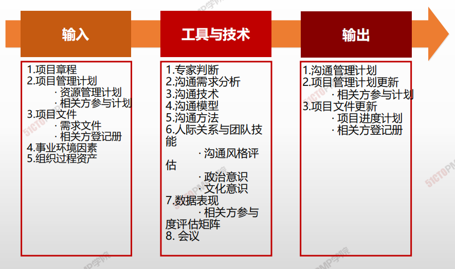

1. 输入

   1. 项目管理计划
      - 资源管理计划
      - 相关方参与计划
   2. 项目文件
      - 需求文件
      - 相关方登记册
   3. 事业环境因素
   4. 组织过程资产

2. 工具与技术

   1. 专家判断
   2. 沟通需求分析
   3. 沟通技术
   4. 沟通模型
   5. 沟通方法
   6. 人际关系与团队技能
      - 沟通风格评估
      - 政治意识
      - 文化意识
   7. 数据表现
      - 相关方参与度评估矩阵
   8. 会议

3. 输出

   1. 沟通管理计划
   2. 项目管理计划更新
      - 相关方参与计划
   3. 项目文件更新
      - 项目进度计划
      - 相关方登记册

   

## 沟通需求分析

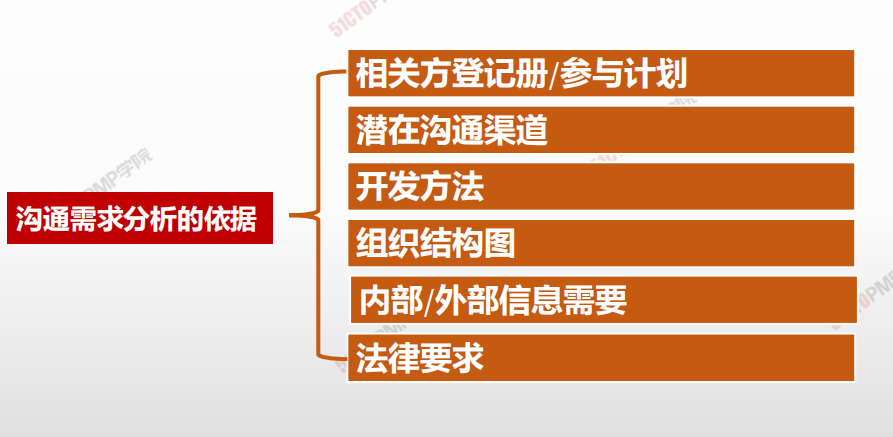

## 沟通技术

信息交换和协作的常见方法：

- 对话、会议、书面、文件、数据库、社交媒体和网站

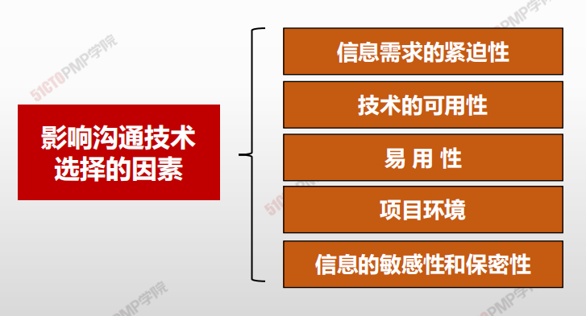

## 沟通模型

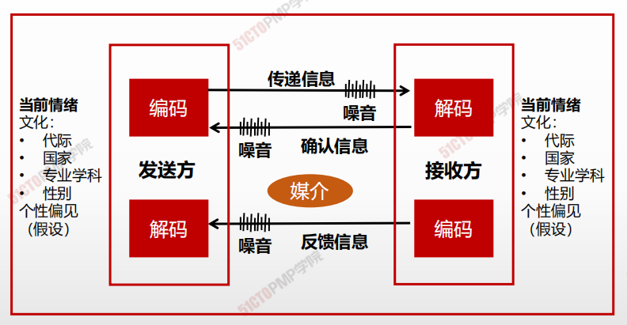

## 沟通噪声

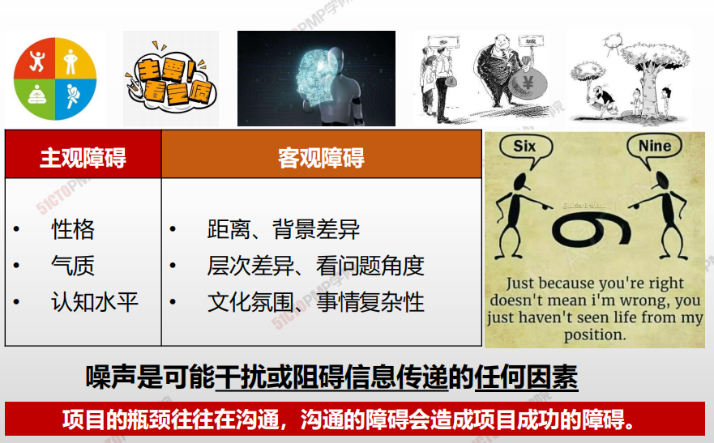

## 沟通漏斗模型

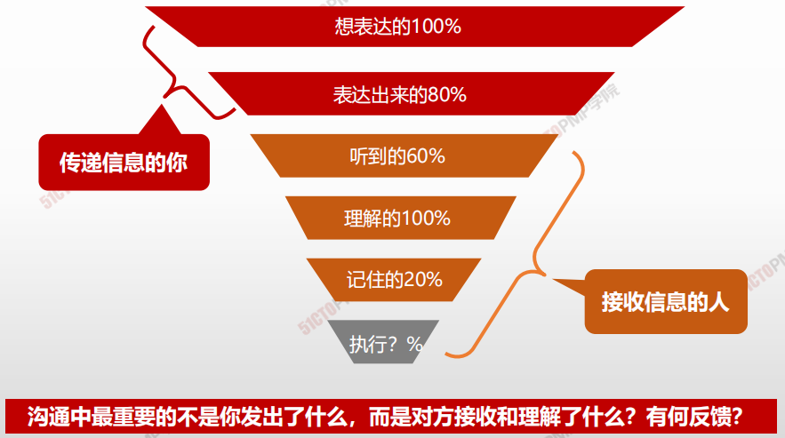

## 沟通方法

>在规划沟通管理过程中，需要根据项目以及相关方的具体情况选择合适的沟通方法，用于将来的沟通

### 1 交互式沟通

沟通双方或多方多方位地交流信息。

**适用条件：**要沟通的信息不多，要沟通的对象不多，且需要立即获得反馈甚至达成协议。

**例如：**开会、打电话、网络在线即时沟通。

### 2 推式沟通

把信息推送给信息接收者。信息接收者处于他们的本来位置不变。

**适用条件：**信息有明确的受众，要沟通的信息和对象不多，而且无须立即得到反馈。

**例如：**给项目相关方发送绩效报告，给别人发短信。

### 3 拉式沟通

把信息放在一个固定的位置，把项目相关方拉到这个位置查看信息。

**适用条件：**要沟通的信息很多，或者要沟通的对象不明确或数量很多。

**例如：**张贴公告，建立项目浏览页面。

## 数据表现

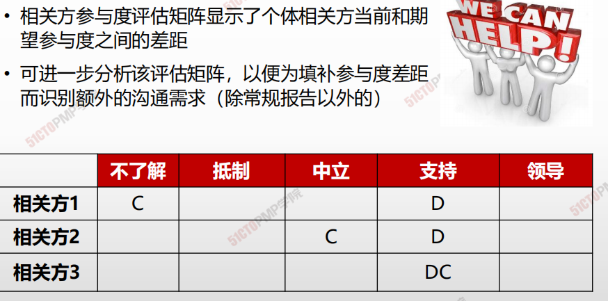

## 传递方式影响沟通效果

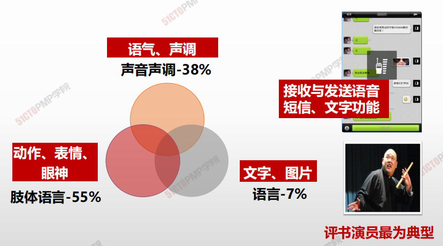

## 信息沟通的形式

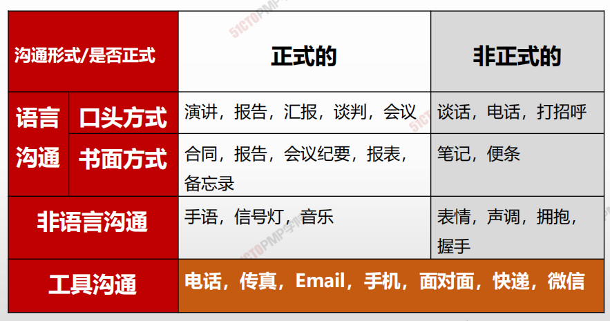

## 不同信息沟通方式的特点

|  方式    |   特点   |    缺点  |  适用场景    |
| ---- | ---- | ---- | ---- |
|正式书面|清晰，二义性少以及可以作为备忘录，也可作为双方沟通的证据适合保存、内容不走样、有格式要求|缺乏人性化 |根据合同进行的沟通：终止与某供应商的合作|
|正式口头| 传达速度快| 不易保存，需要很多条件|项目启动会\项目沟通（对外沟通)|
|非正式  口头|人性化，效率高，也容易使双方充分了解和沟通，拉近距离|缺乏沟通的有效证据，当一方的理解和另一方不同时，容易产生较强的分歧。|某个团队成员表现欠佳对内沟通|
|非正式|书面| 适合保存，格式没有要求|不够正式，有时约束无力|团队成员的笔记、便条、即时贴|

## 沟通管理计划

**沟通管理计划的主要内容:**

- 相关方的沟通需求；
- 需沟通的信息，包括语言、形式、内容和详细程度；
- 上报步骤；
- 发布信息的原因；
- 发布所需信息、确认已收到，或作出回应（若适用）的时限和频率；
- 负责沟通相关信息的人员；
- 负责授权保密信息发布的人员；
- 接收信息的人员或群体，包括他们的需要、需求和期望；
- 用于传递信息的方法或技术，如备忘录、电子邮件、新闻稿，或社交媒体；
- 为沟通活动分配的资源，包括时间和预算；
- 随着项目进展，如项目不同阶段相关方社区的变化，而更新与优化沟通管理计划的方法；
- 通用术语表；
- 项目信息流向图、工作流程（可能包含审批程序）、报告清单和会议计划等；
- 来自法律法规、技术、组织政策等的制约因素。

**沟通管理计划简化：**

- 需要收集什么信息
- 在什么时候收集
- 以什么方式收集
- 什么时候，以什么方式、向谁发送什么信息
- 主要项目相关方的联系方式
- 对于关键术语的定义 
- 如何更新沟通管理计划

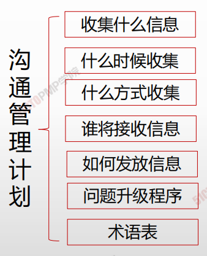

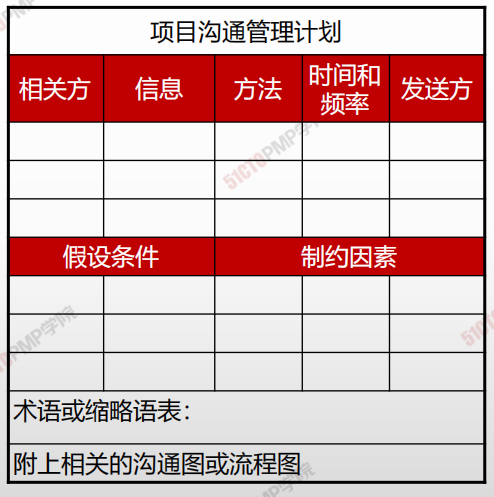

## 规划沟通

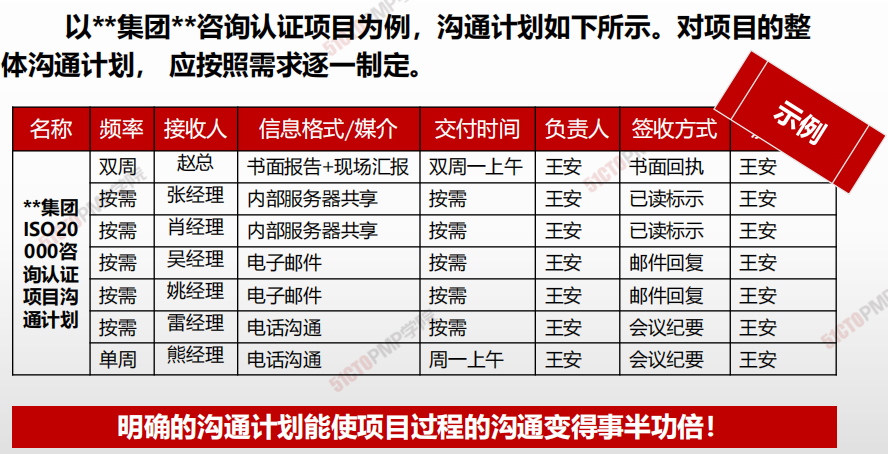

> **明确的沟通计划能使项目过程的沟通变得事半功倍！**

1. 规划沟通管理是基于每个相关方或相关方群体
的信息需求以及具体项目的需求，为项目沟通
活动制定怡当的方法和计划的过程
2. 沟通规划不当，可能导致各种问题
3. 沟通方法可以分为互动沟通、推式沟通、拉式
沟通

---

# 管理沟通

## 4W1H

| 4W1H                | 管理沟通                                                     |
| ------------------- | ------------------------------------------------------------ |
| what 做什么     | 确保项目信息及时且恰当地收集、生成、发布、存储、检索、管理、监督和最终处置的过程。 作用：促成项目团队与相关方之间的有效信息流动 |
| why 为什么做    | 本过程不局限于发布相关信息，它还设法确保信息以适当的格式正确生成和送达目标受众。本过程也为相关方提供机会，允许他们请求更多信息、澄清和讨论。 实现有效率、有效果沟通 |
| who 谁来做      | 项目管理团队。                                               |
| when 什么时候做 | 本过程需要在整个项目期间开展。                               |
| how 如何做      | 管理沟通过程会涉及与开展有效沟通有关的所有方面，包括使用适当的技术、方法和技巧。此外，它还应允许沟通活动具有灵活性，允许对方法和技术进行调整，以满足相关方及项目不断变化的需求。 <u>沟通技术、沟通方法、沟通技能、项目管理信息系统、项目报告、人际关系与团队技能、会</u>议 |

## 输入/工具技术/输出

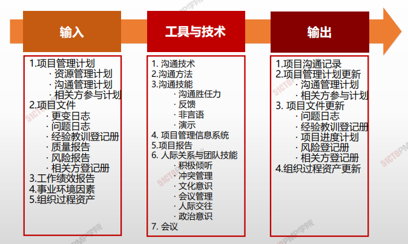

1. 输入

   1. 项目管理计划
      - 资源管理计划
      - 沟通管理计划
      - 相关方管理计划
   2. 项目文件
      - 变更日志
      - 问题日志
      - 经验教训登记册
      - 质量报告
      - 风险报告
      - 相关方登记册
   3. 工作绩效报告
   4. 事业环境因素
   5. 组织过程资产
2. 工具与技术
   1. 沟通技术
   2. 沟通方法
   3. 沟通技能
      - 沟通胜任力
      - 反馈
      - 非言语
      - 演示
   4. 项目管理信息系统
   5. 项目报告
   6. 人际关系与团队技能
      - 积极倾听
      - 冲突管理
      - 文化意识
      - 会议管理
      - 人际交往
      - 政治意识
   7. 会议
3. 输出
   1. 项目沟通记录
   2. 项目管理计划更新
      - 沟通管理计划
      - 相关方参与计划
   3. 项目文件更新
      - 问题日志
      - 经验教训登记册
      - 项目进度计划
      - 风险登记册
      - 相关方登记册
   4. 组织过程资产更新

## 沟通技能

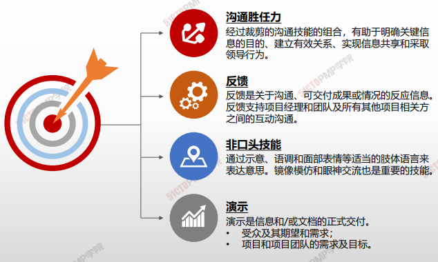

## 沟通渠道计算

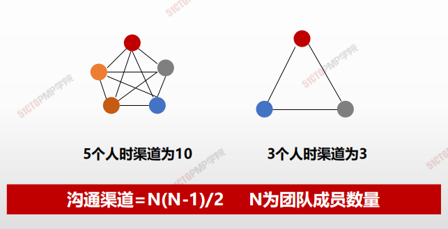

---

1. 管理沟通是确保项目信息及时且怡当地收集、生
  成、发布、 存储、检索、管理、监督和最终处置
  的过程
2. 项目信息应发布给众多相关方群体，应针对每种
  相关方来调整项目信息发布的适当层次、形式和
  细节

---

# 监督沟通

## 4W1H

| 4W1H                | 管理沟通                                                     |
| ------------------- | ------------------------------------------------------------ |
| what 做什么     | 确保满足项目及其相关方的信息需求的过程。 作用：按沟通管理计划和相关方参与计划的要求优化信息传递流程。 |
| why 为什么做    | 通过监督沟通过程，来确定规划的沟通工作和沟通活动是否如预期提高或保持了相关方对项目可交付成果与预计结果的支持力度。项目沟通的影响和结果应该接受认真的评估和监督，以确保在正确的时间，通过正确的渠道，将正确的内容（<u>发送方和接收方对其理解一致</u>）传递给正确的受众。 |
| who 谁来做      | 项目经理与项目管理团队                                       |
| when 什么时候做 | 本过程需要在整个项目期间开展                                 |
| how 如何做      | 监督沟通可能需要采取各种方法，例如，开展客户满意度调查、整理经验教训、开展团队观察、审查问题日志中的数据，或评估相关方参与度评估矩阵中的变更。 <u>专家判断、项目管理信息系统、数据分析、人际关系与团队技能、会议</u> |

## 输入/工具技术/输出

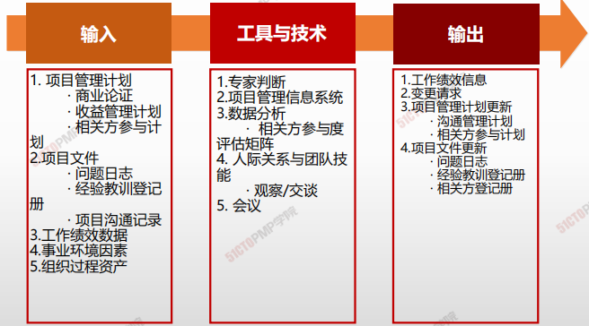

1. 输入

   1. 项目管理计划
      - 商业论证
      - 收益管理计划
      - 相关方参与计划
   2. 项目文件
      - 问题日志
      - 经验教训等级册
      - 项目沟通记录
   3. 工作绩效数据
   4. 事业环境因素
   5. 组织过程资产
2. 工具与技术
   1. 专家判断
   2. 项目挂历信息系统
   3. 数据分析
      - 相关方参与度评估矩阵
   4. 人际关系与团队技能
      - 观察/交谈
   5. 会议
3. 输出
   1. 工作绩效信息
   2. 变更请求
   3. 项目管理计划更新
      - 沟通管理计划
      - 相关方参与计划
   4. 项目文件更新
      - 问题日志
      - 经验教训登记册
      - 相关方登记册

## 工作绩效信息和变更请求

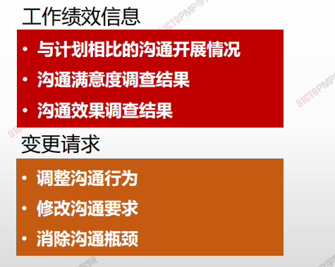

---

1. 监督沟通是确保满足项目及其相关方的信息需求
  的过程
2. 监督沟通过程可能触发规划沟通管理和管理沟通
  过程的迭代，以便修改沟通计划并开展额外的沟
  通活动
3. 监督沟通要确保在正确的时间，通过正确的渠道，
  将正确的内容传递给正确的受众

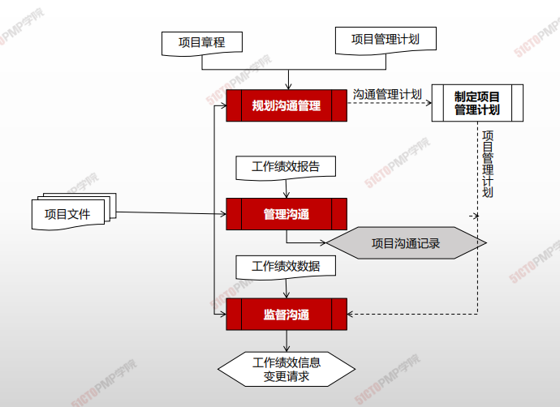

---

## 有效沟通的障碍和原则

## 有效沟通

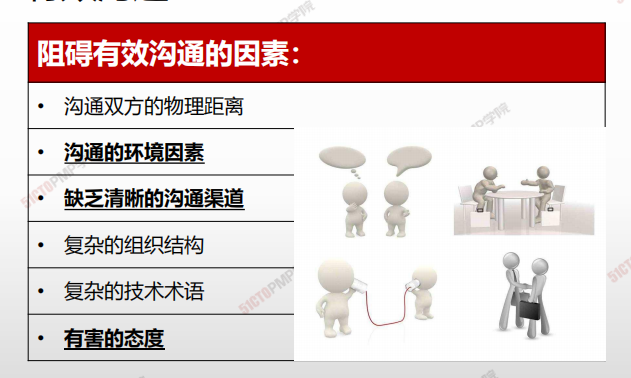

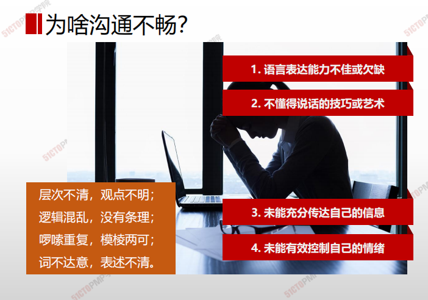

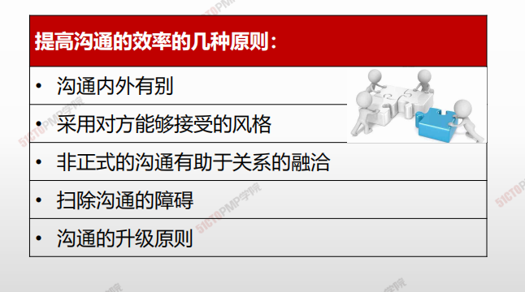

## 5C原则

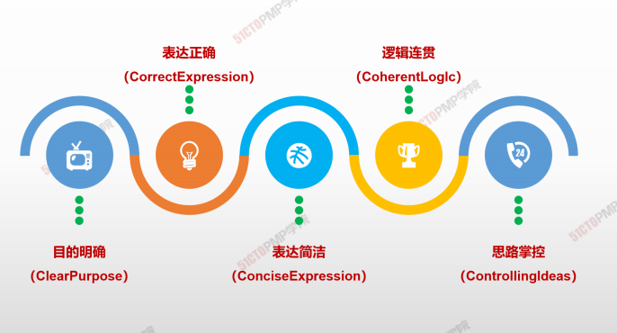

# 如何高效召开会议

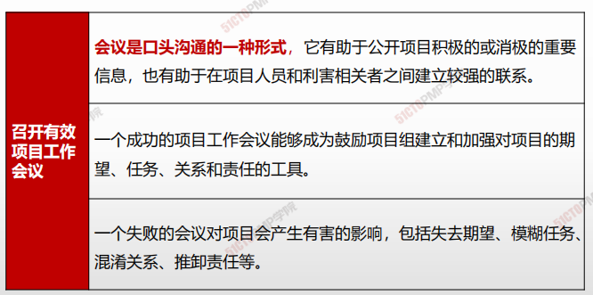

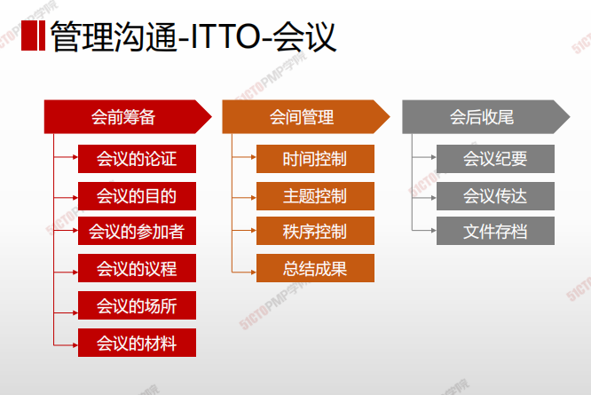

>1、明确会议的目的和期望的结果（**只在确实需要时才召开会议）**

2、确定参加会议的人员

3、在会议召开前向参加者提供会议议程（明确议题，**提前分发评审资料、**

**会议通知）**

4、使会议专业化（**指定一名主持人——控制时间、方向）**

5、解决问题 “对事不对人”，积极的、正面的态度解决问题

6、重视会议之后的记录（**会议要形成结论、发布经审核的会议纪要）**

7、重视会议结果的告知（**会议纪要任务落实到人、时间要求）**

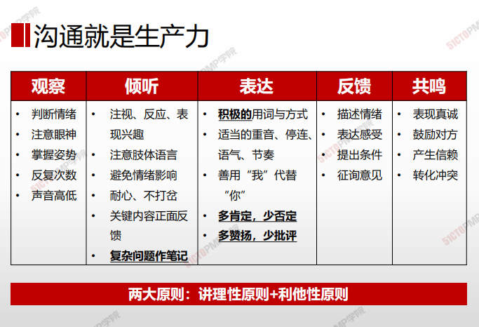

---

