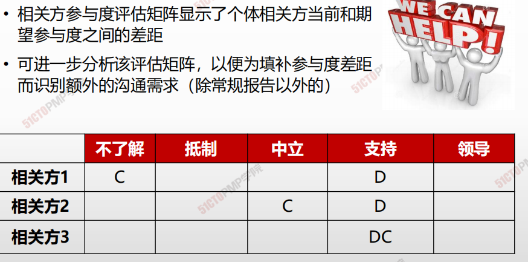
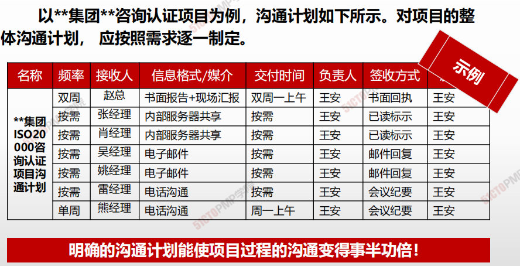

# 规划沟通管理

## 4W1H

| 4W1H                | 规划沟通管理                                                 |
| ------------------- | ------------------------------------------------------------ |
| what 做什么     | 基于每个相关方或相关方群体的信息需求、可用的组织资产，以及具体项目的需求，为项目沟通活动制定恰当的方法和计划的过程。 作用：为及时向相关方提供相关信息，引导相关方有效参与项目，而编制书面沟通计划 |
| why 为什么做    | 良好的沟通是项目成功的必须，项目经理必须做好沟通，项目经理75%-90%的时间用来沟通，目的是整合项目工作，达成项目目标 |
| who 谁来做      | 项目经理和项目管理团队                                       |
| when 什么时候做 | 项目早期，项目章程批准后，开始制定项目沟通管理计划           |
| how 如何做      | 需在项目生命周期的早期，针对项目相关方多样性的信息需求，制定有效的沟通管理计划。应该定期审核沟通管理计划，并进行必要的修改。 **专家判断、沟通需求分析、沟通技术、沟通模型、沟通方法、人际关系与团队技能、数据表现、会议** |

## 输入/工具技术/输出

1. 输入

   1. 项目管理计划
      - 资源管理计划
      - 相关方参与计划
   2. 项目文件
      - 需求文件
      - 相关方登记册
   3. 事业环境因素
   4. 组织过程资产

2. 工具与技术

   1. 专家判断
   2. 沟通需求分析
   3. 沟通技术
   4. 沟通模型
   5. 沟通方法
   6. 人际关系与团队技能
      - 沟通风格评估
      - 政治意识
      - 文化意识
   7. 数据表现
      - 相关方参与度评估矩阵
   8. 会议

3. 输出

   1. 沟通管理计划
   2. 项目管理计划更新
      - 相关方参与计划
   3. 项目文件更新
      - 项目进度计划
      - 相关方登记册

   

## 沟通需求分析

## 沟通技术

信息交换和协作的常见方法：

- 对话、会议、书面、文件、数据库、社交媒体和网站

## 沟通模型

## 沟通噪声

## 沟通漏斗模型

## 沟通方法

>在规划沟通管理过程中，需要根据项目以及相关方的具体情况选择合适的沟通方法，用于将来的沟通

### 1 交互式沟通

沟通双方或多方多方位地交流信息。

**适用条件：**要沟通的信息不多，要沟通的对象不多，且需要立即获得反馈甚至达成协议。

**例如：**开会、打电话、网络在线即时沟通。

### 2 推式沟通

把信息推送给信息接收者。信息接收者处于他们的本来位置不变。

**适用条件：**信息有明确的受众，要沟通的信息和对象不多，而且无须立即得到反馈。

**例如：**给项目相关方发送绩效报告，给别人发短信。

### 3 拉式沟通

把信息放在一个固定的位置，把项目相关方拉到这个位置查看信息。

**适用条件：**要沟通的信息很多，或者要沟通的对象不明确或数量很多。

**例如：**张贴公告，建立项目浏览页面。

## 数据表现

## 传递方式影响沟通效果

## 信息沟通的形式

## 不同信息沟通方式的特点

|  方式    |   特点   |    缺点  |  适用场景    |
| ---- | ---- | ---- | ---- |
|正式书面|清晰，二义性少以及可以作为备忘录，也可作为双方沟通的证据适合保存、内容不走样、有格式要求|缺乏人性化 |根据合同进行的沟通：终止与某供应商的合作|
|正式口头| 传达速度快| 不易保存，需要很多条件|项目启动会\项目沟通（对外沟通)|
|非正式  口头|人性化，效率高，也容易使双方充分了解和沟通，拉近距离|缺乏沟通的有效证据，当一方的理解和另一方不同时，容易产生较强的分歧。|某个团队成员表现欠佳对内沟通|
|非正式|书面| 适合保存，格式没有要求|不够正式，有时约束无力|团队成员的笔记、便条、即时贴|

## 沟通管理计划

**沟通管理计划的主要内容:**

- 相关方的沟通需求；
- 需沟通的信息，包括语言、形式、内容和详细程度；
- 上报步骤；
- 发布信息的原因；
- 发布所需信息、确认已收到，或作出回应（若适用）的时限和频率；
- 负责沟通相关信息的人员；
- 负责授权保密信息发布的人员；
- 接收信息的人员或群体，包括他们的需要、需求和期望；
- 用于传递信息的方法或技术，如备忘录、电子邮件、新闻稿，或社交媒体；
- 为沟通活动分配的资源，包括时间和预算；
- 随着项目进展，如项目不同阶段相关方社区的变化，而更新与优化沟通管理计划的方法；
- 通用术语表；
- 项目信息流向图、工作流程（可能包含审批程序）、报告清单和会议计划等；
- 来自法律法规、技术、组织政策等的制约因素。

**沟通管理计划简化：**

- 需要收集什么信息
- 在什么时候收集
- 以什么方式收集
- 什么时候，以什么方式、向谁发送什么信息
- 主要项目相关方的联系方式
- 对于关键术语的定义 
- 如何更新沟通管理计划

## 规划沟通

> **明确的沟通计划能使项目过程的沟通变得事半功倍！**

1. 规划沟通管理是基于每个相关方或相关方群体
的信息需求以及具体项目的需求，为项目沟通
活动制定怡当的方法和计划的过程
2. 沟通规划不当，可能导致各种问题
3. 沟通方法可以分为互动沟通、推式沟通、拉式
沟通