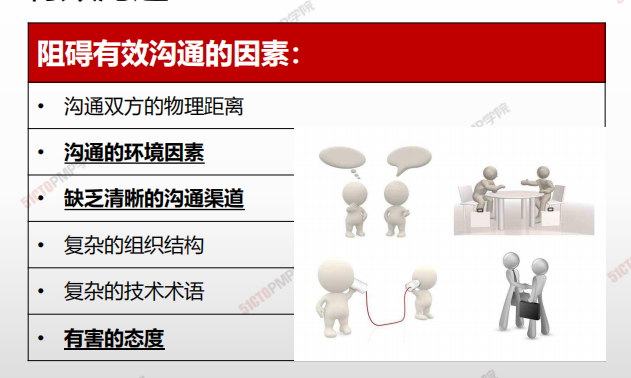
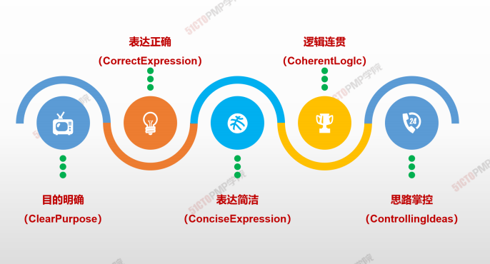
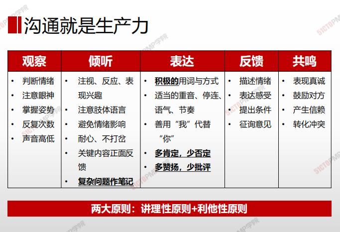

## 有效沟通的障碍和原则

## 有效沟通

## 5C原则

# 如何高效召开会议

>1、明确会议的目的和期望的结果（**只在确实需要时才召开会议）**

2、确定参加会议的人员

3、在会议召开前向参加者提供会议议程（明确议题，**提前分发评审资料、**

**会议通知）**

4、使会议专业化（**指定一名主持人——控制时间、方向）**

5、解决问题 “对事不对人”，积极的、正面的态度解决问题

6、重视会议之后的记录（**会议要形成结论、发布经审核的会议纪要）**

7、重视会议结果的告知（**会议纪要任务落实到人、时间要求）**

