# 项目风险概述

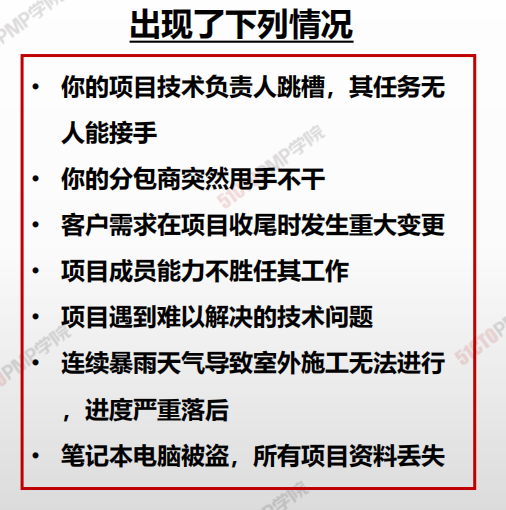

## 项目风险认知

* 项目是独特的，必然存在风险，任何一个项目的挂历都必须面对风险。
* 风险管理决定项目的成败，它是最容易出问题的地方，项目最薄弱的地方。
* 风险不等于 ” 坏事 “ ；
* 大多是风险都是可以预测和管理的，甚至90%的风险都是可预测的；

## 项目风险的特点

- 项目风险贯穿整个项目生命周期，并且项目的不同阶段会有不同的风险。
- 风险随着项目的进展而变化，其不确定性一般会逐渐减少。
- 最大的不确定性存在于项目的早期，早期阶段做出的决策对以后阶段和项目目标的实现影响最大。

## 项目风险管理的特点

* 项目风险管理是为了减轻潜在的不利事件对项目的影响而采取的一项活动。
* 风险管理是一种投资，需要成本。
* 在任何情况下，项目风险管理的成本不应超过项目潜在的收益。
* 需要努力在项目的各个方面寻找风险和机会之间的平衡；

---

- 风险从 <u>项目构思</u>那一刻就存在，贯穿整个项目生命周期。
- 树立风险意识，<u>积极主动</u>管理风险，而不是消极被动应对风险。
- 风险并不可怕，可怕的是对风险存在 <u>**侥幸心里**</u>，<u>**最大的风险是不认真对待风险**</u>

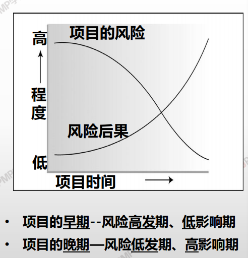

---

## 风险四要素

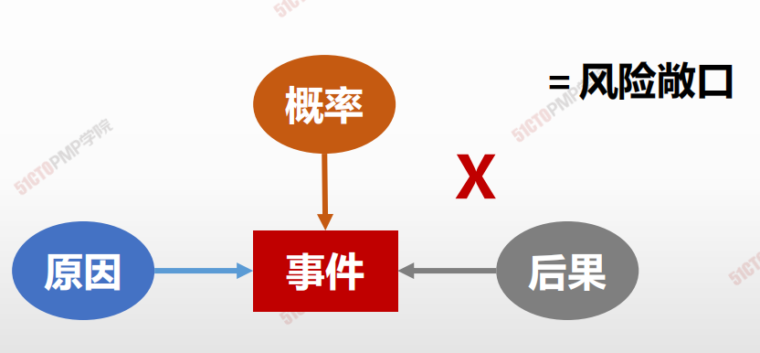

## 风险管理概述

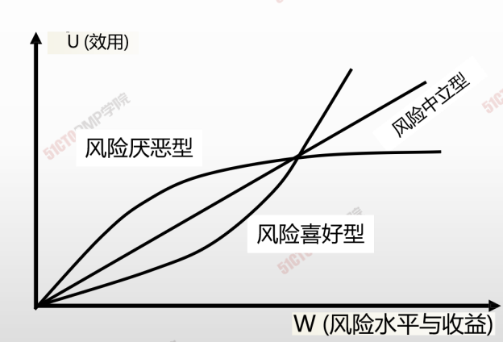

* 不同的人对风险的 <u>取向不同</u>
* 相同的财富金额，在不同的人心里有不同的效用
* 获得的心理满足效用不同

## 风险分类

### 已知风险

### 未知风险

#### <u>已知已知的风险</u>可能造成损失：<u>应对措施 - 直接成本</u>

#### <u>已知未知的风险</u>可能造成损失：<u>应急计划 - 应急储备</u>

#### <u>未知未知的风险</u>可能造成损失：<u>权变措施 - 管理储备</u>

> 对于已知未知，必须加以管理，以便降低威胁。对于未知未知风险，则只能听之任之，待实际发生后再来处理。如果去管理位置位置风险，就是 **杞人忧天**

## 风险管理几个关键概念

| 主要概念   | 解释                                                         | 解读                           |
| ---------- | ------------------------------------------------------------ | ------------------------------ |
| 风险责任人 | 只要负责监控与应对计划实施，只要是对风险管理过程的责任       | 责任落实                       |
| 次生风险   | 实施风险应对措施直接导致的风险                               | 瓜果打农药，杀虫灭菌，农药残流 |
| 残余风险   | 在采取预定的对应措施任然残余的风险，包括已被接受并处置过的小风险 | 漏网之鱼                       |
| 弹回风险   | 风险发生所选主要应对措施无效时所使用的备用应对计划           | Plan A，Plan B                 |
| 权变措施   | 对已发生的且未实现规划应对的不利风险的应对                   | 逼不得已，狗急跳墙             |

## 风险管理的内容

| 11.1 | 规划风险管理     | 定义如何实施<u>项目风险管理活动的过程</u>                    |
| ---- | ---------------- | ------------------------------------------------------------ |
| 11.2 | 识别风险         | 识别单个项目风险，以及整体项目风险的 <u>来源</u>，并记录风险的特征的过程。 |
| 11.3 | 实施定性风险分析 | 通过评估单个项目风险发生的概率和影响以及其他特征，对风险进行 <u>优先级排序，</u>，从而为后续分析或行动提供基础的过程。 |
| 11.4 | 实施定量风险分析 | 就已识别的单个项目风险和其他不确定性的来源对 <u>整体项目目标</u>的综合影响进行 <u>定量分析</u>。 |
| 11.5 | 规划风险应对     | 为处理整体项目风险敞口，以及应对单个项目风险，而制定可选方案、选择应对策略并商定 <u>应对行动</u>的过程 |
| 11.6 | 实施风险应对     | 执行商定的 <u>风险应对计划的</u>过程                         |
| 11.7 | 监督风险         | 在整个项目期间，监督商定的风险应对计划的实施、跟踪已识别的风险、识别和分析新的风险，以及评估风险管理 <u>有效性的</u>过程 |

> 1. <u>**一步做规划**</u>
> 2. <u>**二步做识别**</u>
> 3. <u>**三步做分类 （定性） – 优先级**</u>
> 4. <u>**四步做量化**</u>
> 5. <u>**五步做应对**</u>
> 6. <u>**六部重执行**</u>
> 7. <u>**一循环：持续监督**</u>

**项目风险管理概述：**风险是指一旦发生，就会对项目

目标产生积极或消极的不确定性事件或条件

---

# 规划风险管理

### 风险管理规划应该明确的问题

* 有哪些项目风险
* 为什么承担或不承担这一风险对于项目目标很重要？
* 什么是具体的风险，风险的影响程度?
* 什么是风险减轻的可交付成果？
* 风险应对计划：风险如何被减轻？
* 谁是负责实施风险管理计划的人？
* 与减轻方法相关的里程碑事件何时会发生？
* 为减轻风险，需要多少资源？

## 4W1H

| 4W1H                | **规划风险管理**                                             |
| ------------------- | ------------------------------------------------------------ |
| what 做什么     | 规划风险管理是定义如何实施项目风险管理活动的过程。 作用：确保风险管理的水平、方法和可见度与项目风险程度，以及项目对组织和其他相关方的重要程度相匹配 |
| why 为什么做    | 确保风险管理的水平、方法和可见度与项目风险程度，以及项目对组织和其他相关方的重要程度相匹配。 |
| who 谁来做      | 风险管理计划可由项目经理、指定项目团队成员、关键相关方，或负责管理项目风险管理过程的团队成员合作制定 |
| when 什么时候做 | 项目早期，项目章程批准后，开始制定项目沟通管理计划本过程仅开展一次或仅在项目的预定义点开展。规划风险管理过程在项目构思阶段就应开始，并在项目早期完成。在项目生命周期的后期，可能有必要重新开展本过程。 |
| how 如何做      | 通过描述如何安排与实施风险管理活动来制定计划。**专家判断、数据收集、会议** |

## 输入/工具技术/输出

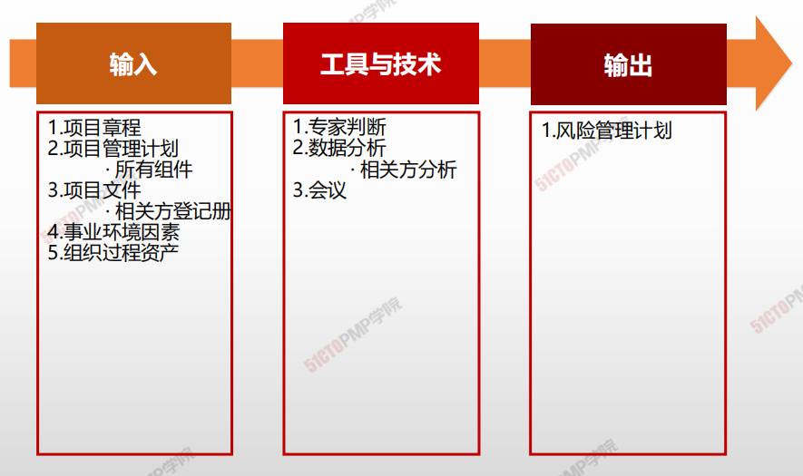

1. 输入

   1. 项目章程
   2. 项目管理计划
      - 所有组件
   3. 项目文件
      * 相关方登记册
   4. 事业环境因素
   5. 组织过程资产

2. 工具与技术

   1. 专家判断
   2. 数据分析
      - 分析相关方
   3. 会议

3. 输出

   1. 风险管理计划

   

   

   

## 风险管理计划

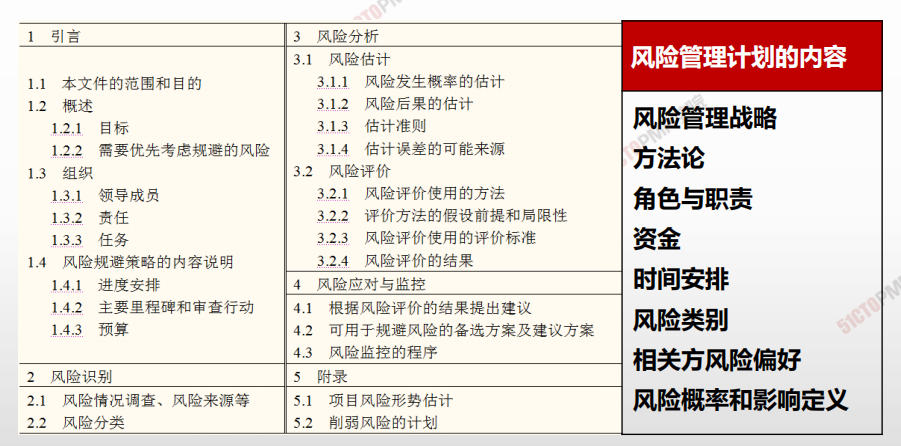

1. 规划风险管理是定义如何实施项目风险管理活动
的过程
2. 规划风险管理过程应该尽早展开，在项目构思阶
段就应开始，并在项目早期完成
3. 风险管理计划是项目管理计划的组成部分，描述
如何安排与实施风险管理活动

---

# 识别风险

### 风险管理规划应该明确的问题

* **风险识别就是采用系统化的方法，识别出项目中已知的和可预**

  **测到的风险。**

* **风险识别是一项反复的过程，**项目团队应该参与该过程。

* 风险识别包括确定风险的来源、风险产生的条件，描述风险特

  征和确定哪些风险事件有可能影响整个项目

* 风险识别分为三步进行

  1. **收集资料**
  2. **估计项目风险形势**
  3. **将潜在的风险识别出来**

## 4W1H

| 4W1H                | **识别风险**                                                 |
| ------------------- | :----------------------------------------------------------- |
| what 做什么     | 识别风险是识别单个项目风险以及整体项目风险的来源，并记录风险特征的过程。 作用：记录现有的单个项目风险，以及整体项目风险的来源；同时，汇集相关信息，以便项目团队能够恰当应对已识别的风险。 |
| why 为什么做    | 记录现有的单个项目风险，以及整体项目风险的来源；同时，汇集相关信息，以便项目团队能够恰当应对已识别的风险。 |
| who 谁来做      | 项目经理、项目团队成员、项目风险专家（若已指定）、客户、项目团队外部的主题专家、最终用户、其他项目经理、运营经理、相关方和组织内的风险管理专家。虽然这些人员通常是风险识别活动的关键参与者，但是还应鼓励所有项目相关方参与单个项目风险的识别工作 |
| when 什么时候做 | 本过程需要在整个项目期间开展。                               |
| how 如何做      | 通过审查文档，信息收集技术，核对表分析，图解技术，假设分析，SWOT分析和专家判断来识别风险 专家判断、数据收集、数据分析、人际关系与团队技能、提示清单、会议 |

## 输入/工具技术/输出

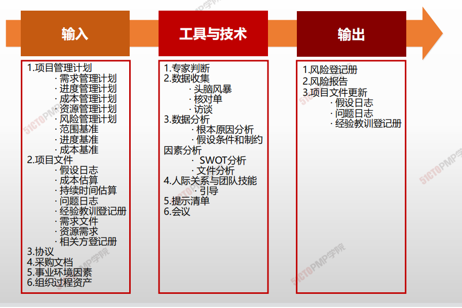

1. 输入
   1. 项目管理计划
      * 需求管理计划
      * 进度管理计划
      * 成本管理计划
      * 资源管理计划
      * 风险管理计划
      * 范围基准
      * 进度基准
      * 成本基准
   2. 项目文件
      - 假设文件
      - 成本估算
      - 持续时间估算
      - 问题日至
      - 经验教训登记册
      - 资源需求
      - 相关方登记册
   3. 协议
   4. 采购文件
   5. 事业环境因素
   6. 组织过程资产
2. 工具与技术
   1. 专家判断
   2. 数据和搜集
      - 头脑风暴
      - 核对单
      - 访谈
   3. 数据分析
      - 根本原因分析
      - 假设条件和制约因素分析
      - SWOT分析
      - 文件分析
   4. 人际关系与团队技能
      - 引导
   5. 提示清单
   6. 会议
3. 输出
   1. 风险登记册
   2. 风险报告
   3. 项目文件更新
      - 假设日志
      - 问题日志
      - 经验教训登记册

## 核对单

- 根据以往项目或其他渠道积累的**历史信息与知识**，编制风险识别核对单； 
- 列出过去项目中曾经和可能遇到的各种风险的清单
  - 优点：风险识别过程**快速简单**
  - 缺点：**不能包含所有情况、**限制思考
- 通常**按照风险类别**来组织
  - 可按风险的来源、风险影响的领域等分类
  - 风险分解结构：**RBS的最底层可作为风险核对单**
- **项目收尾过程中更新核对单。**

## 假设条件和制约因素分析

- 检验假设条件在项目中的有效性，并识别因其中的错误、变化、矛盾或片面性所致的项目风险

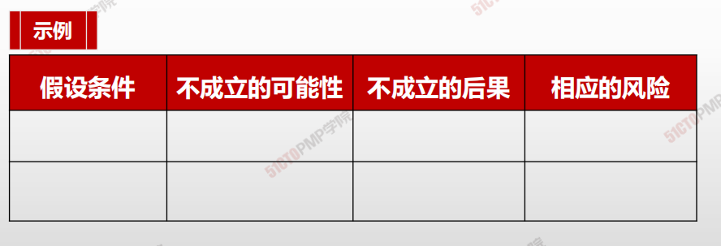

## SWOT分析

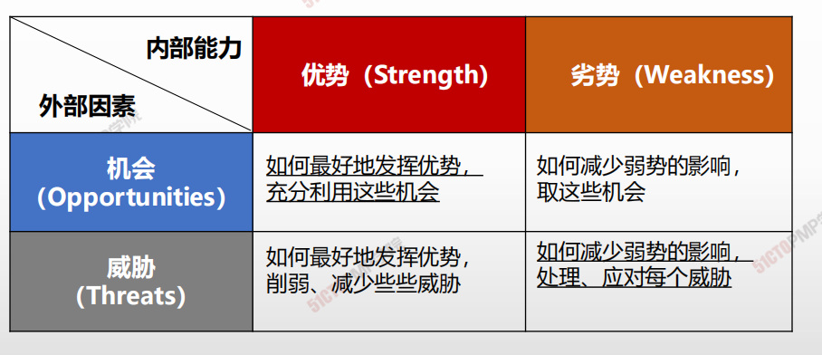

- 劣势
- 优势
- 机会
- 威胁

## 提示清单

**关于可能引发单个项目风险以及可作为整体项目风险来源的风险类别的预设清单**

**PESTLE：**政治、经济、社会、技术、法律、环境

**TECOP：**技术、环境、商业、运营、政治

**VUCA：**易变性、不确定性、复杂性、模糊性

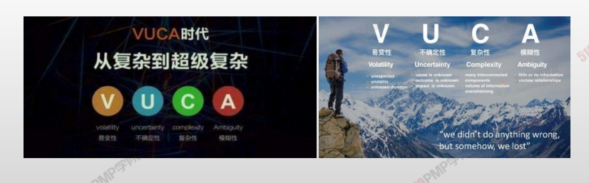

## 风险登记册

- 风险登记册记录已识别单个项目风险的详细信息。
- 风险登记册的内容可能包括（但不限于）：
  - **已识别风险的清单** 在风险登记册中，每项单个项目风险都被赋予一个独特的标识号。要以所需的详细程度对已识别风险进行描述，确保明确理解。可以使用结构化的风险描述，来把风险本身与风险原因及风险影响区分开来。
  - **潜在风险责任人** 如果已在识别风险过程中识别出潜在的风险责任人，就要把该责任人记录到风险登记册中。随后将由实施定性风险分析过程进行确认。
  - **潜在风险应对措施清单** 如果已在识别风险过程中识别出某种潜在的风险应对措施，就要把它记录到风险登记册中。随后将由规划风险应对过程进行确认。
- 根据风险管理计划规定的风险登记册格式，可能还要记录关于每项已识别风险的其他数据

## 风险报告

- 风险报告提供关于整体项目风险的信息，以及关于已识别的单个项目风险的概述信息。
- 在项目风险管理过程中，风险报告的编制是一项渐进式的工作。
- 在完成识别风险过程时，风险报告的内容可能包括（但不限于）：
  - **整体项目风险的来源** 说明哪些是整体项目风险敞口的最重要驱动因素。
  - **关于已识别单个项目风险的概述信息** 例如，已识别的威胁与机会的数量、风险在风险类别中的分布情况、测量指标和发展趋势。

根据风险管理计划中规定的报告要求，风险报告中可能还包含其他信息

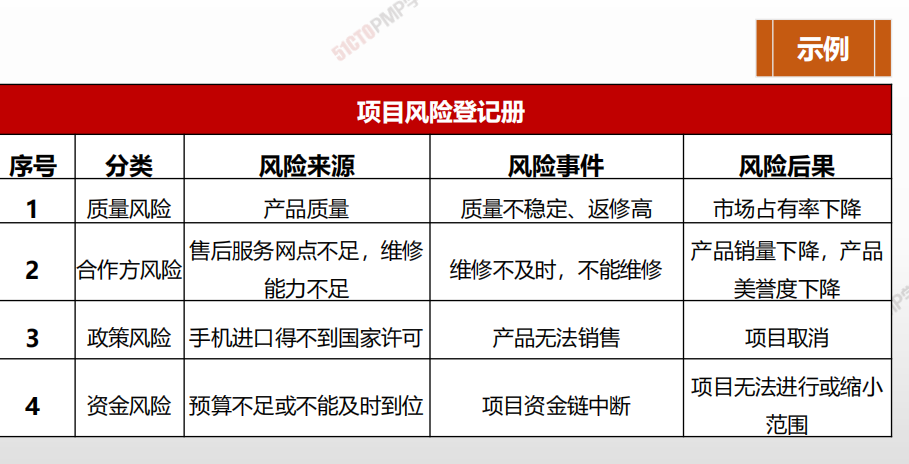

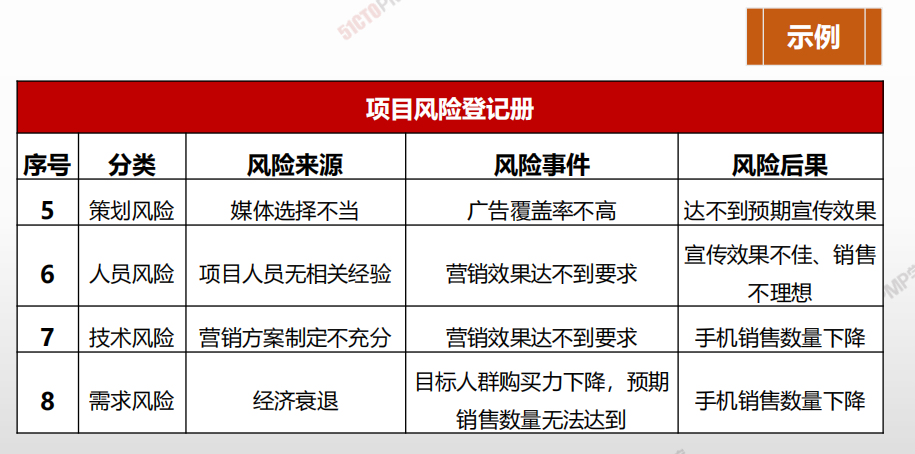

## 风险分解结构

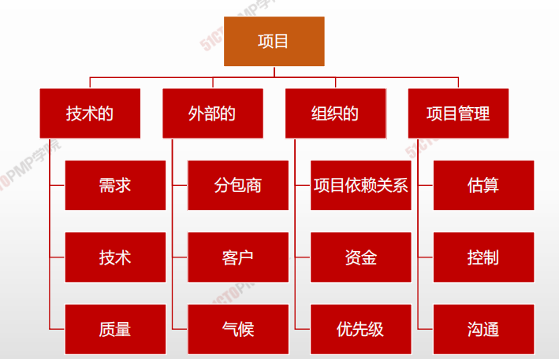

>  **风险分解结构列出了一个典型项目中可能发生的风险分类和风险子分类。**提醒风险识别人员**风险产生的原因是多种多样的**

## 识别风险经验谈

#### **不要遗漏重要风险**

#### **不可能识别所有风险**

#### **风险识别的详尽程度与项目的预算有关**

#### **风险识别的详尽程度与项目的重要性有关**

1. 识别风险是识别单个项目风险以及整体项目风险
的来源，并记录风险特征的过程
2. 应该鼓励所有项目相关方特别是项目团队参与项
目风险的识别工作

---

# 实施定性风险分析

## 概述

**<u>定性风险分析</u>：是指对已识别风险的影响和可能性大小的评估过程**

* 定性风险分析的关注重点是风险的**概率**和**影响**两个方面

* 该过程按风险对项目目标潜在影响的轻重缓急进行排序，并

为定量风险分析奠定了基础。

## 4W1H

| 4W1H                | **实施定性风险分析**                                         |
| ------------------- | :----------------------------------------------------------- |
| what 做什么     | 实施定性风险分析是通过评估单个项目风险发生的概率和影响以及其他特征，对风险进行优先级排序，从而为后续分析或行动提供基础的过程。 作用：重点关注高优先级的风险 |
| why 为什么做    | 实施定性风险分析，使用项目风险的发生概率、风险发生时对项目目标的相应影响以及其他因素，来评估已识别单个项目风险的优先级。这种评估基于项目团队和其他相关方对风险的感知度，从而具有主观性 |
| who 谁来做      | 项目经理与项目管理和项目外部资深人员。                       |
| when 什么时候做 | 本过程需要在整个项目期间开展                                 |
| how 如何做      | 根据风险管理计划的规定，在整个项目生命周期中要定期开展实施定性风险分析过程。在敏捷开发环境中，实施定性风险分析过程通常要在每次迭代开始前进行。 <u>专家判断、数据收集、数据分析、人际关系与团队技能、风险分类、数据表现、会议</u> |

## 输入/工具技术/输出

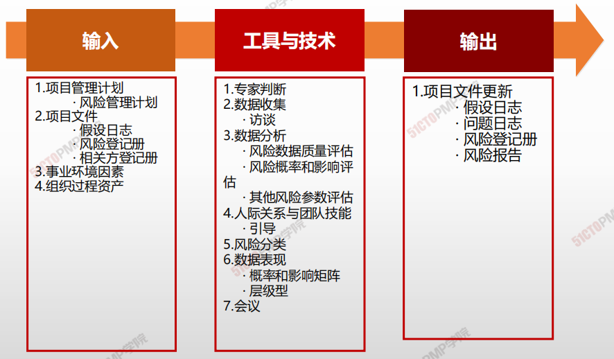

1. 输入
   1. 项目管理计划
      * 风险管理计划
   2. 项目文件
      - 假设日志
      - 风险登记册
      - 相关方登记册
   5. 事业环境因素
   6. 组织过程资产
2. 工具与技术
   1. 专家判断
   2. 数据收集
      - 访谈
   3. 数据分析
      - 风险数据质量评估
      - 风险概率和影响评估
      - 其他风险参数评估
   4. 人际关系与团队技能
      - 引导
   5. 风险分类
   6. 数据表现
      - 概率和影响矩阵
      - 层级型
   7. 会议
3. 输出
   3. 项目文件更新
      - 假设日志
      - 问题日志
      - 风险登记册
      - 风险报告

## 风险数据质量评估

- 评估风险数据对风险管理的**有用程度**的一种技术
  - 考察风险数据的**准确性、质量、可靠性**和**完整性**
  - 若无法接受数据的质量，则需**重新收集**更好的数据

## 层级型

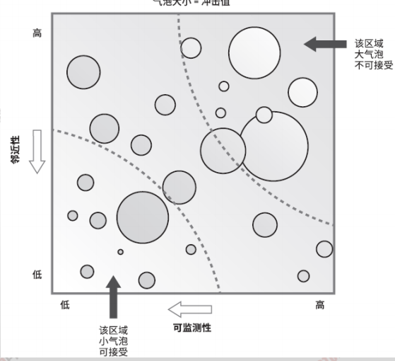

## 项目文件更新

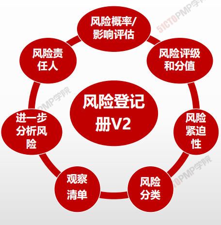

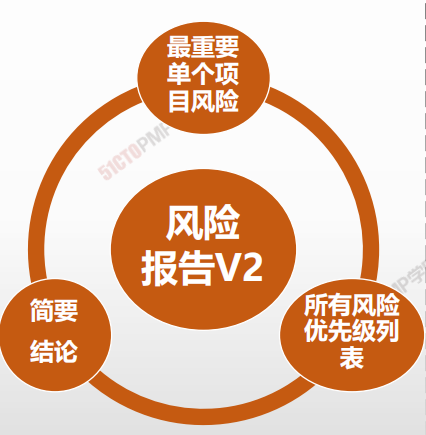

1. 实施定性风险分析是评估风险发生的概率和影响
以及其他特征，对风险进行优先级排序，从而为
后续分析或行动提供基础的过程
2. 要对每个已识别的单个项目风险进行概率和影响
评估
3. 概率和影响矩阵是把每个风险发生的概率和一旦
发生对项目目标的影响映射起来的表格，用于对
风险排序

---

# 实施定性风险分析

## 定性风险分析vs.定量风险分析

- 定性风险分析：对**单个**风险进行**排序**。**主观**判断。
- 定量风险分析：对**整体**风险的影响进行**量化**估算。**客观**评价。

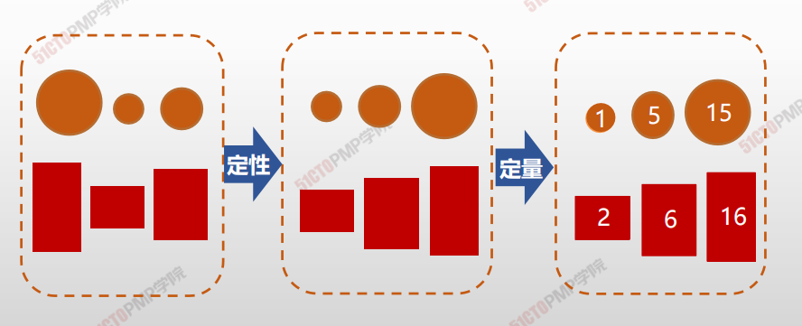

## 4W1H

| 4W1H                | **实施定量风险分析**                                         |
| ------------------- | :----------------------------------------------------------- |
| what 做什么     | 实施定量风险分析是就已识别的单个项目风险和不确定性的其他来源对整体项目目标的影响进行定量分析的过程。 <u>作用</u>：量化整体项目风险敞口，并提供额外的定量风险信息，以支持风险应对规划。 |
| why 为什么做    | 通过评估所有单个项目风险和其他不确定性来源对项目结果的综合影响，定量风险分析就成为评估整体项目风险的唯一可靠的方法。 |
| who 谁来做      | 项目经理与项目管理团队外加**一名熟练的引导者。**             |
| when 什么时候做 | 本过程并非每个项目必需，但如果采用，它会在整个项目期间持续 开展。 |
| how 如何做      | 实施定量风险分析过程的输出，则要用作规划风险应对过程的输入，特别是要据此为整体项目风险和关键单个项目风险推荐应对措施。定量风险分析也可以在规划风险应对过程之后开展，以分析已规划的应对措施对降低整体项目风险敞口的有效性。 <u>专家判断、数据收集、人际关系与团队技能、不确定性表现方式、数据分析</u> |

## 输入/工具技术/输出

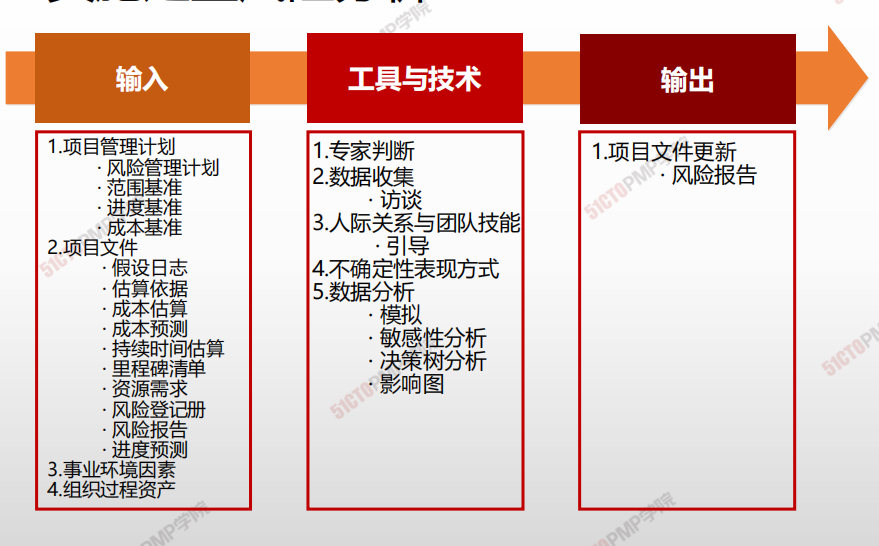

1. 输入
   1. 项目管理计划
      * 风险管理计划
      * 范围基准
      * 进度基准
      * 成本基准
   2. 项目文件
      - 假设日志
      - 估算依据
      - 成本估算
      - 成本预测
      - 持续时间估算
      - 里程碑清单
      - 资源需求
      - 风险登记册
      - 风险报告
      - 进度预测
   5. 事业环境因素
   6. 组织过程资产
2. 工具与技术
   1. 专家判断
   2. 数据收集
      - 访谈
   4. 人际关系与团队技能
      - 引导
   5. 不确定性表现方式
   5. 数据分析
      - 模拟
      - 敏感性分析
      - 决策树分析
      - 影像图
3. 输出
   3. 项目文件更新
      - 风险报告

## 敏感性分析

**敏感性分析有助于确定哪些风险对项目具有最大的潜在影响。**
把所有其他不确定因素都固定在基准值，再来考察**每个因素的变化**会对目标产生多大程度的影响。
用于比较很不确定的变量与相对稳定的变量之间的相对重要性和相对影响。

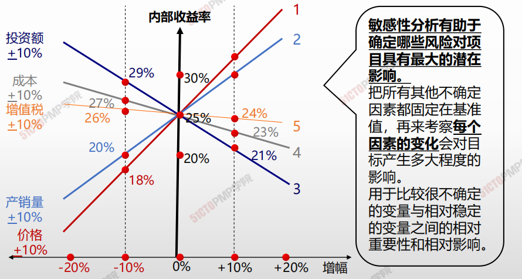

## 龙卷风图

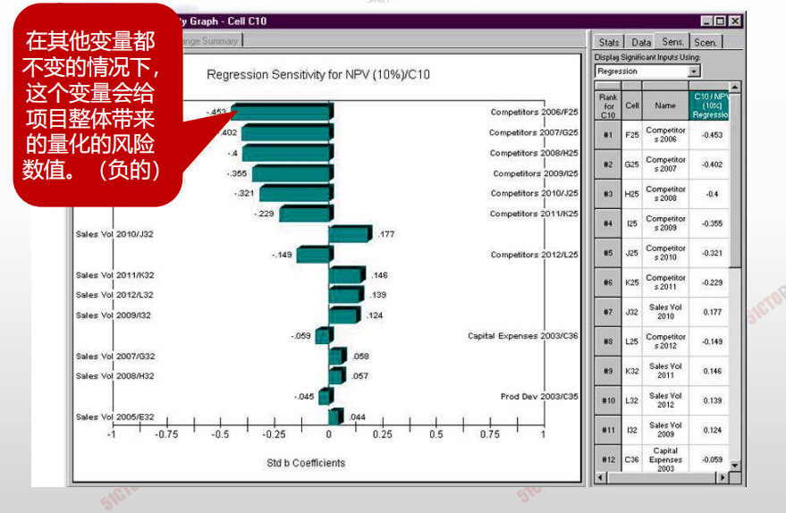

## 决策树分析

通常采用决策树图表进行分析，描述了每种可能的选择和这种情况发

生的概率

综合考虑每种选择的成本及其概率

通过决策树分析可以找出每种选择

的具体情况，包括成本、预期回报等定量分析

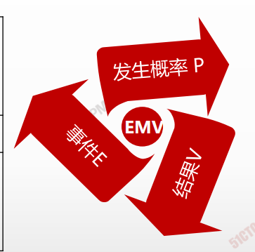

## 蒙特卡罗技术

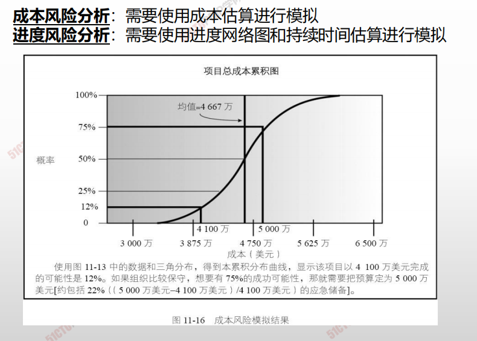

---

1. 实施定量风险分析是就已识别的单个项目风险和
不确定性的其他来源对整体项目目标的影响进行
定量分析的过程
2. 一般先进行风险的定性分析，对风险相对清晰的
认识后，定量风险分析需要高质量的基础数据，
消耗比较大的人力、物力和时间，只有重要的风
险才进行定量分析
3. 可以利用决策树分析在若干备选行动方案中选择
一个最佳方案

---

# 实施定性风险分析

## 4W1H

| 4W1H                | **规划风险应对**                                             |
| ------------------- | :----------------------------------------------------------- |
| what 做什么     | 规划风险应对是为处理整体项目风险敞口，以及应对单个项目风险，而制定可选方案、选择应对策略并商定应对行动的过程。 <u>作用：制定应对整体项目风险和单个项目风险的适当方法；本过程还将分配资源，并根据需要将相关活动添加进项目文件和项目管理计划。</u> |
| why 为什么做    | 有效和适当的风险应对可以最小化单个威胁，最大化单个机会，并降低整体项目风险敞口；不恰当的风险应对则会适得其反。 |
| who 谁来做      | 项目经理与项目管理团队以及具备威胁应对、机会应对、应急应对专业知识的 个人或小组 |
| when 什么时候做 | 本过程需要在整个项目期间开展。                               |
| how 如何做      | 要为实施商定的风险应对策略，包括主要策略和备用策略（若必要），制定具体的应对行动。如果选定的策略并不完全有效，或者发生了已接受的风险，就需要制定应急计划（或弹回计划）。同时，也需要识别次生风险。次生风险是实施风险应对措施而直接导致的风险。往往需要为风险分配时间或成本应急储备，并可能需要说明动用应急储备的条件。 <u>专家判断、数据收集、人际关系与团队技能、威胁应对策略、机会应对策略、应急应对策略、整体项目风险应对策略、数据分析、决策</u> |

## 输入/工具技术/输出

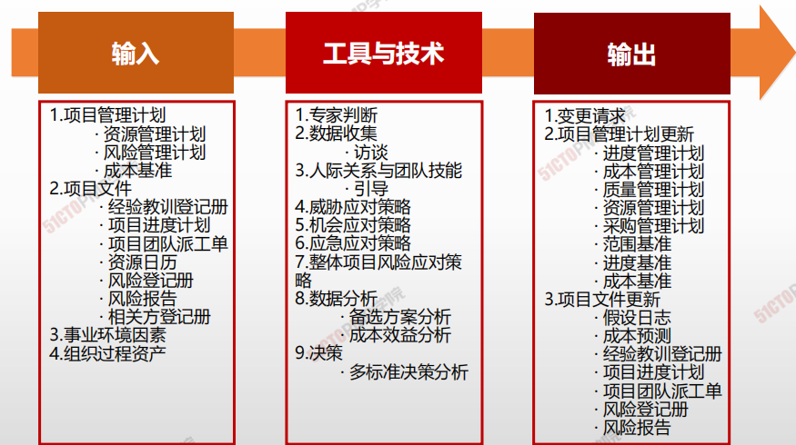

1. 输入
   1. 项目管理计划
      - 资源管理计划
      - 风险管理计划
      - 成本基准
   2. 项目文件
      - 经验教训登记册
      - 项目进度计划
      - 项目团队派工单
      - 资源日历
      - 风险登记册
      - 风险报告
      - 相关方登记册
   3. 事业环境因素
   4. 组织过程资产
2. 工具与技术
   1. 专家判断
   2. 数据收集
      - 访谈
   3. 人际关系与团队技能
      - 引导
   4. 威胁应对策略
   5. 机会应对策略
   6. 应急应对策略
   7. 整体项目风险应对策略
   8. 数据分析
      - 备选方案分析
      - 成本效益分析
   9. 决策
      - 多标准决策
3. 输出
   1. 变更请求
   2. 项目管理计划更新
      - 进度管理计划
      - 成本管理计划
      - 质量管理计划
      - 资源管理计划
      - 采购管理计划
      - 范围基准
      - 进度基准
      - 成本基准
   3. 项目文件更新
      - 假设日志
      - 成本预测
      - 经验教训登记册
      - 项目进度计划
      - 项目团队派工单
      - 风险登记册
      - 风险报告

## 规划风险应对

| 策略 | 特点 | 情景 |
| ---- | ---- | ---- |
|开拓 |消除积极风险的不确定性，确保机会出现|• 分配组织中最好的资源：最好的人，最大的经费保障，最优惠的政策，一把手领导亲自带队 • 用新技术，节约成本 • 用高能力人员提前完工 • 穷尽全部可能性，消除不确定性 |
|分享| 充分利用机会，使各方都从中受益|• 建立合作关系，共担责任 • 共享发生利益 • 成立联合体进行投标或组建合资公司提高 提高发生概率、扩大发生影响 • 更加努力学习 • 增加资源以提前完工 • 加强宣传 |
|接受 机会|发生乐以利用|• 不主动促使发生，乐意在发生时利用 • 不大的机会 • 可列入观察清单|
|上报| 上报给管理层| • 项目集、项目组合、整个组织层面，不在项目范围内 • 应对措施超出项目经理的权限|
|回避Avoid | 取消整个项目，以完全消除威胁使目标不受威胁影响|• 去掉WBS中有风险的工作包 • 或由第三方来消除 • 排除风险起源、延长进度、减少范围、改变策略|
| 缓解、减轻Mitigate | 降低概率或后果 | • 雇佣有经验的雇员，更多测试 • 设置警示标志 • 设置备用部件 • 使用优质供应商  |
|转移Transference |转给第三方|• 购买保险或第三方担保，履约保证书，担保书、保证书 • 签订风险转移合同 • 要求提交担保 |
|积极接受Acceptance|准备备用计划\准备应急储备金\列入观察清单|• 能承受的威胁 • 有风险不能回避和减轻，准备备用计划，建立应急储备|
| 被动接受Acceptance | 什么都不作 | • 无法用其他策略 |
| 上报 | 上报给管理层 | • 项目集、项目组合、整个组织层面，不在项目范围内 • 应对措施超出项目经理的权限 |

## 风险应对策略

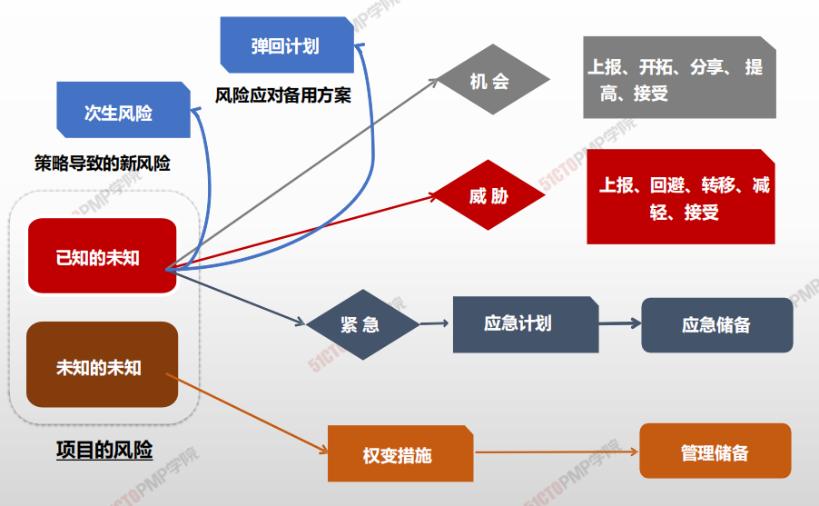

----

1. 规划风险应对是为处理整体项目风险敞口，以及
应对单个项目风险，而制 定可选方案、选择应对
策略并商定应对行动的过程
2. 威胁有五种应对策略，包括上报、规避、转移、
减轻和接受
3. 机会的应对策略也有五种，包括上报、开拓、提
高、分享和接受

---

# 实施风险应对

## 4W1H

| 4W1H                | **实施风险应对**                                             |
| ------------------- | :----------------------------------------------------------- |
| what 做什么     | 实施风险应对是执行商定的风险应对计划的过程。 作用：确保按计划执行商定的风险应对措施，来管理整体项目风险敞口、最小化单个项目威胁，以及最大化单个项目机会。 |
| why 为什么做    | 适当关注实施风险应对过程，能够确保已商定的风险应对措施得到实际执行。 |
| who 谁来做      | 项目经理或人员就施展影响力，指定的风险责任人执行             |
| when 什么时候做 | 本过程需要在整个项目期间开展。                               |
| how 如何做      | 项目团队努力识别和分析风险并制定应对措施，然后把经商定的应对措施记录在风险登记册和风险报告中，但是不采取实际行动去管理风险。 <u>专家判断、人际关系与团队技能、项目管理信息系统</u> |

## 输入/工具技术/输出

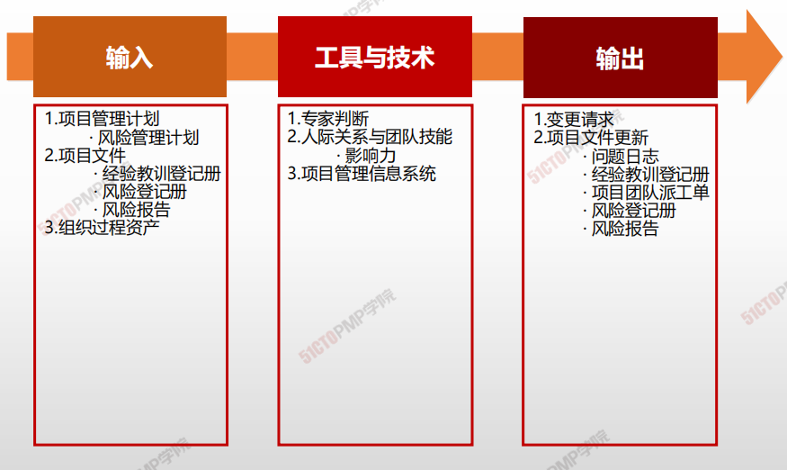

1. 输入
   1. 项目管理计划
      - 风险管理计划
   2. 项目文件
      - 经验教训登记册
      - 风险登记册
      - 风险报告
   4. 组织过程资产
2. 工具与技术
   1. 专家判断
   2. 人际关系与团队技能
      - 引导
   3. 项目管理信息系统
3. 输出
   1. 变更请求
   3. 项目文件更新
      - 问题日志
      - 经验教训登记册
      - 项目团队派工单
      - 风险登记册
      - 风险报告

## 更新后的风险登记册

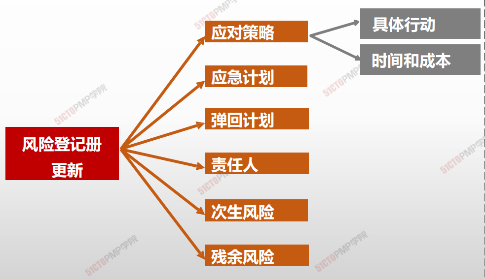

---

# 监督风险

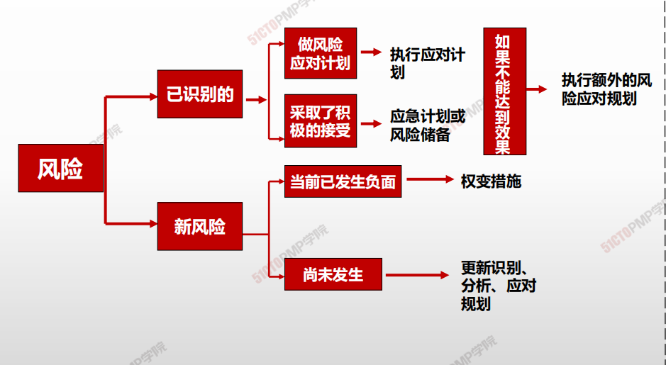

## 4W1H

| 4W1H                | 监督风险                                                     |
| ------------------- | :----------------------------------------------------------- |
| what 做什么     | 监督风险是在整个项目期间，监督商定的风险应对计划的实施、跟踪已识别风险、识别和分析新风险，以及评估风险管理有效性的过程。 作用：使项目决策都基于关于整体项目风险敞口和单个项目风险的当前信息 |
| why 为什么做    | 为了确保项目团队和关键相关方了解当前的风险敞口级别。         |
| who 谁来做      | 项目经理和项目团队                                           |
| when 什么时候做 | 本过程需要在整个项目期间开展。                               |
| how 如何做      | 应该通过监督风险过程对项目工作进行持续监督，来发现新出现、正变化和已过时的单个项目风险。 数据分析、审计、会议 |

## 输入/工具技术/输出

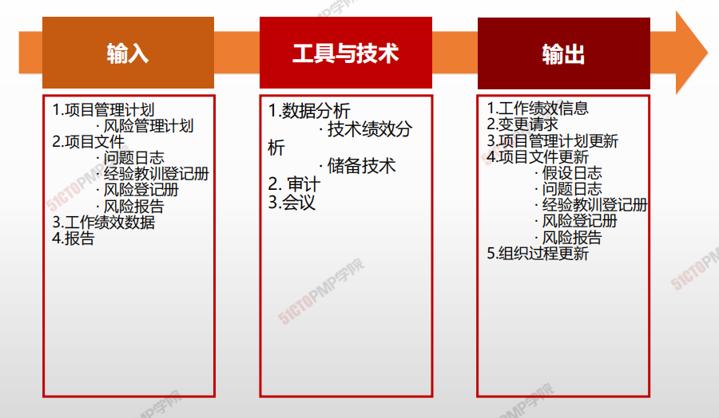

1. 输入
   1. 项目管理计划
      - 风险管理计划
   2. 项目文件
      - 问题日志
      - 经验教训登记册
      - 风险登记册
      - 风险报告
   4. 工作绩效数据
   4. 报告
2. 工具与技术
   1. 数据分析
      - 技术绩效分析
      - 储备技术
   2. 审计
   3. 会议
3. 输出
   1. 工作绩效信息

   2. 变更请求

   3. 项目管理计划更新

   4. 项目文件更新

      - 假设日志

      - 问题日志
      - 经验教训登记册
      - 风险登记册
      - 风险报告

   5. 组织过程更新

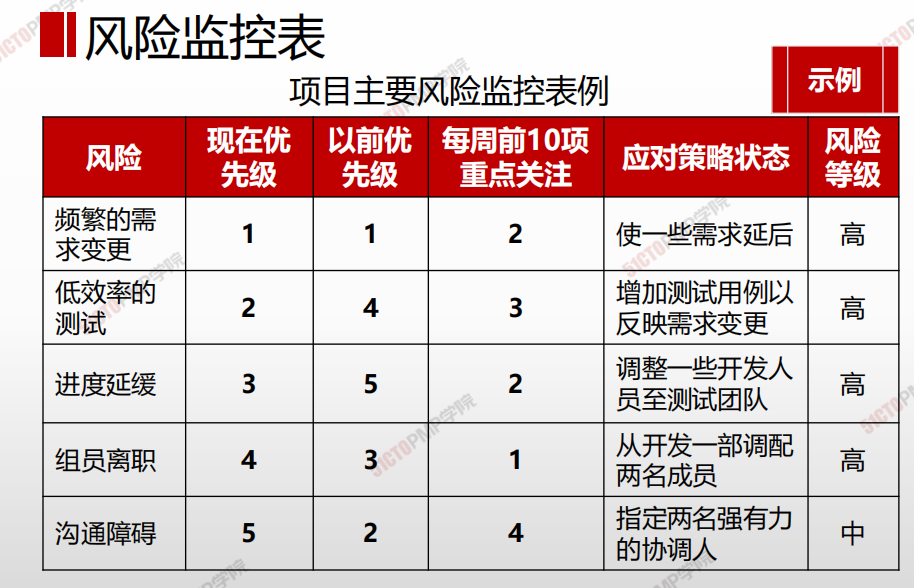

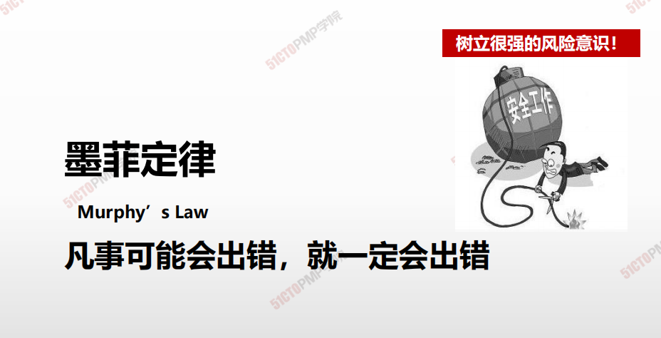

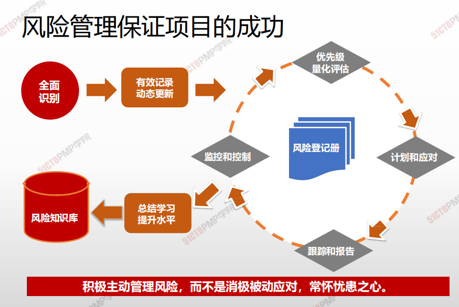

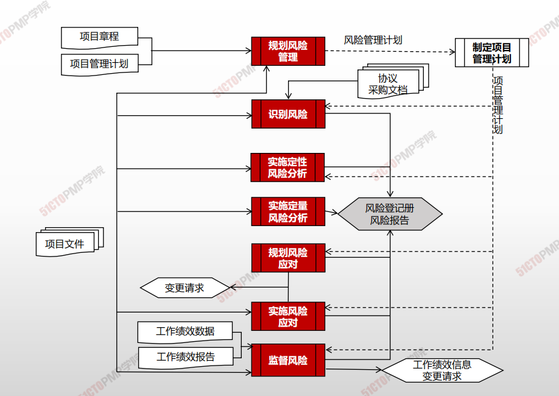

---

