# 采购管理概述

| 12.1 | 规划采购管理 | 记录项目采购决策、明确采购方法，及识别潜在卖方的过程         |
| ---- | ------------ | ------------------------------------------------------------ |
|12.2 | 实施采购     | 获取卖方应答、选择卖方并授予合同的过程。                     |
| 12.3 | 控制采购     | 管理采购关系、监督合同绩效、实施必要的变更和纠偏，以及关闭合同的过程。 |

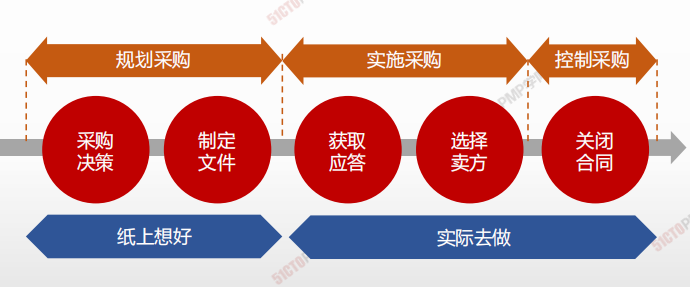

| **规划采购管理** | **实施采购** | **控制采购** |
| ---------------- | ------------ | ------------ |
|1.编制采购管理计划，做出并记录采购决策|1.发出招标文件，获取卖方应答|1.管理合同关系，监督合同绩效|
|2.编制招标文件和其他相关文件|2.评审卖方建议书，选择卖方 |2.开展必要的纠偏和变更|
|3.识别潜在卖方（有资格来投标 的厂家）|3.授予合同 |3.核实和移交成果，关闭合同， 总结经验教训|

1. 一步做决策---自制还是外购的决策
2. 二步做准备—准备招投标文件-------一步二步做规划
3. 三步做筛选—选出3家或3家以上（初步筛选）不足三家要废标
4. 四步做选择---选择1家最适合—评标、授标（发出中标通知书，
   告知投标人我接收你们的方案和报价）、签订合同---三步、
   四步做实施
5. 五步做合同---合同管理---控制采购
6. 六步做收尾---结束采购---五步、六步做控制 
7. 一法：采购看优选，合同看条款

---

# 规划采购管理

## 4W1H

| 4W1H                | **规划采购管理**                                             |
| ------------------- | ------------------------------------------------------------ |
| what 做什么     | 记录项目采购决策、明确采购方法，及识别潜在卖方的过程。 作用：确定是否从项目外部获取货物和服务，如果是，则还要确定将在什么时间、以什么方式获取什么货物和服务 |
| why 为什么做    | 项目进度计划对规划采购管理过程中的采购策略制定有重要影响。为如何采购指定规矩，制定原则，明确采购方法，识别潜在卖方。 |
| who 谁来做      | 项目经理                                                     |
| when 什么时候做 | 本过程仅开展一次或仅在项目的预定义点开展                     |
| how 如何做      | 应该在规划采购管理过程的早期，确定与采购有关的角色和职责。项目经理应确保在项目团队中配备具有所需采购专业知识的人员。 **专家判断、数据收集、数据分析、供方选择分析、会议** |

## 输入/工具技术/输出

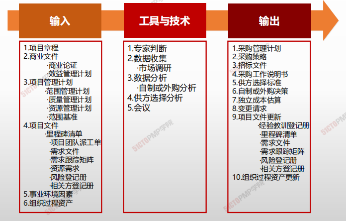

1. 输入

   1. 项目章程
   2. 商业文件
      - 商业论证
      - 效益管理计划
   3. 项目管理计划
      - 范围管理计划
      - 质量管理计划
      - 资源管理计划
      - 范围基准
   4. 项目文件
      - 里程碑清单
      - 项目团队派工单
      - 需求文件
      - 需求跟踪矩阵
      - 资源需求
      - 风险等级册
      - 相关方登记册
   5. 事业环境因素
   6. 组织过程资产

2. 工具与技术

   1. 专家判断
   2. 数据收集
      - 市场调研
   3. 数据分析
      - 自制或外购分析
   4. 供方选择分析
   5. 会议

3. 输出

   1. 采购管理计划
   2. 采购决策
   3. 招标文件
   4. 采购工作说明书
   5. 供方选择标准
   6. 自制或外购决策
   7. 独立成本估算
   8. 变更请求
   9. 项目文件更新
      - 经验教训登记册
      - 里程碑清单
      - 需求文件
      - 需求跟踪矩阵
      - 风险登记册
      - 相关方登记册
   10. 组织过程资产更新

   

## 自制/外购分析

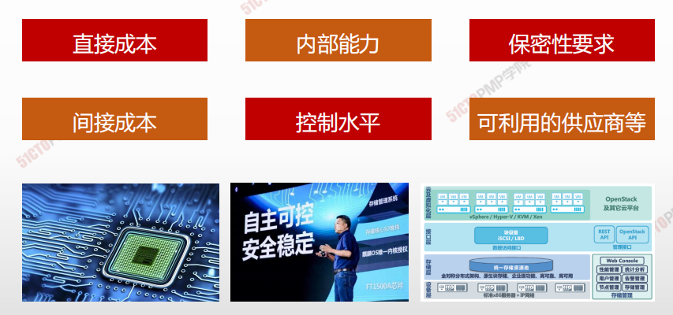

## 供方选择分析

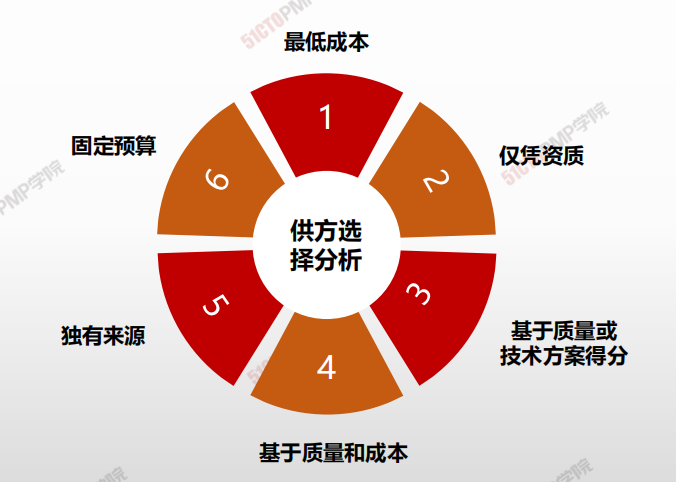

## -采购管理计划

**项目管理计划的组成部分**

**采购管理计划的主要内容包括：**

- 如何协调采购与项目的其他工作
- 开展重要采购活动的时间表；
- 用于管理合同的采购测量指标；
- 与采购有关的相关方角色和职责；
- 是否需要编制独立估算，是否应将其作为评价标准；
- 风险管理事项；
- 拟使用的预审合格的卖方（如果有）。

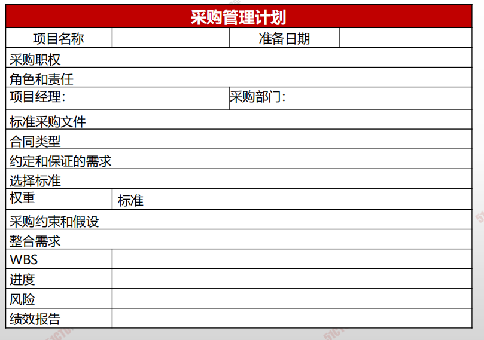

## 采购工作说明书

- 对将要包含在相关合同中的那一部分**项目范围进行定义**
- 应**详细描述**拟采购的产品、服务或成果
- 包括规格、所需数量、质量水平、绩效数据、履约期限、工作地点和其他需求
- 要求：**清晰、完整、简练**

## 供方选择标准

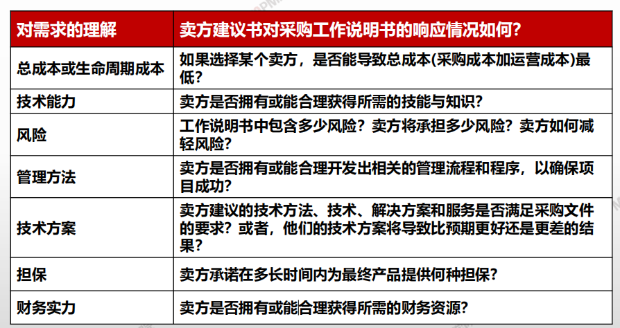

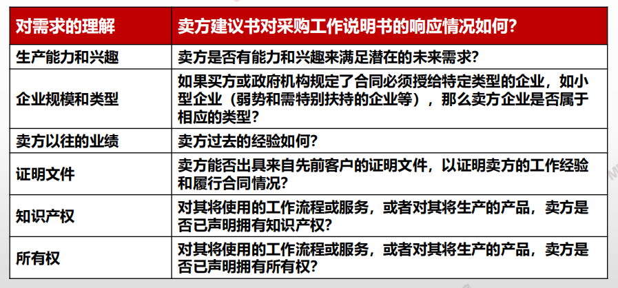

---

1. 规划采购管理是记录项目采购决策、明确采购方
法，及识别潜在卖方的过程
2. 应该针对项目范围中已知的工作，编制采购工作
说明书SOW

---

# 03.实施采购

## 实施采购

### 4W1H

| 4W1H                 | 实施采购                                                                               |
| -------------------- | ---------------------------------------------------------------------------------- |
| 
what 做什么
   | 
获取卖方应答、选择卖方并授予合同的过程。 作用：选定合格卖方并签署关于货物或服务交付的法律协议。
                         |
| 
why 为什么做
   | 实际进行采购                                                                             |
| 
who 谁来做
    | 组织中的职能部门或项目经理                                                                      |
| 
when 什么时候做
 | 执行时做                                                                               |
| 
how 如何做
    | 
采用投标人会议，建议书评价技术，独立估算，广告，因特网搜索，采购谈判和专家判断来采购。 专家判断、广告、投标人会议、数据分析、人际关系与团队技能
 |

### 输入/工具技术/输出

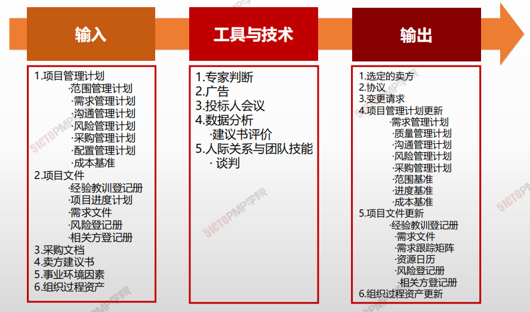

1. 输入
   3. 项目管理计划
      * 范围管理计划
      * 需求管理计划
      * 沟通管理计划
      * 风险管理计划
      * 采购管理计划
      * 配置管理计划
      * 成本基准
   4. 项目文件
      * 经验教训登记册
      * 项目进度计划
      * 需求文件
      * 风险登记册
      * 相关方登记册
   5. 采购文档
   6. 卖方建议书
   7. 事业环境因素
   8. 组织过程资产
2. 工具与技术
   1. 专家判断
   2. 广告
   3. 招标人会议
   4. 数据分析
      * 建议书评价
   5. 人际关系与 团队技能
      * 谈判
3. 输出
   1. 选定的卖方
   2. 协议
   3. 变更请求
   4. 项目管理计划更新
      * 需求管理计划
      * 质量管理计划
      * 沟通管理计划
      * 风险管理计划
      * 采购管理计划
      * 范围基准
      * 进度基准
      * 成本基准
   5. 项目文件更新
      * 经验教训登记册
      * 需求文件
      * 需求跟踪矩阵
      * 资源日历
      * 风险登记册
      * 相关方登记册
   6. 组织过程资产更新

## 采购谈判

* 采购谈判指在合同签署之前，对合同的结构、要求以及其他条款加以澄清，以取得一致意见。最终的合同措辞应该反映**双方达成的全部一致意见。**
* 谈判的内容应包括：责任、进行变更的权限、使用的条款和法律、技术和商务要求、所有权、合同融资、技术解决方案、总体进度计划、付款以及价格等。

### 协议

合同是对双方都有**约束力的协议**，它**强制卖方**提供规定的产品、

服务或成果，**强制买方**向卖方支付相应的报酬。

主要内容有（不限于）：

* 采购工作说明书或主要**可交付成果**
* **进度计划、里程碑，或进度计划中规定的**日期\*\*
* 绩效报告
* **定价和支付条款**
* 检查、质量和\*\*验收标准
* 激励和惩罚
* 保险和履约保函
* **终止条款和替代争议解决方法**
* ……

### 合同的基本原则和精神

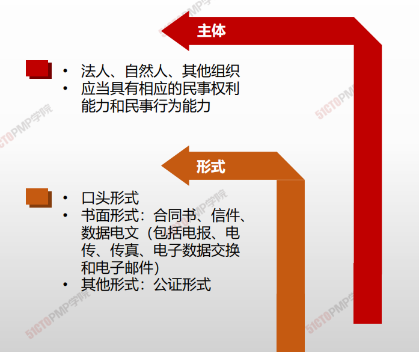

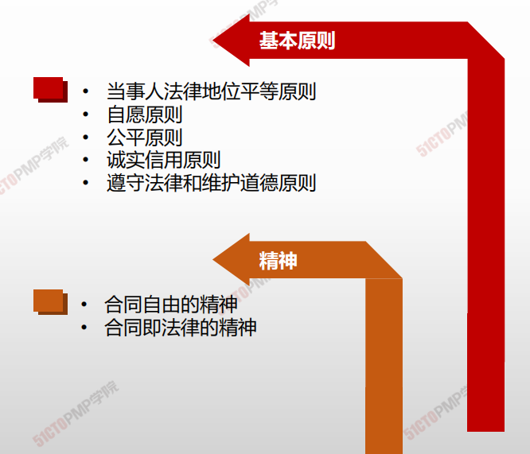

### 合同类型

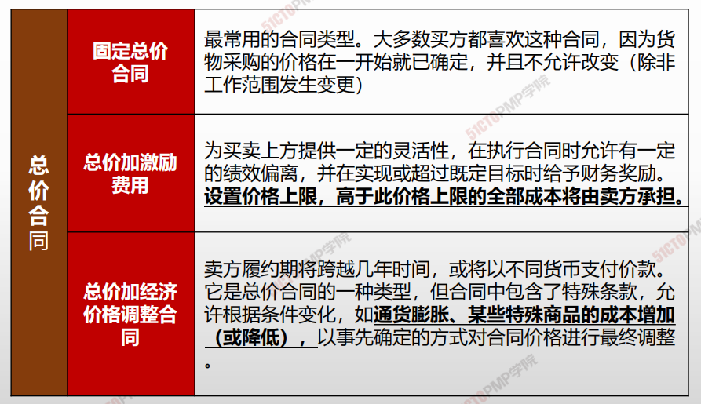

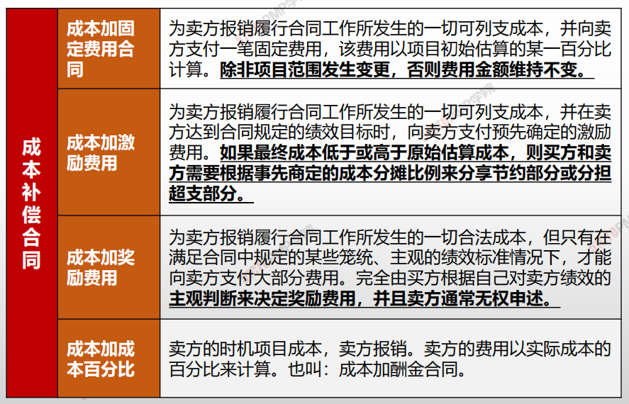

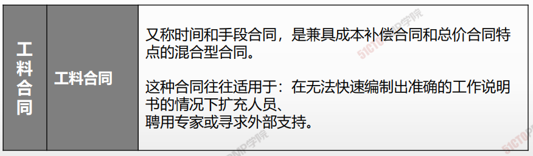

### 合同类型及其适用场景

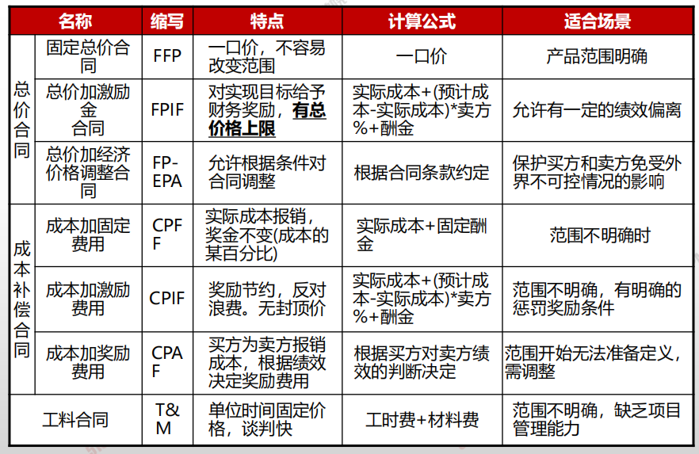

### 合同类型与风险分摊

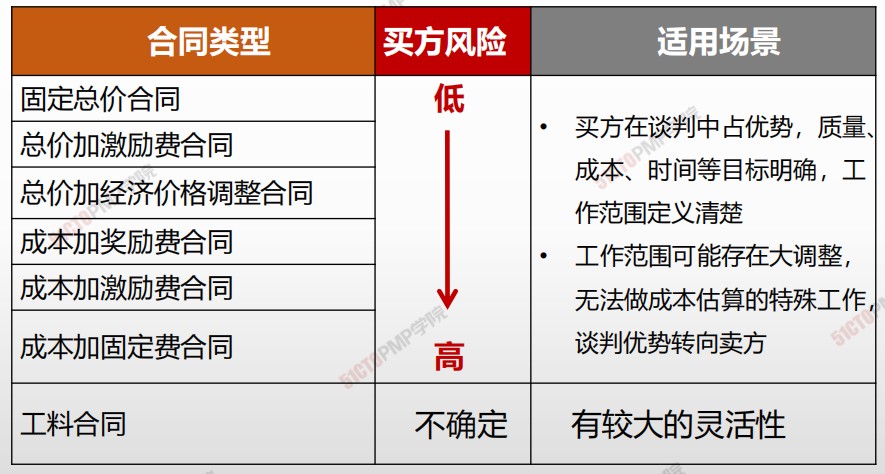

***

1. 实施采购是获取卖方应答，选择卖方并授予合 同的过程
2. 合同是对双方都有约束力的协议，它强制卖方 提供规定的产品、服务或成果，强制买方向卖 方支付相应的报酬
3. 实施采购过程将更新资源日历中资源的数量和 可用性，可能会影响进度计划

---

# 控制采购

## 在控制采购过程中：

- **第一：要对卖方的工作情况进行检查。**
- 第二：要使用数据分析中的挣值分析来计算进度和成本绩效指标，并据此**进行进度和成本绩效的趋势分析。**
- 第三：**要定期或不定期地开展审计，总结合同履行方面的经验教训，****提出相应的变更请求。
- **第四：要使用数据分析中的**绩效审查**，确定卖方的工作绩效和工作能力是否令买方满意，以决定该卖方是否适合承接以后类似的工作。**
- **第五：要通过**索赔管理**去预防、记录和处理卖方向买方的索赔。

## 合同管理活动：

- 收集数据和管理项目记录，包括维护对实体和财务绩效的详细记录，以及建立可测量的采购绩效指标；
- 完善采购计划和进度计划；
- 建立与采购相关的项目数据的收集、分析和报告机制，并为组织编制定期报告；监督采购环境，以便引导或调整实施；
- 向卖方付款

## 索赔

索赔是一方遭受了某种不该自己承担的实际损失（包括金钱或时间损失），而基于法律或合同规定向对方提出的补偿请求。**索赔的实质是****要求损失补偿，不带任何惩罚性质。**

虽然合同任何一方都可以向对方索赔，但一般只讨论卖方（承包商）向买方（业主）的索赔。

索赔可以分成不同的类别，如**工期延误索赔、赶工索赔、**变更索赔、不利现场条件索赔、违约索赔。

## 4W1H

| 4W1H                | 控制采购                                                     |
| ------------------- | ------------------------------------------------------------ |
| what 做什么     | 管理采购关系，监督合同绩效，实施必要的变更和纠偏，以及关闭合同的过程。 <u>作用：确保买卖双方履行法律协议，满足项目需求</u> |
| why 为什么做    | 为保证采购活动顺利进行，采购物品符合项目要求                 |
| who 谁来做      | 组织中的职能部门或项目经理                                   |
| when 什么时候做 | 执行采购时做。                                               |
| how 如何做      | 采用合同变更控制系统，采购绩效审查，检查与审计，绩效报告，<支付系统，索赔管理和记录管理系统来管理采购。 <u>专家判断、索赔管理、数据分析、检查、审计</u> |

## 输入/工具技术/输出

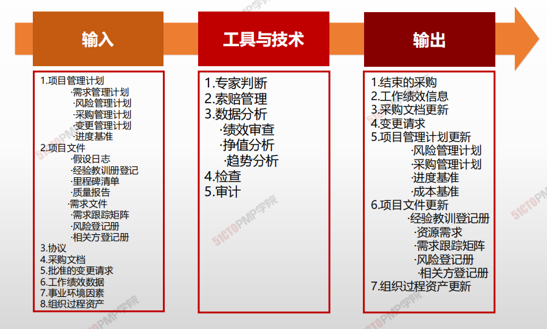

1. 输入

   1. 项目管理计划
      - 需求管理计划
      - 风险管理计划
      - 采购管理计划
      - 变更管理计划
      - 进度基准
   4. 项目文件
      - 假设日志
      - 经验教训登记册
      - 里程碑清单
      - 质量报告
      - 需求文件
      - 风险登记册
      - 相关方登记册
   3. 采购文档
   4. 协议
   7. 批准的变更请求
   8. 工作绩效数据
   9. 事业环境因素
   10. 组织过程资产

2. 工具与技术

   1. 专家判断
   2. 索赔管理
   3. 数据分析
      - 绩效审查
      - 挣值分析
      - 趋势分析
   4. 检查
   5. 审计

3. 输出

   1. 结束的采购
   2. 工作绩效信息
   3. 采购文档更新
   4. 变更请求
   5. 项目管理计划更新
      - 风险管理计划
      - 采购管理计划
      - 进度基准
      - 成本基准
   6. 项目文件更新
      - 经验教训登记册
      - 资源需求
      - 需求跟踪矩阵
      - 风险登记册
      - 相关方登记册
   7. 组织过程资产更新
   
   

# 索赔管理

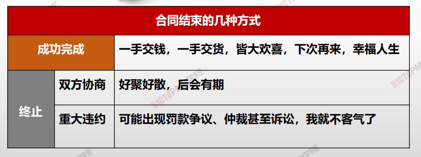

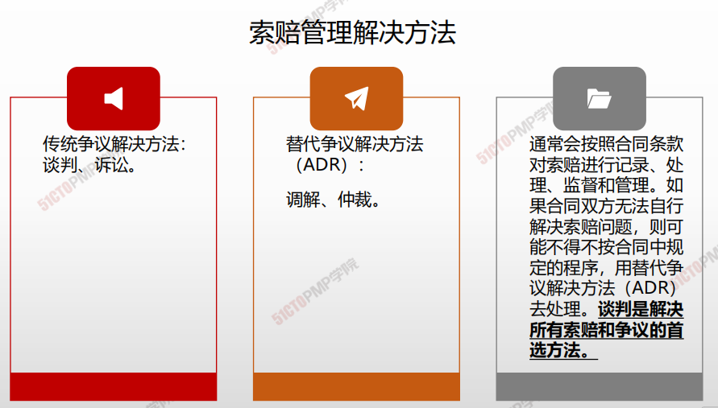

## 检查&审计

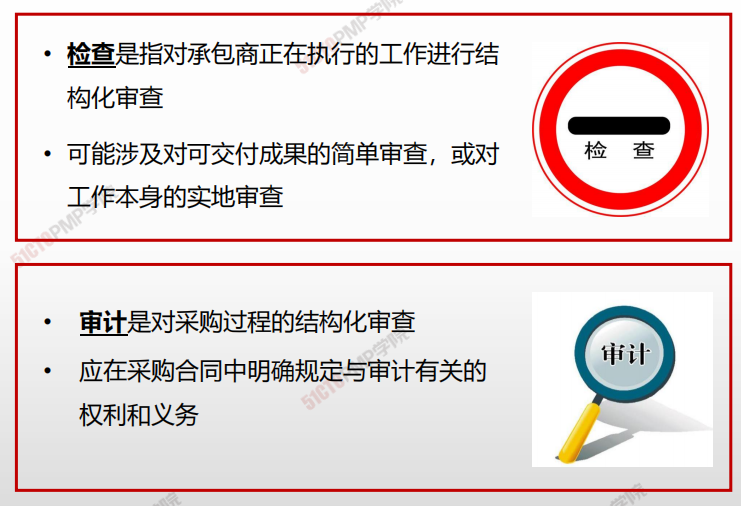

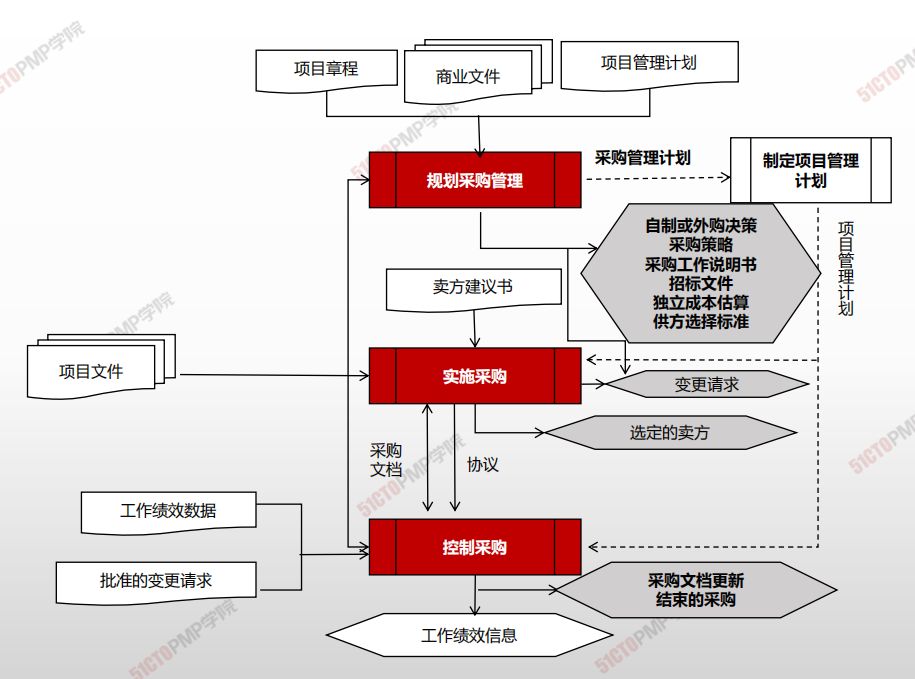

---

