# 相关方管理概述

| 13.1 | 识别相关方 | 定期识别项目相关方，分析和记录他们的利益、参与度、相互依赖性、影响力和对项目成功的潜在影响的过程 |
| ---- | ------------ | ------------------------------------------------------------ |
|13.2 | 规划相关方参与 | 根据相关方的需求、期望、利益和对项目的潜在影响，<u>制定项目相关方参与项目的方法</u>的过程。 |
| 13.3 | 管理相关方参与 | 与相关方进行沟通和协作，以满足其需求与期望，处理问题，并促进<u>相关方合理参与</u>的过程 |
| 13.4 | 监督相关方参与 | 监督项目相关方关系，并通过修订参与<u>策略和计划</u>来引导相关方合理参与项目的过程。 |

## 如何获取相关方的支持

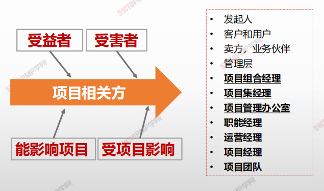

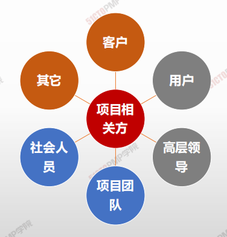

1. **一步做识别：尽早、尽量全部、持续开展**
2. **二步找策略（先分类，再定策略）** 
3. **三步做沟通（相关方参与项目—参与度）**
4. **四步做改进：策略和计划的改进**

---

# 识别相关方

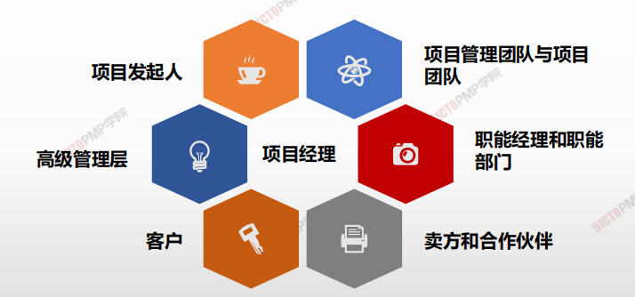

### 项目发起人

**项目发起人是为项目提供资金和其他重要资源的人**

- 项目发起人在提出项目的初步设想之后会组织专家开展项目商业论证，然后对可行的项目落实所需资金。
- 项目发起人亲自领导项目启动工作。
- 在项目正式启动之后，发起人应该授权项目经理管理项目，并充当项目最重要的高层支持者。 
- 发起人应该对项目及其成果提出一些原则性要求。
- 发起人可以亲自起草项目章程或授权项目经理代为起草。
- 发起人可以亲自签发项目章程或授权项目执行组织高级管理层签发。
- 发起人应该与其他重要项目相关方（如客户）一起验收项目成果
- 应该由项目发起人或其授权人员宣布项目正式关闭（结束）。

>  **知道谁是大BOSS特别重要！**

### 高级管理层

**高级管理层是项目执行组织中高于项目经理的全体管理者的集合。**

高级管理层又包括如下主要成员: 

- **项目治理委员会**：项目的高层决策机构。

- **项目组合经理**：负责确保项目与组织战略的一致性。

- **项目集经理**：负责管理项目集中的各个项目之间的横向联系。

- **项目管理办公室**：项目执行组织中负责管理项目管理工作的常设职能部门。

### 客户

**客户是项目成果的使用者，既包括直接使用者，也包括间接使用者。**

**一个项目可能有多种客户。**

- 必须在起草和签发项目章程时就明确谁是本项目的客户了解客户对项目的重要利益追求。
- 对于项目经理来讲，发起人或高级管理层本身也是客户，至少也是客户之

> 众多项目相关方之间有利益冲突，发起人、高级管理层或项目经理应该尽力协调相关方之间的利益冲突。如果实在无法协调，通常应该按有利于客户的原则进行处理。
>
> >  **客户利益至上！**

### 项目经理

- 项目发起人或高级管理层应该尽早指定项目经理。
- 项目经理尽早参与项目工作，有利于项目成功。
- 项目章程中赋予项目经理管理项目的权责，往往是职责大于职权。 
- 项目经理面没有足够的正式权力，用其他权力来弥补正式权力的不足，如专家权力、参照权力等，也要把项目做成功。 
- 项目经理应该积极主动地工作，而不是消极被动地工作。要主动预防问题的出现，并积极解决已经出现的问题。
- 项目经理作为项目管理专业人士，必须理解并遵守项目管理的职业要求（如职业道德）。
- 项目经理控制着项目，但不一定控制着资源。 
- 项目经理作为一个整合者，应该在更大程度上是一个通才而不是专才。

>  **人微责重 权小事多**

### 项目管理团队、职能经理、合作伙伴

---

**项目管理团队与项目团队**

项目经理应该把主要相关方都看成项目团队的组成部分。

---

**职能经理**

- 参与项目启动工作，参与制定项目目标，参与项目计划的编制和审批工作。
- 与项目经理就项目所需的资源进行协商，分派具体人员到项目上去。
- 就自己部门的专业领域，向项目提供技术支持

---

**卖方和合作伙伴**

通过合同为项目提供货物、服务或其他成果的人，就是

卖方。

---

### 相关方管理的核心概念

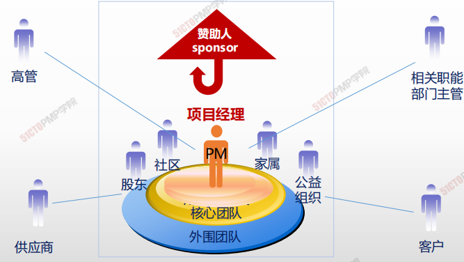

> > **识别相关方：要全面、要尽早、要迭代开展，关注变化，引导参与**

### 什么时候识别全部潜在相关方？

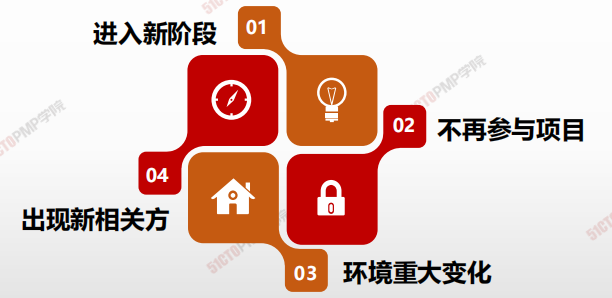

> > **尽早、全面开始识别相关方并引导相关方参与**
>
> > **相关方满意度应作为项目目标加以识别和管理**

### 如何360度识别全部潜在相关方？

> 由于涉及范围广泛，采用360度法来识别全部潜在的相关方，填入相关方登记表中。识别后应采用专家判断法进行筛选和确认

**后方相关方：**市场部、用户、审计部

**上方相关方**：赵副总经理

**左侧相关方**：广告公司、媒体、分销商、代言人、设备厂家、售后服务、设备代理商、 竞争对手

**右侧相关方**：财务部、人力资源部、公众客户部

**前方相关方**：公司内部专家及外部专家

**下方相关方**：钱进度主管、孙成本主管、 李质量主管

## 4W1H

| 4W1H                | **识别相关方**                                               |
| ------------------- | ------------------------------------------------------------ |
| what 做什么     | 识别相关方是定期识别项目相关方，分析和记录他们的利益、参与度、相互依赖性、影响力和对项目成功的潜在影响的过程。 <u>作用：</u>使项目团队能够建立对每个相关方或相关方群体的适度关注 |
| why 为什么做    | 每个项目都有相关方，他们会受项目的积极或消极影响，或者能对项目施加积极或消极的影响。有些相关方影响项目工作或成果的能力有限，而有些相关方可能对项目及其期望成果有重大影响。 |
| who 谁来做      | 本过程需在必要时重复开展，至少应在每个阶段开始时，以及项目或组织出现重大变化时重复开展。 |
| when 什么时候做 | 执行时做                                                     |
| how 如何做      | 每次重复开展本过程，都应通过查阅项目管理计划组件及项目文件，来识别有关的项目相关方。 <u>专家判断、数据收集、数据分析、数据表现、会议</u> |

## 输入/工具技术/输出

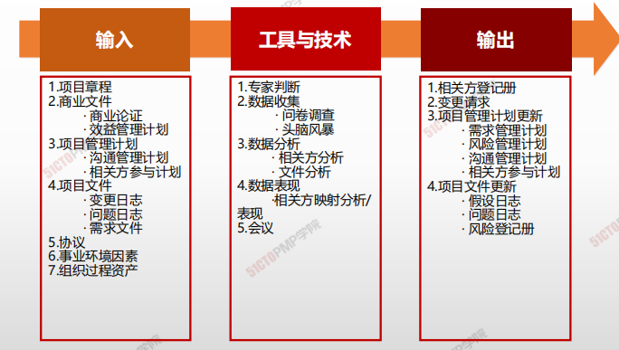

1. 输入

   1. 项目章程
   2. 商业文件
      - 商业论证
      - 效益管理计划
   3. 项目管理计划
      - 沟通管理计划
      - 相关方参与计划
   4. 项目文件
      - 变更日志
      - 问题日志
      - 需求文件
   5. 协议
   6. 事业环境因素
   7. 组织过程资产

2. 工具与技术

   1. 专家判断
   2. 数据收集
      - 问卷调查
      - 头脑风暴
   3. 数据分析
      - 相关方分析
      - 文件分析
   4. 数据表现
      - 相关方映射分析/表现
   5. 会议

3. 输出

   1. 相关方登记册
   2. 变更请求
   3. 项目管理计划更新
      - 需求管理计划
      - 沟通管理计划
      - 风险管理计划
      - 相关方参与计划
   4. 项目文件更新
      - 假设日志
      - 问题日志
      - 风险登记册

   

## 数据分析

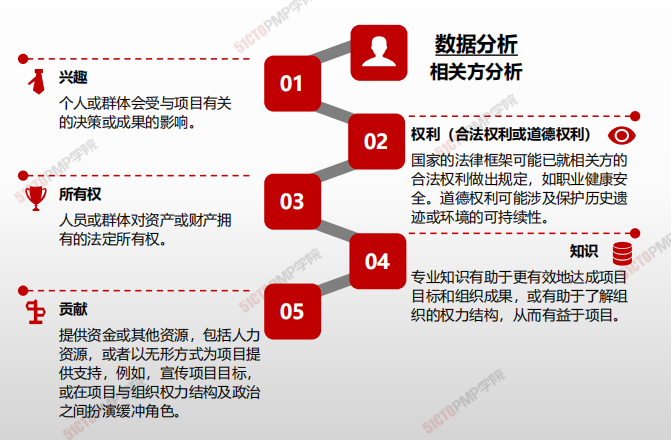

## 数据表现

相关方映射分析和表现是一种利用不同方法对相关方进行分类的方法。对相关方进行分类有助于团队与已识别的项目相关方建立关系。

常见的分类方法包括：

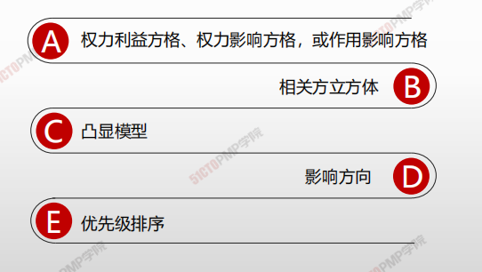

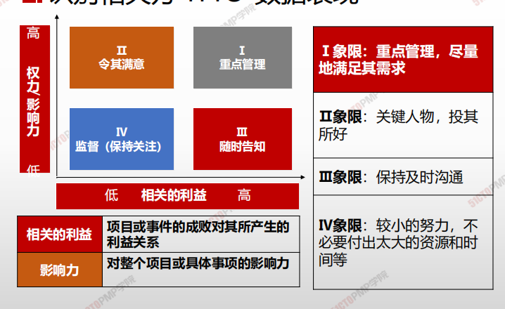

## 相关方登记册

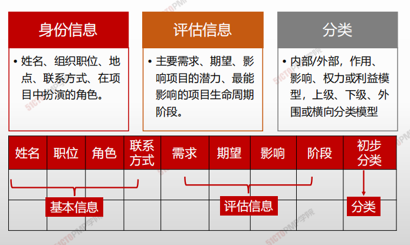

---

1. 识别相关方是定期识别项目相关方，分析和记
录他们的利益、参与度、相互依赖性、影响力
和对项目成功的潜在影响的过程
2. 《相关方登记册》是识别相关方过程的主要输
出，记录已识别相关方的身份信息、评估信息
和相关方分类
3. 应识别全部潜在项目相关方及其相关信息
4. 权力/利益方格就是根据相关方的职权大小以及
对项目结果的关注程度进行分组

---

# 规划相关方参与

## 4W1H

| 4W1H                | **规划相关方参与**                                           |
| ------------------- | ------------------------------------------------------------ |
| what 做什么     | 规划相关方参与是根据相关方的需求、期望、利益和对项目的潜在影响，制定项目相关方参与项目的方法的过程。 <u>作用：</u>提供与相关方进行有效互动的可行计划 |
| why 为什么做    | 为管理相关方提供指南。                                       |
| who 谁来做      | 项目经理和项目管理团队。                                     |
| when 什么时候做 | 项目早期，尽早规划相关方管理，可以降低项目风险。             |
| how 如何做      | 为满足项目相关方的多样性信息需求，应该在项目生命周期的早期制定一份有效的计划；然后，随着相关方社区的变化，定期审查和更新该计划。 <u>专家判断、数据收集、数据分析、决策、数据表现、会议</u> |

## 输入/工具技术/输出

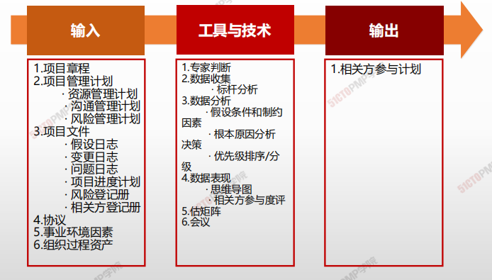

1. 输入

   1. 项目章程
   3. 项目管理计划
      - 资源管理计划
      - 沟通管理计划
      - 风险管理计划
   4. 项目文件
      - 假设日志
      - 变更日志
      - 问题日志
      - 项目进度计划
      - 风险登记册
      - 相关方登记册
   5. 协议
   6. 事业环境因素
   7. 组织过程资产

2. 工具与技术

   1. 专家判断
   2. 数据收集
      - 标杆分析
   3. 数据分析
      - 假设条件和制约因素
      - 根本原因分析决策
      - 优先级排序/分级
   4. 数据表现
      - 思维导图
      - 相关方参与度评估矩阵
   5. 会议

3. 输出

   1. 相关方参与计划
   
   

## 相关方参与度评估矩阵

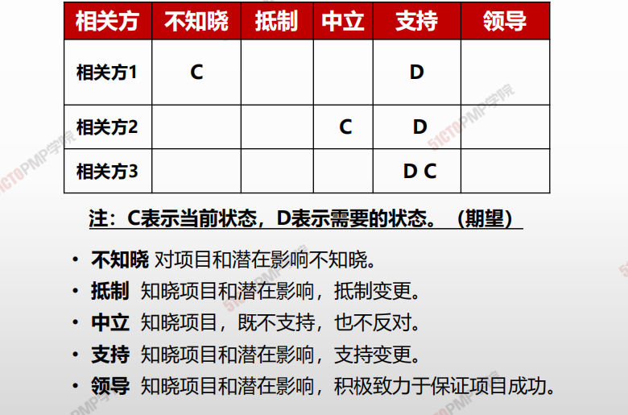

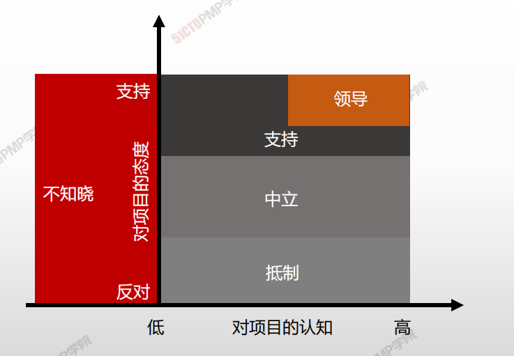

## 相关方参与计划

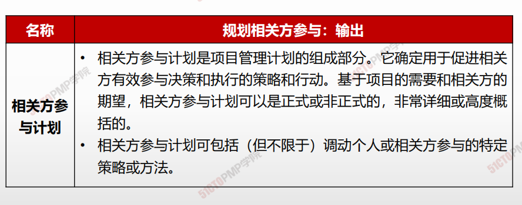

> **确定用于促进相关方有效参与决策和执行的策略和行动**

### **相关方参与计划**

- **相关方登记册内容**
- **相关方参与度评估矩阵**
- **相关方之间的关系**

- **管理策略和措施**
- **与沟通计划的关系**
- **相关方变更管理**

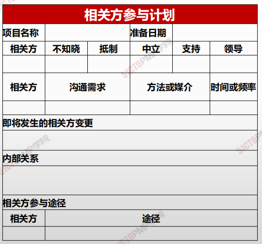

---

# 04.管理相关方参与

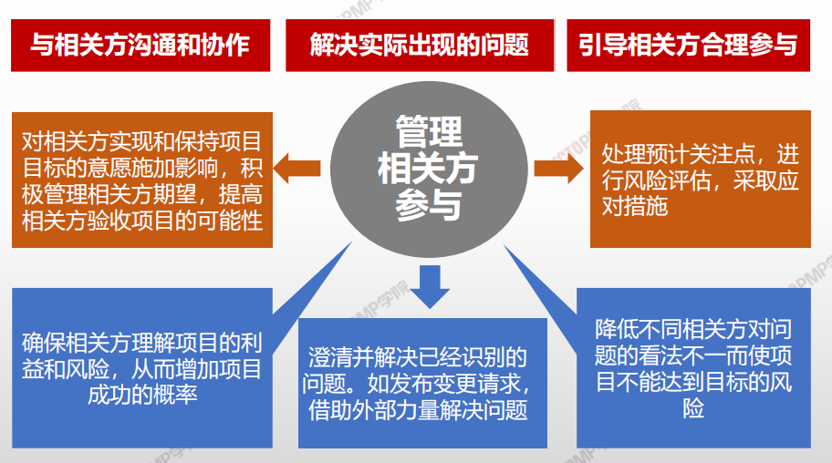

## 4W1H

| 4W1H                 | **管理相关方参与**                                                                                |
| -------------------- | ------------------------------------------------------------------------------------------ |
| 
what 做什么
   | 
管理相关方参与是与相关方进行沟通和协作以满足其需求与期望、处理问题，并促进相关方合理参与的过程。 作用：让项目经理能够提高相关方的支持，并尽可能降低相关方的抵制
 |
| 
why 为什么做
   | 有助于确保相关方明确了解项目目的、目标、收益和风险，以及他们的贡献将如何促进项目成功。                                                |
| 
who 谁来做
    | 项目管理团队                                                                                     |
| 
when 什么时候做
 | 计划制定后，按照计划执行。                                                                              |
| 
how 如何做
    | 
使用沟通方法，人际关系技能和管理技能 专家判断、沟通技能、人际关系与团队技能、基本规则、会议
                                   |

## 输入/工具技术/输出

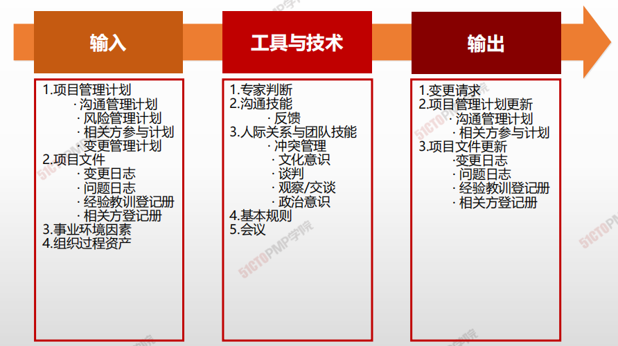

1. 输入
   3. 项目管理计划
      * 资源管理计划
      * 风险管理计划
      * 相关方管理计划
      * 变更管理计划
   4. 项目文件
      * 变更日志
      * 问题日志
      * 经验教训登记册
      * 相关方登记册
   5. 事业环境因素
   6. 组织过程资产
2. 工具与技术
   1. 专家判断
   2. 沟通技能
      * 反馈
   3. 人际关系与团队技能
      * 冲突管理
      * 文化意识
      * 谈判
      * 观察/交谈
      * 政治意识
   4. 基本规则
   5. 会议
3.  输出

    1. 变更请求
    2. 项目管理计划更新
       * 沟通管理计划
       * 相关方参与计划
    3. 项目文件更新
       * 变更日志
       * 问题日志
       * 经验教训登记册
       * 相关方登记册

    ***

    1. 管理相关方参与是与相关方进行沟通和协作以 满足其需求与期望、处理问题，并促进相关方 合理参与的过程
    2. 管理相关方参与的目标是让项目经理能够提高 相关方的支持，并尽可能降低相关方的抵制
    3. 在开展管理相关方参与过程时，应根据沟通管 理计划，针对每个相关方制定相应的沟通方法

---

# 05.监督相关方参与

## 4W1H

| 4W1H                 | **监督相关方参与**                                                                                 |
| -------------------- | ------------------------------------------------------------------------------------------- |
| 
what 做什么
   | 
监督相关方参与是监督项目相关方关系，并通过修订参与策略和计划来引导相关方合理参与项目的过程。 作用：随着项目进展和环境变化，维持或提升相关方参与活动的效率和效果。
 |
| 
why 为什么做
   | 随着项目进展和环境变化，维持或提升相关方参与活动的效率和效果。                                                             |
| 
who 谁来做
    | 项目管理团队。                                                                                     |
| 
when 什么时候做
 | 本过程需要在整个项目期间开展                                                                              |
| 
how 如何做
    | 
关键绩效，关注参与度，灵活调整策略。 数据分析、决策 、数据表现、沟通技能、人际关系与团队技能、会议
                                |

## 输入/工具技术/输出

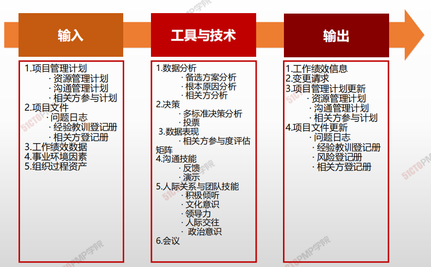

1. 输入
   3. 项目管理计划
      * 资源管理计划
      * 沟通管理计划
      * 相关方管理计划
   4. 项目文件
      * 问题日志
      * 经验教训登记册
      * 相关方登记册
   5. 工作绩效数据
   6. 事业环境因素
   7. 组织过程资产
2. 工具与技术
   1. 数据分析
      * 备选方案分析
      * 根本原因分析
      * 相关方分析
   2. 决策
      * 多标准决策分析
      * 投票
   3. 数据表现
      * 相关方参与度评估矩阵
   4. 沟通技能
      * 反馈
      * 演示
   5. 人际关系与团队技能
      * 积极倾听
      * 文化意识
      * 领导力
      * 人际交往
      * 政治意识
   6. 会议
3.  输出

    1. 工作绩效信息
    2. 变更请求
    3. 项目管理计划更新
       * 资源管理计划
       * 沟通管理计划
       * 相关方参与计划
    4. 项目文件更新

    ***

    1. 监督相关方参与是监督项目相关方关系，并通 过修订参与策略和计划来引导相关方合理参与 项目过程
    2. 通过获得反馈确保发送给相关方的信息被接收 和理解
    3. 通过积极倾听，减少理解错误和沟通错误
    4. 使用相关方参与度评估矩阵，来跟踪每个相关 方参与水平的变化，对相关方参与加以监督
    5. 工作绩效信息记录了相关方当前支持水平与期 望参与水平进行比较的结果

    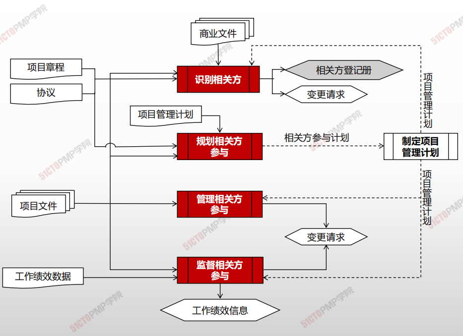

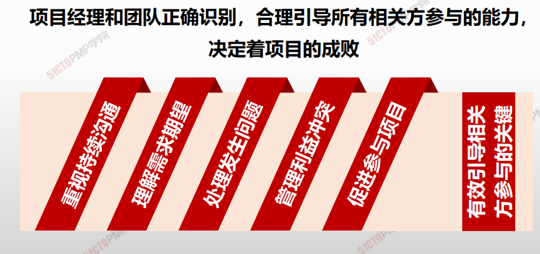

---

